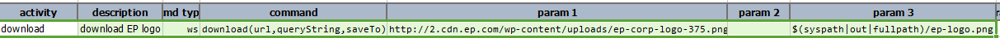
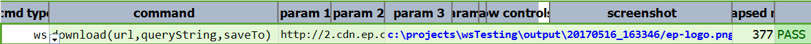

### Description
This command is used to download the object from web using web service url and save it in the given destination path. 
In the given example downloading the image from web using web service url.

### Parameters
- **url** - the target URL
- **queryString** - query string for the specified URL.  Use `(empty)` to indicate no query string to send
- **saveTo** - the location to save the downloaded file

### Example
**Script**: 

**Output**: 

### See Also
- [`delete(url,body,var)`](delete(url,body,var))
- [`put(url,body,var)`](put(url,body,var))