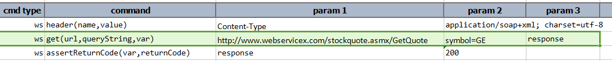
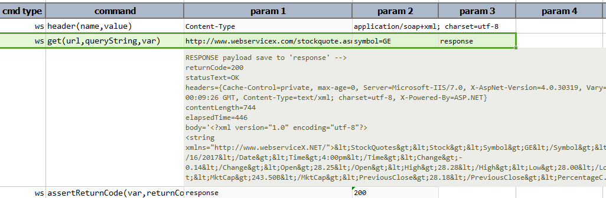

### Description
This command sends a GET request to the specified `url`.

To learn about how to utilize the response returned from the target URL, click [here](index.html#http-response).

### Parameters
- **url** - the target URL
- **queryString** - query string for the specified URL.  Use `(empty)` to indicate no query string to send
- **var** - the variable to hold the [response](index.html#http-response)

### Example
Get the stock quote with the given query string. Here the query is to get the stock quote of company
 GE (General Electric Company). 

**Script**: 

**Output**: 

### See Also
- [`delete(url,body,var)`](delete(url,body,var))
- [`head(url,var)`](head(url,var))
- [`patch(url,body,var)`](patch(url,body,var))
- [`post(url,body,var)`](post(url,body,var))
- [`put(url,body,var)`](put(url,body,var))
