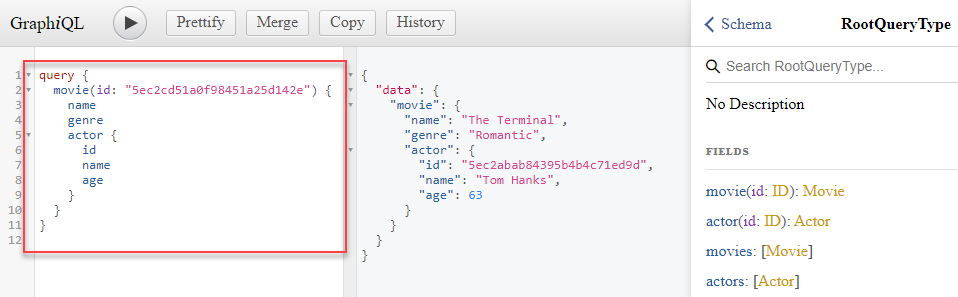
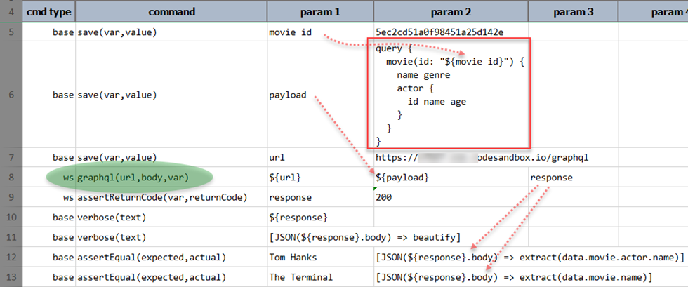
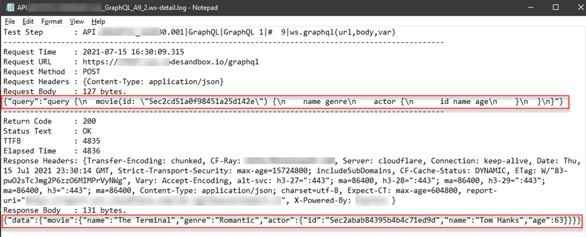

### Description
This command supports and simplifies the automation of a 
<a href="https://spec.graphql.org/June2018/" class="external-link" target="_nexial_external">GraphQL</a> request. Using
this command, one can specify a standard GraphQL 
<a href="https://spec.graphql.org/June2018/#sec-Query" class="external-link" target="_nexial_external">query</a> or 
<a href="https://spec.graphql.org/June2018/#sec-Mutation" class="external-link" target="_nexial_external">mutation</a> 
dataset, and Nexial will perform the underlying HTTP-level construction.

Note:
- GraphQL <a href="https://spec.graphql.org/June2018/#sec-Subscription" class="external-link" target="_nexial_external">subscription</a> 
  operation is currently not supported (_but coming soon!_).
- For consistency and simplicity sake, this command implements HTTP POST for either "mutation" or "query" requests.

Let's see this command in action. Suppose we have the following GraphQL endpoint:

The highlighted (red) portion is the "query" dataset for this GraphQL request. To the right of it is the response of
this request, which is a standard JSON document.

To make such GraphQL request, one would use this command like this:

- Row 6 shows the same "query" dataset as show in the first diagram. But notice that instead of using hardcode value of
  `5ec2cd51a0f98451a25d142e`, we have put a data variable `${movie.id}` in its place. This allows us to replace parts of
  the GraphQL request with dynamic data.
- Row 5 defines the value of the data variable`movie id`. During execution, Nexial will substitute `${movie id}` with 
  its defined value.
- Row 8 shows the use of this command. Notice that the `${payload}` referenced here is the same one defined in Row 6.
- Row 9 onwards show the similar usage as other REST API automation.
- Because a GraphQL response body is of type JSON, we can use [JSONPath](../../jsonpath) to extract and manipulate it.
  - Row 12 shows how we can extract the "name of the actor for the movie in question".
  - Row 13 shows how we can extract the "name of the movie in question".
  
Behind the scene, a GraphQL request is an HTTP POST request with the GraphQL dataset transformed into a JSON document.
Suppose the [`nexial.ws.logDetail`](../../systemvars/index.html#nexial.ws.logDetail) System variable is set to `true`, 
then we can further examine the request and response interaction between Nexial and the GraphQL endpoint:

Observe that the request body is an JSON document "transformed" from the specified "query" dataset (Row 6), and the 
response body is a JSON document.

### Parameters
- **url** - the target URL
- **body** - the dataset to send; it should start with either `query` or `mutation`
- **var** - the variable to hold the [response](index.html#http-response)

### Example
See above

### See Also
- [`delete(url,body,var)`](delete(url,body,var))
- [`get(url,queryString,var)`](get(url,queryString,var))
- [`head(url,var)`](head(url,var))
- [`patch(url,body,var)`](patch(url,body,var))
- [`post(url,body,var)`](post(url,body,var))
- [`put(url,body,var)`](put(url,body,var))

