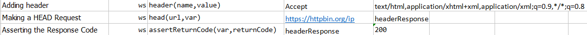
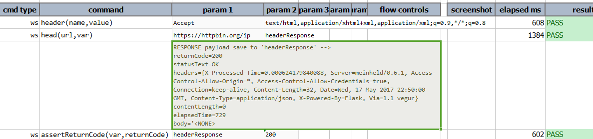

### Description
This command is identical to GET except that the server MUST NOT return a message-body in the response. The meta 
information contained in the HTTP headers in response to a HEAD request SHOULD be identical to the information sent 
in response to a GET request. This command can be used for obtaining meta information about the entity implied by the 
request without transferring the entity-body itself. This command is often used for testing hypertext links for 
validity, accessibility, and recent modification.

To learn about how to utilize the response returned from the target URL, click [here](index.html#http-response).

### Parameters
- **url** - the target URL
- **var** - the variable to hold the [response](index.html#http-response)

### Example
**Script**: 

**Output**: The response is returned with headers and does not have the response payload. 

### See Also
- [`delete(url,body,var)`](delete(url,body,var))
- [`get(url,queryString,var)`](get(url,queryString,var))
- [`patch(url,body,var)`](patch(url,body,var))
- [`post(url,body,var)`](post(url,body,var))
- [`put(url,body,var)`](put(url,body,var))
