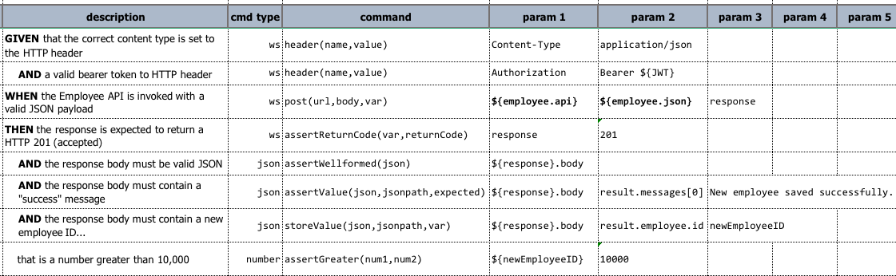

### Description
This command is used to add, modify or remove HTTP header before making an HTTP request, include REST, GraphQL or Web 
Service request. 

This command is useful when an HTTP request requires additional header information to be set prior to invocation. Let's 
suppose the following REST API example to add a new employee to the company database:

| category                  | specification                                                        |
|---------------------------|----------------------------------------------------------------------|
| **Endpoint**              | `https://mycompany.com/api/v1/employee`                              |
| **Method**                | `POST`                                                               |
| **Required HTTP headers** | `Content-Type: application/json`                                     |
|                           | `Authorization: Bearer ...`                                          |
| **Request Body**          | `{"name": "John Doe", "age": 30, ...}`                               |
| **Response**              | `{"result": { "messages: [...], "employee": { "id": 12345, ...} } }` |

 
In order that a request to this API can be accepted, 2 HTTP headers must be set:
- `Content-Type`
- `Authorization`

With this command, we can set these required 2 headers, following a 
[ws &raquo; `post(url,body,var)`](post(url,body,var)) command to invoke the REST API. Lastly using various 
[JSON](../json/index/html) commands we can verify the response payload. 

The above example uses a BDD-like construct (`Given-When-Then`) for the `description` column further provide 
readability to the test script. Note that this is not required for Nexial, but may provide some benefits to some.

The last few commands are included to illustrate how one can use Nexial to verify the response payload. The actual
response assertion may differ based on the requirement of the target API.

A few noteworthy points:
- The header(s) only need to be set once prior to API invocations. All subsequent API invocations will have *inherit* 
  the same HTTP headers previously set.
- An HTTP header can be altered simply by invoking this command again with the same header name and a different value.
- To remove an HTTP header, invoke this command with either `(null)` or `(empty)` as the value.
- To remove multiple HTTP headers, one may choose to use [`clearHeaders(headers)`](clearHeaders(headers)) command instead.

For more information about HTTP Headers:
<ul>
<li><a href="https://docs.microsoft.com/en-us/previous-versions/office/developer/sharepoint-2010/bb802855(v=office.14)" class="external-link" target="_nexial_link">microsoft - Support for Custom HTTP and SOAP Headers</a></li>
<li><a href="https://developer.mozilla.org/en-US/docs/Web/HTTP/Headers" class="external-link" target="_nexial_link">mozilla - HTTP headers</a></li>
<li><a href="https://www.whatismybrowser.com/detect/client-hints" class="external-link" target="_nexial_link">whatismybrowser - The Client Hints headers your bowser is sending</a></li>
<li><a href="https://www.oreilly.com/library/view/restful-web-services/9780596529260/apc.html" class="external-link" target="_nexial_link">o'reilly - The HTTP Header Top Infinity</a></li>
</ul>

### Parameters
- **name** - the name of the header to set
- **value** - the corresponding value of the specified header `name`

### Example

### See Also
- [`clearHeaders(headers)`](clearHeaders(headers))
- [`delete(url,body,var)`](delete(url,body,var))
- [`put(url,body,var)`](put(url,body,var))
