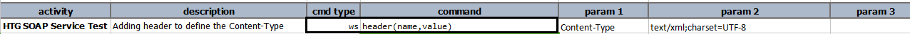

### Description
This command is used to add the header before making any Web Service request. Like setting
up request header's **Content-Type, Accept, etc..**

### Parameters
- **name** - the name of the header to set
- **value** - the corresponding value of the specified header `name`

### Example

### See Also
- [`delete(url,body,var)`](delete(url,body,var))
- [`put(url,body,var)`](put(url,body,var))