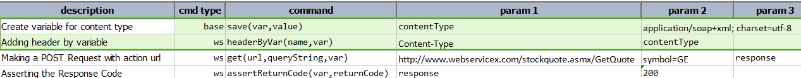
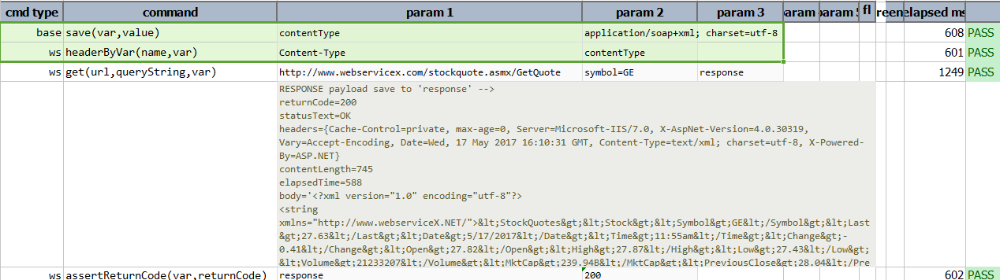

### Description
This command is used to add the header value to web service request by calling variable name.

### Parameters
- **name** - this parameter is the name of the header
- **var** - the variable name whose value will be used to set the specified header

### Example
**Script**: 

**Output**: 

### See Also
- [`header(name,value)`](header(name,value))
