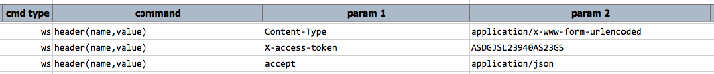
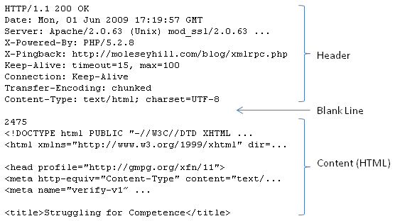
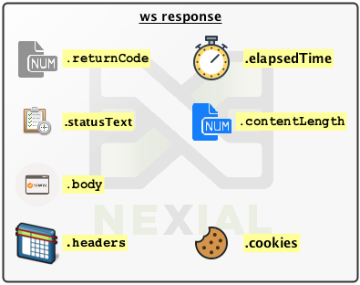
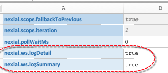
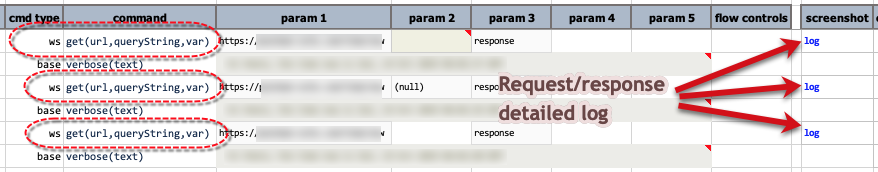
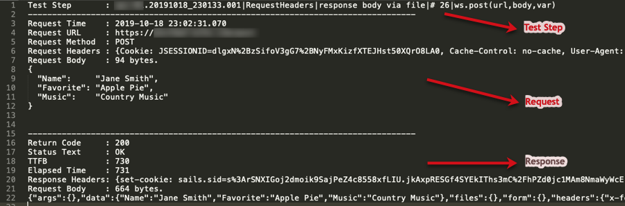
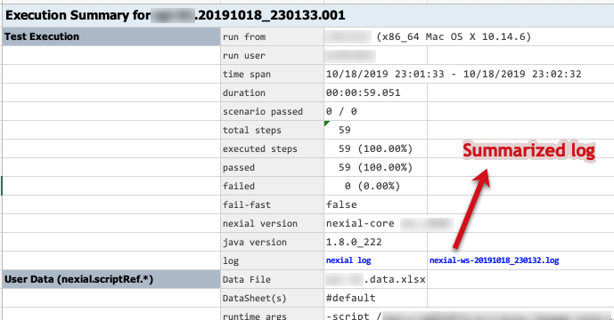
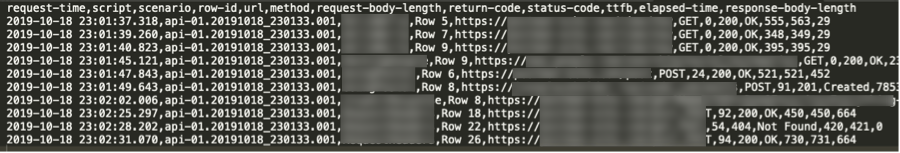
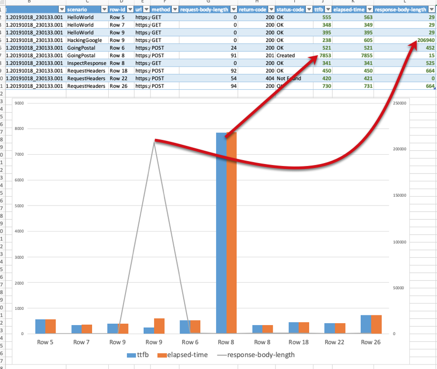

`ws` is short for Web Service. For Nexial, this refers to any form of HTTP-based web services (REST, SOAP, etc.). The 
`ws` set of commands provides a set of web service related interactions and validations. The specific of each commands 
are documented in the designated pages (below). However there are a few common things to note:

### [ws &nbsp; `header(name,value)`](header(name,value))
This command affects all subsequent `ws` commands. The main purpose of this command is to set up HTTP headers for the 
subsequent web service invocations within the same Nexial execution. One can create a series of HTTP headers, and
modify or enhance them between web service invocations. For example: 

### HTTP Response
When a HTTP request is made, the corresponding server responds with a set of information generally known as 
<a href="https://www.w3.org/Protocols/rfc2616/rfc2616-sec6.html" class="external-link" target="_nexial_external">HTTP Response</a>.
The response at the network transport layer looks something like this: 

The response contains all sorts of useful information. Nexial captures such information and made them available during
execution to support validation and further processing. Each "response" object contains the following data: 

Assuming that the response is stored in a data variable named `var`, one can ...:
- access the date/time, in epoch, of the corresponding request via the **`${var}.requestTime`** syntax.
- use the **`${var}.ttfb`** syntax to retrieve the number of millisecond between the request sent from Nexial to the 
  intended server and the time when the first byte (of response) is received by Nexial in return. "TTFB" stands for 
  "Time-to-First-Byte".
- use the `${var}.elapsedTime` syntax to retrieve the number of millisecond between the request sent from Nexial to the 
  intended server and the time when the entire response has been received by Nexial in return.
- access the return code (status code) and status text via **`${var}.returnCode}`** and **`${var}.statusText`** 
  respectively. The purpose of these "data" in inherently the same, except the former is a numerical representation. 
  Visit <a href="https://httpstatuses.com/" class="external-link" target="_nexial_external">https://httpstatuses.com/</a> 
  and <a href="https://www.restapitutorial.com/httpstatuscodes.html" class="external-link" target="_nexial_external">
  HTTP Status Codes</a> for more information.
- access the response payload via the **`${var}.body`** syntax. This usually returns some form of text, which can be 
  further processed via the [`json`](../json/index) command type, [`xml`](../xml/index) command type or 
  [`io`](../io/index) command type for plain text.
- access the length of the payload via **`${var}.contentLength`** syntax.
- determine the external file location which stores the response payload via the **`${var}.payloadLocation`** syntax.
  This is only applicable for [ws &raquo; `download(url,queryString,saveTo)`](download(url,queryString,saveTo))
  command.

All HTTP response header information can be retrieved via the `${var}.headers.[HEADER_NAME]` syntax (assuming response
is stored to the `var` data variable). For example, to retrieve response content type, we can specify
`${var}.headers.[Content-Type]`. HTTP response headers inherently also include cookie information. But to simplify
your scripting, Nexial provides a more direct access in the form of `${var}.cookies[COOKIE_NAME].value`.

Each cookie contains the following property:
- **name**: The name of a cookie. Syntax: `${var}.cookies[COOKIE_NAME].name`
- **value**: The value of a cookie. Syntax: `${var}.cookies[COOKIE_NAME].value`
- **domain**: The domain for which a cookie is considered valid and accessible. Syntax: 
  `${var}.cookies[COOKIE_NAME].domain`
- **expiryDate**: The date of when a cookie would be expired and removed from its attached browser. Date format is
	 `Wdy, DD mmm yyyy HH:mm:ss GMT`. Syntax: `${var}.cookies[COOKIE_NAME].expiryDate`
- **path**: The URL subset of the origin server to which a cookie was issue. Similar to the domain option, this is 
  another way to control access. The path indicates a URL path that must exist in the requested resource before 
  sending the Cookie header. Syntax: `${var}.cookies[COOKIE_NAME].path`
- **persistent**: `true` or `false` to indicate if a cookie is a session cookie (expires when browser is restarted) or 
  not (cookie is preserves between browser restarts). Syntax: `${var}.cookies[COOKIE_NAME].persistent`
- **secure**: `true` or `false` to indicate if a cookie requires a secure (HTTPS) connection for access. A secure 
  cookie will only be sent to the server when a request is made using SSL and the HTTPS protocol. The idea that the 
  contents of the cookie are of high value and could be potentially damaging to transmit as clear text. Syntax: 
  `${var}.cookies[COOKIE_NAME].secure`

### Logging
Since [v2.8](../../release/nexial-core-v2.8.changelog.md), Nexial has the capability to externalize the 
request/response details as log files. This can be very helpful towards root cause analysis or tracking purposes. There
are two types of logging: detailed and summarized.

#### Detailed Logging
To enable detailed logging, set the System variable `nexial.ws.logDetail` to `true`. By doing so, all subsequent
web service calls issued via a `ws` command would be logged and linked to the corresponding test step in the output
file. For example:

##### Data File

##### Output File

##### Sample Detailed Log

Each web service call would have its own log file.

#### Summarized Logging
The summarized log is different from the detailed log in that it accumulates the timing and summary information about 
each invoked web service calls in the same file. Such file can be useful for post-execution analysis across all the 
web service calls made. To enable summarized logging, set the System variable `nexial.ws.logSummary` to `true`. The 
summarized log will be linked in the `#summary` worksheet of the output file: 

Here's an sample of such summarized log file (CSV format): 

Note that the first line of the log file is the column headers. One can import such CSV file to Excel (or similar) to
generate actionable visualization: 

### Available Commands
- [`assertReturnCode(var,returnCode)`](assertReturnCode(var,returnCode))
- [`delete(url,body,var)`](delete(url,body,var))
- [`download(url,queryString,saveTo)`](download(url,queryString,saveTo))
- [`get(url,queryString,var)`](get(url,queryString,var))
- [`head(url,var)`](head(url,var))
- [`header(name,value)`](header(name,value))
- [`headerByVar(name,var)`](headerByVar(name,var))
- [`jwtParse(var,token,key)`](jwtParse(var,token,key))
- [`jwtSignHS256(var,payload,key)`](jwtSignHS256(var,payload,key))
- [`oauth(var,url,auth)`](oauth(var,url,auth))
- [`patch(url,body,var)`](patch(url,body,var))
- [`post(url,body,var)`](post(url,body,var))
- [`put(url,body,var)`](put(url,body,var))
- [`saveResponsePayload(var,file,append)`](saveResponsePayload(var,file,append))
- [`soap(action,url,payload,var)`](soap(action,url,payload,var))
- [`upload(url,body,fileParams,var)`](upload(url,body,fileParams,var))
