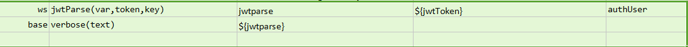
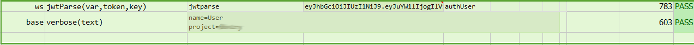

### Description
This command parses the JWT Token to get the payload with provided digitally signed key, and stores it to `var`.

### Parameters
- **var** - the data variable to hold the parsed JWT Token
- **token** - the JWT Token for the content that is to parsed
- **key** - JWT secret key

### Example
**Script**: 

**Output**: 

### See Also
- [`delete(url,body,var)`](delete(url,body,var))
- [`put(url,body,var)`](put(url,body,var))