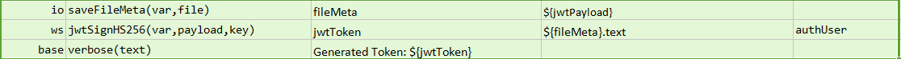
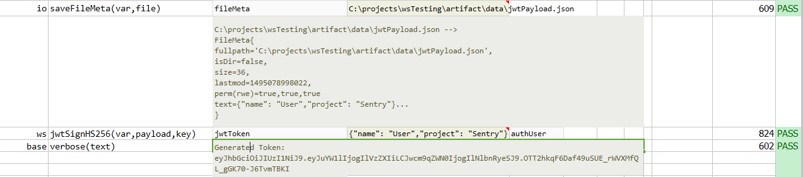

### Description 
This command generates JWT Token that can be used further as an Authorization Header in the Web Service Request.

##### What is JSON Web Token?
JSON Web Token (JWT) is an open standard (
<a href="https://tools.ietf.org/html/rfc7519" class="external-link" target="_nexial_external">RFC 7519</a>) that defines a compact and 
self-contained way for securely transmitting information between parties as a JSON object. This information can be 
verified and trusted because it is digitally signed. JWTs can be signed using a secret (with the **HMAC** algorithm) 
or a public/private key pair using **RSA**. 

<a href="https://jwt.io/introduction/" class="external-link" target="_nexial_external">Learn More</a>..

### Parameters
- **var** - this parameter is used to assign the returned value.
- **payload** - this parameter is the json payload.
- **key** - this parameter is the secret key (digital signature key).

### Example
The actual json content is read from the local file and passed as an argument as payload.

**Script**: 

**Output**: 

### See Also
