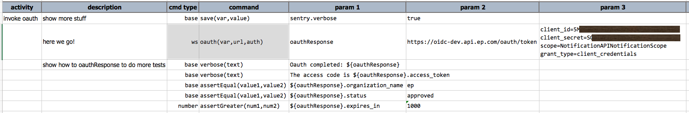
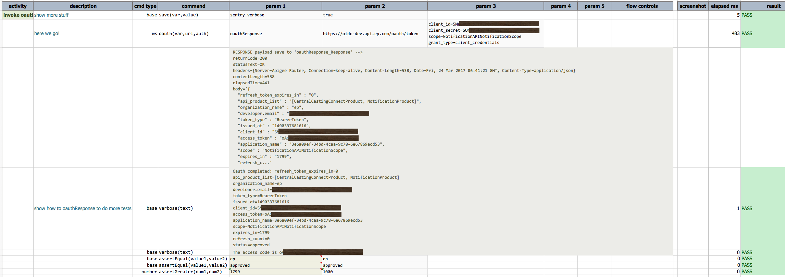

### Description
This command simulate the OAuth exchange in order to obtain an authority token for granting access to otherwise 
protected resources.

<a href="https://tools.ietf.org/html/rfc6749" class="external-link" target="_nexial_external">OAuth</a> is an open standard for authorization 
that lets clients obtain access to protected server resources on behalf of a resource owner. The resource owner could 
be a different client or the end user. OAuth also helps end users authorize third-party access to their server 
resources without having to share their credentials, such as user names and passwords. This series of articles 
adheres to the OAuth 2.0 authorization framework outlined in RFC6749. The complete OAuth 2.0 authorization framework 
as outlined under <a href="https://tools.ietf.org/html/rfc6749" class="external-link" target="_nexial_external">RFC 6749</a> can be found at 
the Internet Engineering Task Force website.

Excerpt from <a href="https://www.ibm.com/developerworks/library/se-oauthjavapt3/" class="external-link" target="_nexial_external">https://www.ibm.com/developerworks/library/se-oauthjavapt3/</a>:

_This grant is optimized for confidential clients and is used to obtain both access and refresh tokens. This is a 
redirection-based flow, and, as such, the client must be capable of interacting with the resource owner's user agent 
(generally a web browser) and also must be capable of accepting incoming requests (through redirection) from the 
authorization server._

_The authorization code grant is illustrated in Figure 1._

##### _Figure 1. Authorization code flow_

_The flow illustrated in Figure 1 includes the following steps:_

A. _The client (typically, a web application) initiates the flow by directing the resource owner's user agent 
   (typically, a web browser) to the authorization endpoint. The client's request includes the client identifier, 
   requested scope, local state, and a redirection URI. The authorization server directs the user agent (typically, a 
   web browser) back to the redirect URI after the access is granted (or denied)._
   
B. _The resource owner authenticates with the authorization server through the user agent and grants or denies the 
   client's access request._

C. _If the resource owner grants access, the authorization server redirects the user agent (typically, a web 
   browser) back to the client using the redirection URI provided earlier (in the request or during client 
   registration). The redirection URI includes an authorization code and any local state provided by the client earlier._

D. _The client makes an access token request from the authorization server's token endpoint by including the 
   authorization code received in the previous step. When making the request, the client authenticates with the 
   authorization server using the client credentials. The client also includes the redirection URI used to obtain the 
   authorization code for verification._

E. _The authorization server authenticates the client. It validates the authorization code and ensures that the 
   redirection URI received matches the URI used to redirect the client in step (C). If valid, the authorization server 
   responds back with an access token and, optionally, a refresh token in case an offline access was requested._

This command supports the above authorization code grant flow by automating Step (A) through (E), provided the 
pertinent information are specified by Nexial users (see Parameter section). Note that

1. Upon successful OAuth exchange, Nexial will also inject the granted access code into all subsequent HTTP header 
   (as **AUTHORIZATION**). 
2. This command currently does not support the "Mac" token type since such standard is yet in draft and is under 
   active modification.

### Parameters
- **var** - the name of the variable to which the OAuth response will be stored. Nexial user can in turn retrieve 
  specific values from this variable in the respective Nexial script.
- **url** - the URL to which will validate the user-specified authentication details and provide the one-use, 
  time-bound access token.
- **auth** - a set of name-value pairs, as specified by the OAuth standards, in order to complete the OAuth 
  exchange. Each name-value pair is kept as one line. As per OAuth standards, below is a list of the 
  required/optional information:  
    - **scope**: (OPTIONAL) It represents the scope of the access request. The access token that is returned by the 
      server has access to only those services mentioned in the scope.
    - **grant_type**: (REQUIRED) This needs to be set to client_credentials representing the client credentials grant.
    - **client_id**: (REQUIRED) The client or consumer ID provided by the resource server when you register your app 
      with it.
    - **client_secret**: (REQUIRED) The client or consumer secret provided by the resource server when you register 
      your app with it.  
    - **access_token**: The access token returned by the authorization server in response to a valid and authorized 
      access token request. Your client credentials are exchanged for an access token as a part of this request.
    - **authentication\_server\_url**: This represents the token endpoint. All requests for granting and regenerating 
      access tokens need to be sent to this URL.
    - **resource\_server\_url**: This represents the URL of the resource server that needs to be contacted to access 
      a protected resource by passing to it the access token in the authorization header.

### Example
Below is an example how one can use this command to invoke OAuth exchange. The example below set `nexial.verbose=true` 
in order to expose additional debugging information. In practice this is not necessary. 

Note the commands after ws &raquo; `oauth(...)` to illustrate what one could do with `${oauthResponse}` variable.

If all goes well, the result would look something like this: 

### See Also
