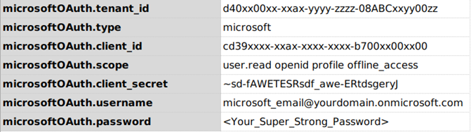
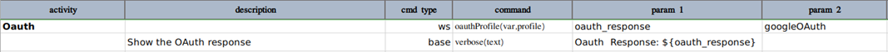
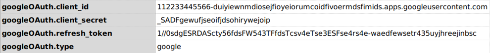
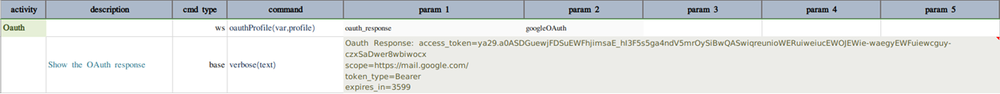
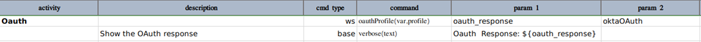
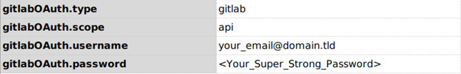
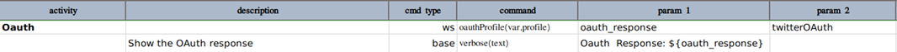
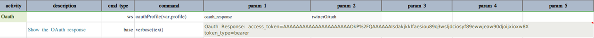

### Description
This command is another version of [oauth(var,url,auth)](oauth(var,url,auth)) but with support of profile and, some 
defaults based on the major OAuth providers such as Google, Microsoft, Okta, Gitlab and Twitter. It can also support 
other unknown OAuth provider in most cases. 

### Parameters
- **var** - the name of the variable to which the OAuth response will be stored. Nexial user can in turn retrieve 
  specific values from this variable in the respective Nexial script.
- **profile** - the profile name with which OAuth inputs are defined in the data variables that share the same prefix

The OAuth providers are identified by the `<profile>.type` (case-sensitive). Please refer the screenshots of `profile` data variable for 
different OAuth providers.

### Microsoft
Below is an example how to use this command for `microsoft` as OAuth provider. 


The `profile` data variables will be something like this



#### Defaults
- The default url for `microsoft` is `https://login.microsoftonline.com/{tenant_id}/oauth2/v2.0/token` and so it 
requires `<your_profile>.tenant_id` in the profile data variable.
- The default `grant_type` is `password`

If all inputs are valid, the successful OAuth response will look something like this 


Refer this link for more information on [Microsoft OAuth](https://docs.microsoft.com/en-us/azure/active-directory/develop/v2-oauth-ropc)

### Google

Google OAuth implementation is a bit restricted as compared to other providers. Hence, there are some additional steps 
you need to perform before you could use the oauth for `google`.





Since Google OAuth API requires using `grant_type` as `refresh_token`, you need to generate one `refresh_token` first and
then set it in `profile` data variables along with `client_id` & `client_secret` as shown in below image.

To generate the `refresh_token`, you may follow these steps:

1. Go to `https://accounts.google.com/o/oauth2/v2/auth?scope=<scope>&access_type=offline&response_type=code&client_id=<your_client_id>&redirect_uri=http://localhost`
2. Authorize the access from your Google account.
3. If you have mentioned the `redirect_uri` as `localhot` in above URL, you will be redirected to that URI in your 
     browser with `code` parameter as query param in the redirected URI of the browser window.
4. Copy the value of `code` and use it to make below POST call using any of your favourite tools like Postman, Curl, Insomnia etc.
     ```
     curl --request POST
     // Added new lines in `data` for readabilty 
     --data "code=<CODE_YOU_COPIED_FROM_REDIRECTED_WINDOW_URL>
             &client_id=<YOUR_CLIENT_ID>
             &client_secret=<YOUR_CLIENT_SECRET>
             &grant_type=authorization_code" 
     https://accounts.google.com/o/oauth2/token
     ```
5. The response of the above HTTP call will be a json body containing `refresh_token`.
6. Copy that `refresh_token` value and set it into `profile` data variable as shown in below image. That's it.     


The `profile` data variables will be something like this


#### Defaults
- The default url for `google` is `https://accounts.google.com/o/oauth2/token` 
- The default `grant_type` is `refresh_token`

If all inputs are valid, the successful OAuth response will look something like this



### Okta
Below is an example how to use this command for `okta` as OAuth provider.



The `profile` data variables will be something like this


#### Defaults
- The default url for `okta` is `https://{tenant_id}.okta.com/oauth2/default/v1/token` and so it requires 
  `<your_profile>.tenant_id` in the profile data variable.
- The default `grant_type` is `password`

If all inputs are valid, the successful OAuth response will look something like this


Refer this link for more information on [Okta OAuth](https://developer.okta.com/docs/guides/implement-password/use-flow/)

### Gitlab
Below is an example how to use this command for `gitlab` as OAuth provider.


The `profile` data variables will be something like this



#### Defaults
- The default url for `gitlab` is `https://gitlab.com/oauth/token`
- The default `grant_type` is `password`

If all inputs are valid, the successful OAuth response will look something like this


Refer this link for more information on [Gitlab OAuth](https://docs.gitlab.com/ee/api/oauth2.html#resource-owner-password-credentials-flow)

### Twitter
Below is an example how to use this command for `twitter` as OAuth provider.



The `profile` data variables will be something like this


#### Defaults
- The default url for `twitter` is `https://api.twitter.com/oauth2/token`
- The default `grant_type` is `client_credentials`

If all inputs are valid, the successful OAuth response will look something like this


Refer this link for more information on [Twitter OAuth](https://developer.twitter.com/en/docs/authentication/oauth-2-0/bearer-tokens)

### Custom
Below is an example how to use this command for any other OAuth provider.


The `profile` data variables will be something like this


Here, `<your_profile>.type` MUST BE `custom` (case-sensitive).

The `custom` type does not assume any defaults. All the data provided in the `profile` data variable will be passed to 
the respective OAuth provider on `<your_profile>.url` (using http POST method).

If all inputs are valid, the successful OAuth response will look something like this


### See Also
- [`oauth(var,url,auth)`](oauth(var,url,auth))