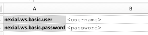
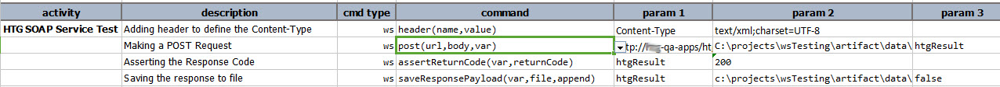
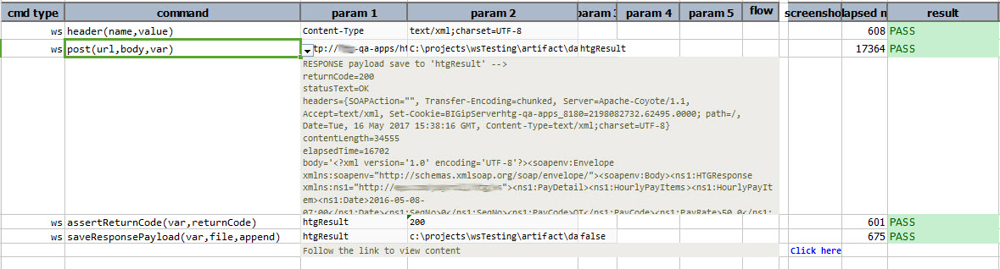

### Description 
This command is used to send POST request to the given endpoint URL. This could be used for both SOAP and RESTful 
Services.

If the Web Service is to be accessed with **Basic Authentication**, provide the username and password in the data 
file with the below shown keywords.

To learn about how to utilize the response returned from the target URL, click [here](index.html#http-response).



### Parameters
- **url** - the target URL
- **body** - the payload to send, or `(empty)` if none is to be send
- **var** - the variable to hold the [response](index.html#http-response)

### Example
**Script**: 

**Output**: 

### See Also
- [`delete(url,body,var)`](delete(url,body,var))
- [`get(url,queryString,var)`](get(url,queryString,var))
- [`head(url,var)`](head(url,var))
- [`patch(url,body,var)`](patch(url,body,var))
- [`put(url,body,var)`](put(url,body,var))
