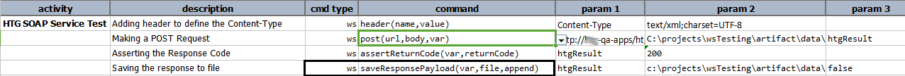

### Description
This command saves the response payload to a `file`.  Optionally one can append the payload to an existing `file.

### Parameters
- **var** - the variable to hold the [response](index.html#http-response)
- **file** - this parameter is the path of the file where the response data is intended to save
- **append** - `true` if payload data should be appended to the file.

### Example
**Script**: 

**Output**: 
File saved at the given location. Click on the provided link to open the file directly from the output file

### See Also
