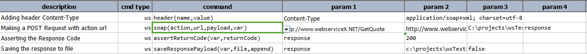
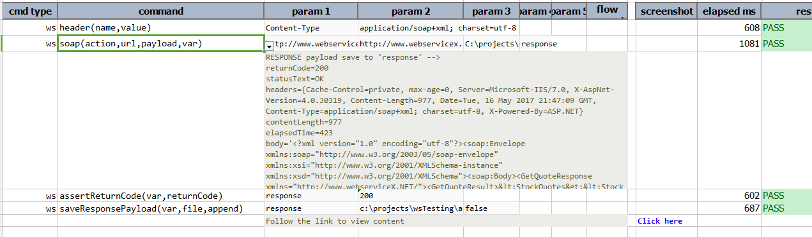

### Description
This command is used to send a SOAP request where SOAP Service has SOAP Action name.

The **soapAction** url can be found in WSDL Document.

This command is similar as **_post(url,payload,var)_** command. But with soapAction url as an additional argument.

### Parameters
- **action** - this parameter is the soapAction url
- **url** - the target URL
- **payload** - the request payload, or `(empty)` if none required
- **var** - the variable to hold the [response](index.html#http-response)

### Example
This example is to get stock quote.

**Script**: 

**Output**: 

### See Also
- [`delete(url,body,var)`](delete(url,body,var))
- [`put(url,body,var)`](put(url,body,var))