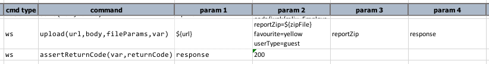

### Description
This command is used to upload one or more files (i.e. multipart-data) to the target endpoint (denoted by `url`). This
command inherently issues a POST request, but with multipart support. The `body` parameter contains either the text or
file request parameters where each is kept as a separate line. The `fileParams` is a list of the request parameters 
that should be considered as files (i.e. the files to upload). See the following example:

The `body` parameter contains one or more request parameters to be sent to the target endpoint (`url`). Each of the 
request parameters is specified as a separate line (as shown above). However only one of the parameters represents the 
file to upload. The `fileParams` parameter is used to distinguish between the "regular" request parameters (`favourite` 
and `userType` in this case) and the request parameter(s) that represent the multipart data to upload. In this case,
`fileParams` to set to the value `reportZip`. Nexial uses such information to determine what to upload. 

One will observe that `reportZip` is assigned as `${zipFile}` as part of the request parameter. Since `reportZip` is
specified as one of the `fileParams`, Nexial will proceed to resolve the file entity via the `${zipFile}` data variable.

The response from the target endpoint is saved to a data variable denoted by `var`. If all goes well, 
`${var}.responseCode` should be 200.
 

### Parameters
- **url** - the target URL
- **body** - query string for the specified URL.  Use `(empty)` to indicate no query string to send
- **fileParams** - the location to save the downloaded file
- **var** - the variable to capture the upload response

### Example
see above.

### See Also
- [`delete(url,body,var)`](delete(url,body,var))
- [`put(url,body,var)`](put(url,body,var))
- [`download(url,queryString,saveTo)`](download(url,queryString,saveTo))

