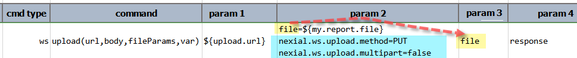

### Description
This command is used to upload one or more files (i.e. multipart-data) to the target endpoint (denoted by `url`). This
command supports multiple HTTP methods (see below) and multipart file transfer is optional. The `body` parameter 
contains either the text or file request parameters where each is kept as a separate line. The `fileParams` is a list 
of the request parameters that should be considered as files (i.e. the files to upload). See the following example:

The `body` parameter contains one or more request parameters to be sent to the target endpoint (`url`). Each of the 
request parameters is specified as a separate line (as shown above). However, some of these parameters represent the 
file(s) to upload. The `fileParams` parameter is used to distinguish between the "regular" request parameters 
(`favourite` and `userType` in this case) and the request parameter(s) that represent the file or multipart data to 
upload. In this case, `fileParams` to set to the value `reportZip`. Nexial uses such information to determine what to 
upload. 

One will observe that `reportZip` is assigned the value of `${zipFile}` in the `body` parameter. Since `reportZip` is
specified as one of the `fileParams`, Nexial will proceed to resolve the appropriate file entity via the `${zipFile}` 
data variable.

The response from the target endpoint is saved to a data variable denoted by `var`. In the above example, this parameter
is assigned the value `response`. If all goes well, `${response}.responseCode` should be (usually) 200 or 201.

By default, Nexial will use an HTTP POST with multipart to perform the upload operation. This might not always suit the
target URL. One can alter the default behavior by specify in the `body` parameter:
- `nexial.ws.upload.method` for the desired HTTP method for this operation.
- `nexial.ws.upload.multipart` to indicate if this request should be constructed as a multipart request or not (default 
  is yes).

For example,

In the above example, `file` in the `body` parameter represents the target file to upload (since it is referenced in the
`fileParams` parameter as well). There are 2 other parameters specified in `body`:
- `nexial.ws.upload.method=PUT`: Instruct Nexial to use HTTP PUT instead of HTTP POST for this upload.
- `nexial.ws.upload.multipart=false`: Instruct Nexial not to construct multipart request.

In this way, one has the option to specify the appropriate HTTP method (`POST` - default, `PUT` or `PATCH`) and toggle
for multipart (`true` by default).

Note that as of [Nexial v4.4](../../release/nexial-core-v4.4.changelog), one can also use the 
[`nexial.ws.requestPayloadAsRaw`](../../systemvars/index.html#nexial.ws.requestPayloadAsRaw) System variable to further
control the behavior of this command. Setting this System variable as `false` (default) means that variable substitution 
should be performed on the specified file(s) prior to upload. Conversely, one can set this System variable as `true` to
prevent any variable substitution to be performed as part of the execution of this command.

### Parameters
- **url** - the target URL
- **body** - query string for the specified URL.  Use `(empty)` to indicate no query string to send
- **fileParams** - the location to save the downloaded file
- **var** - the variable to capture the upload response

### Example
see above.

### See Also
- [`delete(url,body,var)`](delete(url,body,var))
- [`put(url,body,var)`](put(url,body,var))
- [`download(url,queryString,saveTo)`](download(url,queryString,saveTo))

