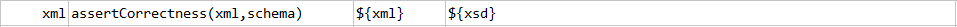
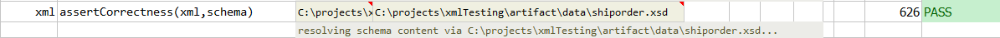

### Description
This command is used to assert the correctness of the xml against the given schema definition. Multiple schemas can be
specified as a list separated by [`nexial.textDelim`](../../systemvars/index#nexial.textDelim). This means that Nexial 
will try all specified schemas until a position conformance is reached. If no conformance can be obtained, this command
will **FAIL** the corresponding step. This can be useful when the target XML is dynamically derived from external 
sources such as API endpoint, and the said XML might belong to one of many schema during runtime.

### Parameters
- **xml** - the XML content or file
- **schema** - the schema definition (xsd) file(s) to validate against specified `xml`. Multiple XSD are separated by
  [`nexial.textDelim`](../../systemvars/index#nexial.textDelim)

### Example
**Script**: 

**Output**: 

### See Also
- [`assertElementCount(xml,xpath,count)`](assertElementCount(xml,xpath,count))
