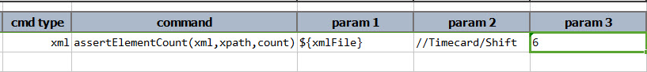
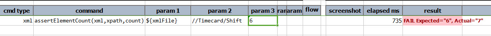

### Description
This command is used to assert the number of total elements that comes under given xpath in the given xml file.

### Parameters
- **xml** - the XML content or file
- **xpath** - the xpath that describes the target element(s)
- **count** - the expected number of elements matching the specified `xpath`

### Example
The below xml file has 7 child elements with name 'Shift' under parent element 'Timecard' 

**Script**: 

**Output**: 

### See Also
- [`assertElementNotPresent(xml,xpath)`](assertElementNotPresent(xml,xpath))
