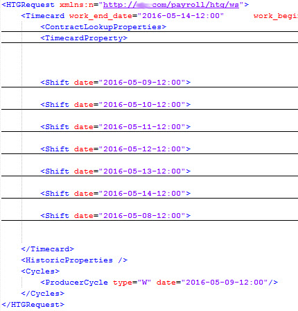
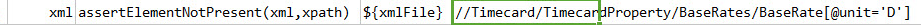

### Description
This command is used to assert that the element is not present in the given xpath in the given xml file.

### Parameters
- **xml** - the XML content or file
- **xpath** - the xpath that describes the element that MUST NOT exists in `xml`

### Example
In the below xml, the `BaseRate` element with attribute unit has the value "H". This example asserts the value 'D' 
not present.

**Script**: 

**Output**: 

### See Also
- [`assertElementPresent(xml,xpath)`](assertElementPresent(xml,xpath))