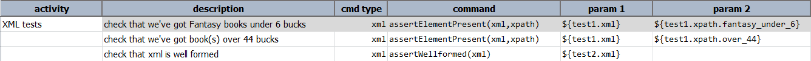
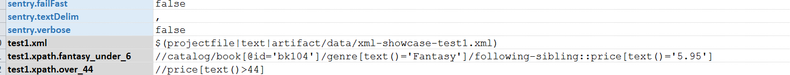
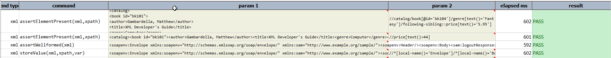

### Description
This command verifies the element in xml file based on the specified `xpath`.

### Parameters
- **xml** - this parameter is to provide full path of xml file.
- **xpath** - this parameter is to provide the content of the element to be verified.

### Example
**Script**: 

**Data File:** 

**Output**: 

### See Also
- [`assertElementNotPresent(xml,xpath)`](assertElementNotPresent(xml,xpath))
