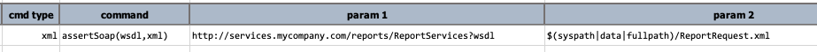
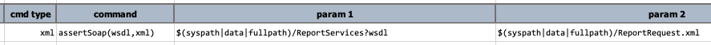

### Description
This command is used to assert that the specified `xml` conforms to the schema defined in `wsdl`. The `wsdl` parameter
can either be an URL (e.g. `http://services.mycompany.com/v1/MyServices?wsdl`) or a file location 
(e.g. `C:\projects\MyProjects\wsdl\MyServices.wsdl`). The `xml` parameter can either be a file or XML document - one 
that conforms to the SOAP-compliant request or response structure as defined in `wsdl`.

Note that:
- Per 1 WSDL, there could be multiple schemas defined. Nexial will try with all defined schemas found in the specified 
  `wsdl` when validating conformance against `xml`.
- Nexial scans and extracts XSD from specified `wsdl`. The extract XSD files are store to `output` directory.

### Parameters
- **wsdl** - the WSDL file or URL
- **xml** - the XML content or file

### Example
Validating schema conformance against a URL-backed WSDL: 

Validating schema conformance against a file-based WSDL: 

### See Also
- [`assertSoapFaultCode(expected,xml)`](assertSoapFaultCode(expected,xml))
- [`assertSoapFaultString(expected,xml)`](assertSoapFaultString(expected,xml))
- [`storeSoapFaultCode(var,xml)`](storeSoapFaultCode(var,xml))
- [`storeSoapFaultString(var,xml)`](storeSoapFaultString(var,xml))
