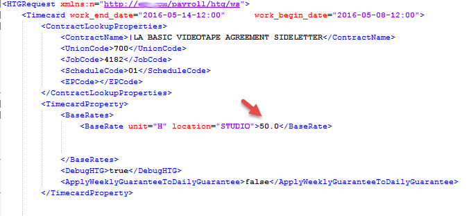
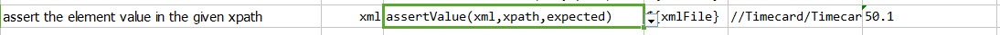
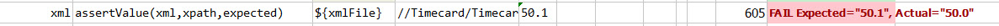

### Description
This command is used to assert the value of the element at the given xpath in the given xml file.

### Parameters
- **xml** - the XML content or file
- **xpath** - the xpath to extract value of target element
- **expected** - the expected value

### Example
In the given xml file, asserting the value of the element `BaseRate`: 

**Script**: 

**Output**: 

### See Also
- [`assertValues(xml,xpath,array,exactOrder)`](assertValues(xml,xpath,array,exactOrder))
