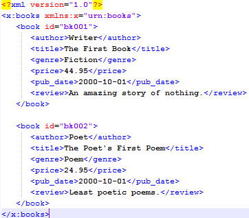
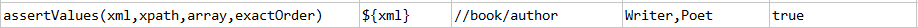
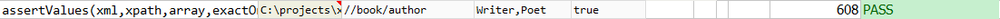

### Description
This command is used to assert the values of the xml elements are in the exact order as expected.

### Parameters
- **xml** - the XML content or file
- **xpath** - the xpath to extract value of interested XML elements
- **array** - the expected list of values
- **exactOrder** - `true` if the extracted values (via `xpath`) is expected to be in the same order as `array`

### Example
Below is the xml file used for example: 

**Script**: 

**Output**: 

### See Also
- [`assertValue(xml,xpath,expected)`](assertValue(xml,xpath,expected))
