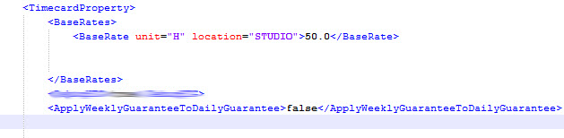
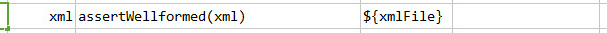
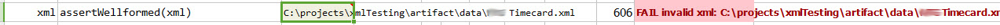

### Description
This command is used to assert if the given xml file is well formed in the structure.

### Parameters
- **xml** - the XML content or file

### Example
In the given xml file the complex element tag `<TimecardProperty>` is not properly closed.  So the assertion should 
fail. 

**Script**: 

**Output**: 

### See Also
- [`assertValue(xml,xpath,expected)`](assertValue(xml,xpath,expected))