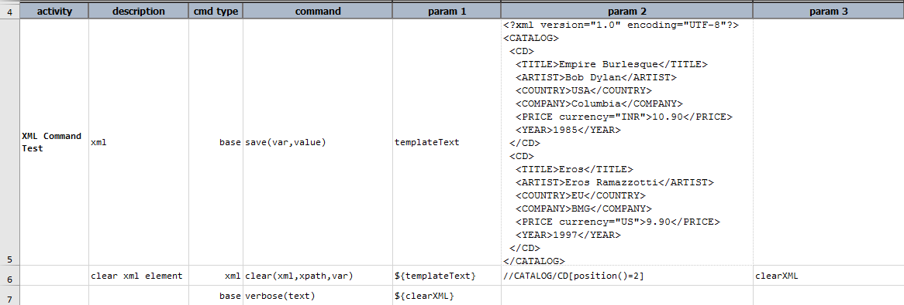
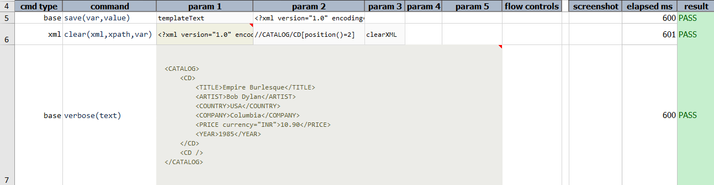

### Description
This command search against specified `xml` via `xpath`, and clear the content of all matching instances. The final 
(modified) XML is then stored in a data variable specified as `var`.

### Parameters
- **xml** - the XML document or file
- **xpath** - the XPATH to specify the target area of impact
- **var** - the variable name to store the beautified content.

### Example
Script: 

Output: 

### See Also
- [`append(xml,xpath,content,var)`](append(xml,xpath,content,var))
- [`delete(xml,xpath,var)`](delete(xml,xpath,var))
- [`prepend(xml,xpath,content,var)`](prepend(xml,xpath,content,var))
- [`replace(xml,xpath,content,var)`](replace(xml,xpath,content,var))
