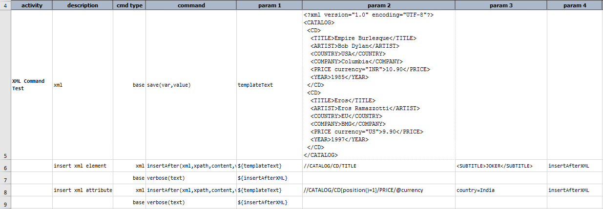
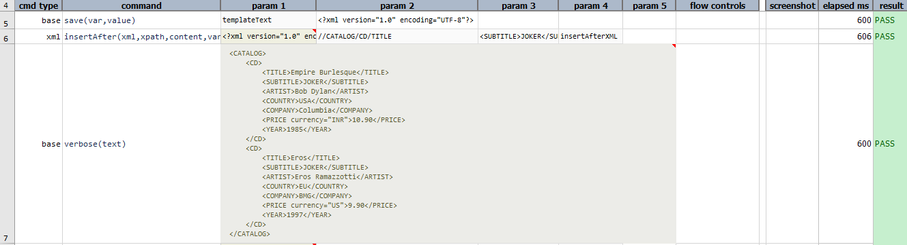
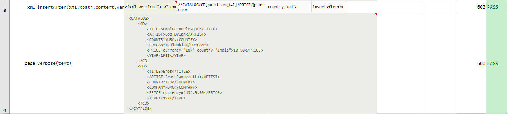

### Description
This command search against specified `xml` via `xpath`, and insert `content` after all matching instances. The final 
(modified) XML is then stored in a data variable specified as `var`. 
If specified `xpath` refers to attribute of `xml`, Nexial will insert new attribute specified via `content` for all matching instances.
`content` must be in `key=value` pair for this. If value is missing, Nexial will create attribute with empty value.

**Note**:
- Nexial doesn't support inserting multiple attributes at the same point.



### Parameters
- **xml** - the XML document or file
- **xpath** - the XPATH to specify the target area of impact
- **content** - the content to insert after, may be text content, attribute value or well formed XML snippet
- **var** - the variable name to store the beautified content.

### Example
Script: 

Output: 

### See Also
- [`append(xml,xpath,content,var)`](append(xml,xpath,content,var))
- [`clear(xml,xpath,var)`](clear(xml,xpath,var))
- [`delete(xml,xpath,var)`](delete(xml,xpath,var))
- [`insertBefore(xml,xpath,content,var)`](insertBefore(xml,xpath,content,var))
- [`prepend(xml,xpath,content,var)`](prepend(xml,xpath,content,var))
- [`replace(xml,xpath,content,var)`](replace(xml,xpath,content,var))
- [`replaceIn(xml,xpath,content,var)`](replaceIn(xml,xpath,content,var))
