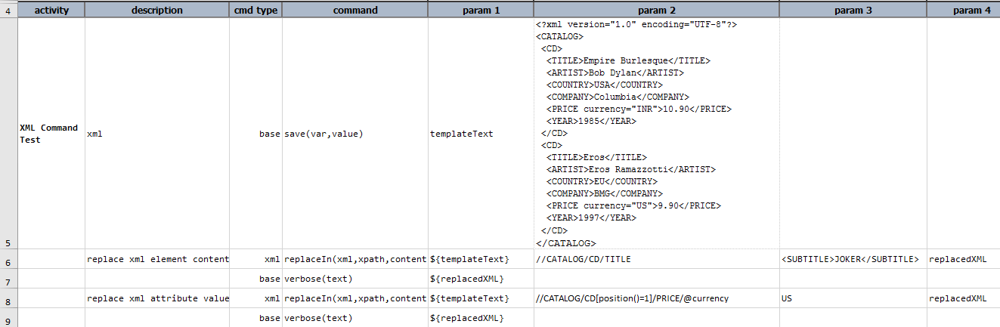
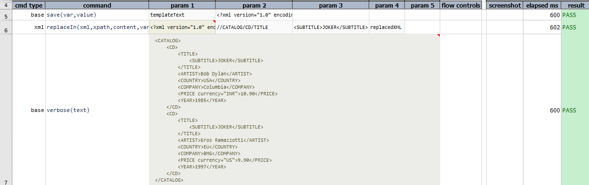
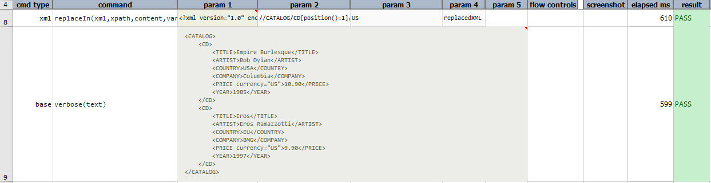

### Description
This command search against specified `xml` via `xpath`, and replace `content` against all matching instances' content. The final 
(modified) XML is then stored in a data variable specified as `var`. Note that this command replaces content of the matching 
XML nodes, not the matched nodes.  
If `xpath` refers to attribute of `xml`, it will replace value of all matching attributes with specified `content`.

### Parameters
- **xml** - the XML document or file
- **xpath** - the XPATH to specify the target area of impact
- **content** - the content to replace, may be text content, attribute value or well formed XML snippet
- **var** - the variable name to store the beautified content.

### Example
Script: 

Output: 

### See Also
- [`append(xml,xpath,content,var)`](append(xml,xpath,content,var))
- [`clear(xml,xpath,var)`](clear(xml,xpath,var))
- [`delete(xml,xpath,var)`](delete(xml,xpath,var))
- [`prepend(xml,xpath,content,var)`](prepend(xml,xpath,content,var))
- [`replaceIn(xml,xpath,content,var)`](replaceIn(xml,xpath,content,var).md)
