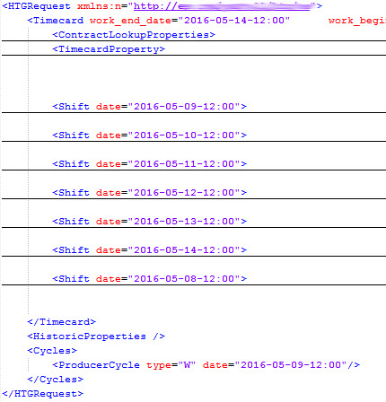
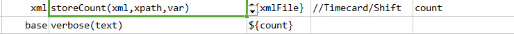
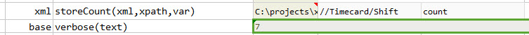

### Description
This command is used to store the number of elements present in the given xpath in the given `xml`.

### Parameters
- **xml** - the XML content or file
- **xpath** - the xpath to count number of matching XML elements
- **var** - variable to store the output value

### Example
In the below example, the number of 'Shift' elements is 7. 

**Script**: 

**Output**: 

### See Also
- [`storeValue(xml,xpath,var)`](storeValue(xml,xpath,var))
