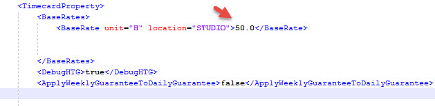
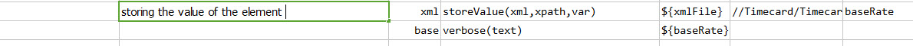
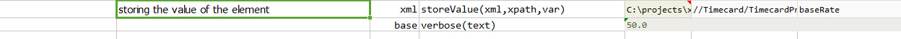

### Description
This command is used to store the value from the element with the given xpath in the given `xml` to the variable `var`.

### Parameters
- **xml** - the XML content or file
- **xpath** - the xpath to extract values of matching elements
- **var** - variable to store the matching element value

### Example
In the given example the value of the `BaseRate` element is 50.0 

**Script**: 

**Output**: 

### See Also
- [`storeValues(xml,xpath,var)`](storeValues(xml,xpath,var))
