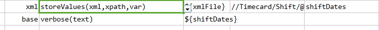
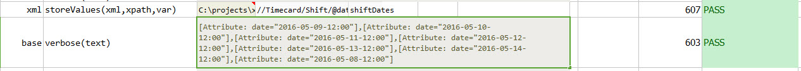

### Description
This command is used to store an array of values of the xml element which is pertaining with multiple values from 
the given xpath.

### Parameters
- **xml** - the XML content or file
- **xpath** - the xpath to extract values of matching elements
- **var** - variable to store the value of elements that match specified `xpath`

### Example
In the below given xml, the date values of all the shift elements can be retrieved using this command 

**Script**: 

**Output**: 

### See Also
- [`storeValue(xml,xpath,var)`](storeValue(xml,xpath,var))