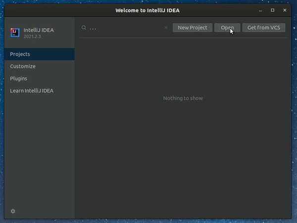
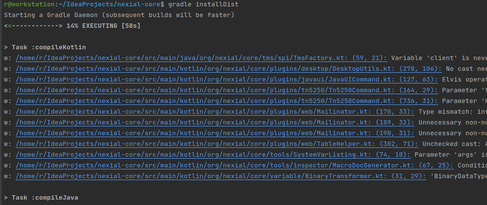
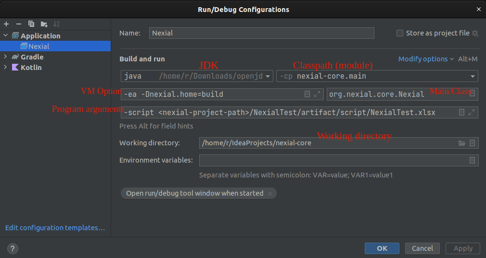

**Welcome to Nexial Automation Platform!**

This page is created to help developers set up their development environment for [`nexial-core`](https://github.com/nexiality/nexial-core) in their local machines. If you are looking for _how-to guide on Nexial Automation_ then you can refer to [this page](../userguide)

## Prerequisite
{: .no_toc }

- [JDK](https://openjdk.java.net/install/) latest version
- [IntelliJ IDEA](https://www.jetbrains.com/idea/download/) (Community Edition is sufficient)
- [gradle](https://gradle.org/install/)
- [```nexial-core```](https://github.com/nexiality/nexial-core) source code

---

## Nexial-Core Setup in IntelliJ IDEA

- Clone the [`nexial-core`](https://github.com/nexiality/nexial-core) repository & import into IntelliJ IDEA

```bash
git clone https://github.com/nexiality/nexial-core.git
```

  

- After the import is completed, open the terminal at `nexial-core` projects root location and run the command `gradle installDist`

  

- Once the build is successful, it will create a `build` directory inside the `nexial-core` projects' root directory.

## Creating nexial test project

- Follow official documentation [here](../userguide/SettingUpYourFirstProject)

## Running Nexial via IntelliJ Run Configuration

- To run the Nexial test scripts via IntelliJ's `Run Configuration` option, click on `Run > Edit Configuration > Add New` (Choose type as `Application`)
  and fill the required details like below.
  

  Note: The file paths and/or project locations may be different in your case. Please provide your local file paths.

  **Since the Nexial is now moved to Java 17, it's recommended to add below options into the IDE's VM Options of the run config. Without this, Nexial may not work as expected.**

    ```
    -ea -Dnexial.home=build
    --add-opens java.base/java.lang=ALL-UNNAMED
    --add-opens java.base/java.lang.reflect=ALL-UNNAMED
    --add-opens java.base/java.lang=ALL-UNNAMED
    --add-opens java.base/java.io=ALL-UNNAMED
    --add-opens java.base/java.util=ALL-UNNAMED
    --add-opens java.base/java.text=ALL-UNNAMED
    --add-opens java.desktop/java.awt.font=ALL-UNNAMED
    ```
