### Description

- **BAI2**  is  a  file  format  standard  developed  by  the  Banking  Administration  Institute to  enable  the 
  electronic  exchange  of  banking  data. BAI2 files come to an account holder from a bank.
- The Nexial expression `BAI2` automates parsing and validating the files with BAI2 file format.
- Read more about <a href="https://www.bai.org/docs/default-source/libraries/site-general-downloads/cash_management_2005.pdf" class="external-link" target="_nexial_link">BAI Standard Specifications (PDF)</a>.

#### BAI2 File Structure
Record types and field names that needs to be used in the `BAI2` expression:

| Record Code | Record Type | Purpose | Field Names |
| --- | --- | --- | --- |
| 01  | `File Header` | Begins File | `Record Code` `Sender ABA` `Receiver ABA` ` File Creation Date` `File Creation Time` `File ID` `Record Length` `File Block Size` `File Version Number`|
| 02  | `Group Header` | Begins Group |`Record Code` `Bank Customer Number` `Receiver ABA` `Group Status` `Effective Date` `Effective Time` `Currency Code` `Date Modifier`|
| 03  | `Account Header` | Begins Account | `Record Code` `Bank Customer Account` `Currency Code` `Summary Type Code` `Summary Amount` `Summary Item Count` `Funds Type`|
| 16  | `Transaction` | Within Account | `Record Code` `Detail Type Code` `Transaction Amount` `Funds Type` `Bank Ref Number` `Customer Ref Number` `Detail Text` |
| 49  | `Account Trailer` | Ends Account | `Record Code` `Account Control Total Amount` `Account Total Records`|
| 98  | `Group Trailer` | Ends Group | `Record Code` `Group Total Amount` `Group Total Accounts` `Group Total Records`|
| 99  | `File Trailer` | Ends File | `Record Code` `File Total Amount` `File Total Groups` `File Total Records`|

BAI2 Sample File 
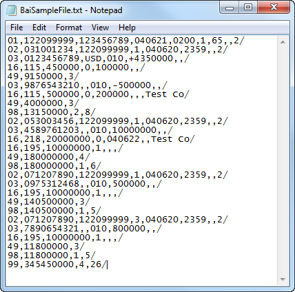

### Operations

#### `csv`
Convert the file content to CSV data type.

**Example** 
Filter all the `Transaction` records in the file and convert into `csv` data type 
Script 
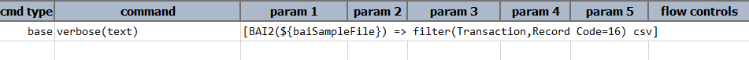

Output** 
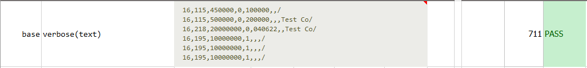

-----

#### `errors`
List out all the errors found during file validation.

-----

#### `field(recordType,name)`
List out all the values of a specific field of a specific record type. 

**Example** 
Sum all the `Group Total Amount` values from each `Group Trailer` record and assert with `File Total Amount` value from `File Trailer` record 
Script 

Output 
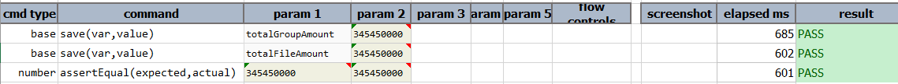

-----

#### `filter(recordType,condition)`
Filter all the matched records with given condition.

**Example** 
Filter all the `Group` blocks with `Group Status` as 1 
Script 
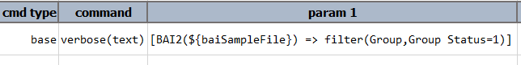

Output 
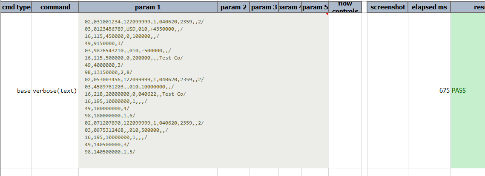

List all the `Bank Customer Account` field values in the filtered groups 
Script 
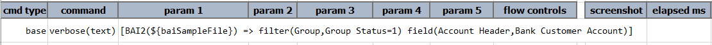

Output 
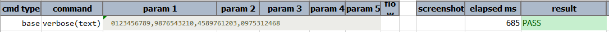

-----

#### `save(path)`
Saves the content to given file path. File path is to be specified including file name.

**Example** 
Filter all the `Group` blocks in the file and `save` the output to a file. 
Script 
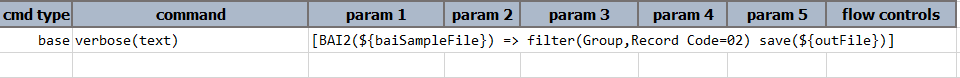

Output 
Output with filtered `Group` blocks are saved to given file `path`: 
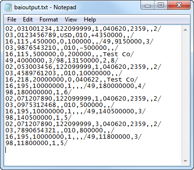

-----

#### `store(var)`
Stores the content to given variable name in memory. This variable name can be used in consecutive steps.

**Example** 
Filter all the `Transaction` records in the file and list out all the `Transaction Amount` values 
Script 
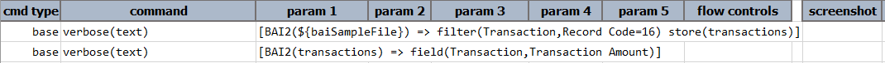

Output 
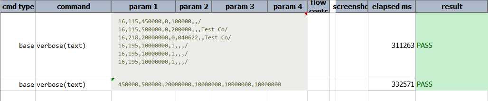

-----

