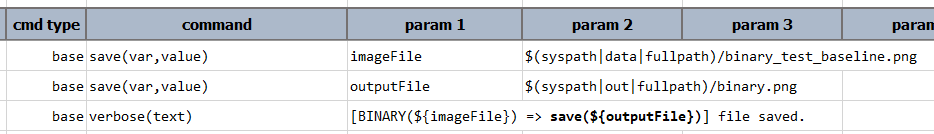
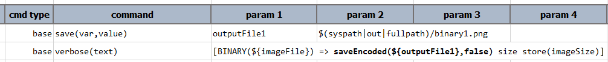
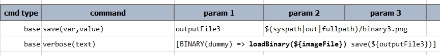

### Description
`BINARY` expression provides a set of operations related to binary data. Content such as image or encrypted data 
would be considered as binary data, and as such could possibly benefit from using this expression.

Generally speaking, binary data (zero's and one's, or hexadecimals) aren't useful to be treated as text. Quite often,
rendering binary data as characters would result in unreadable text. For such reason, `[BINARY(...)] => ... text]` will
simply return `<binary>`.

One may start this expression by pointing to an external file (such as an image file):
```
[BINARY($(syspath|data|fullpath)/image.png) => ... ]
```

Alternatively one can start from an empty BINARY expression and then load an external file via one of its operations:
```
[BINARY() => loadBase64($(syspath|data|fullpath)/secretkey.enc) ... ]
```

### Operations
#### `save(path)`
Save current binary data into a file denoted by `path`. No encoding will be performed when saving.

Example:


-----

#### `saveEncoded(path,append)`
Save current binary data into file denoted by `path`, with the option (`append`) to append or override existing file.

**Example**<br/>
Script:<br/>


-----

#### `base64encode()`
BASE64 encoding on current binary data. This effectively transforms the current expression into a 
[`TEXT` expression](TEXTexpression).

**Example**<br/>
Script:<br/>


-----

#### `size()`
The size of current binary data as a [`NUMBER` expression](NUMBERexpression).

-----

#### `loadBase64(file)`
Override current binary data with the content of the specified `file` that is BASE64 decoded and converted to binary.

**Example**<br/>
Script:<br/>


-----

#### `loadBinary(file)`
Override current binary data with the binary content of the specified `file`.

**Example**<br/>
Script:<br/>


-----

<script>jQuery(document).ready(function () { newOperationSelect(); });</script>
