### Description
The CONFIG files are simple text files with key/value pairs. The general format of the properties CONFIG file is as 
explained below:

Generally expected to be a single line of the form, one of the following: 
- `property-bame=property-value`
- `property-name:property-value`

White space that appears between the property name and property value is ignored, so the following are equivalent.
1. `name=Stephen`
2. `name = Stephen`

Also:
- White space at the beginning of the line is also ignored.
- Lines that start with the comment character `!` or `#` are ignored. Blank lines are also ignored.
- The property value is generally terminated by the end of the line. White space following the property value is not 
  ignored, and is treated as part of the property value.

  
### Operations

- Let's consider we have a properties file in the data directory, as in 
  **`C:\Projects\MyFirstProject\artifact\data\file.properties`**. 
  

#### `ascending()`
Sorts the key-value pairs in ascending order of the keys. Can also be used to sort the keys themselves. 

**Example** 
**Config File:** file.properties  

**Script:** 

**Output:** 
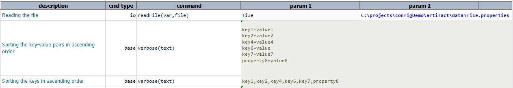

-----

#### `descending()`
Sorts the key-value pairs in descending order of the keys. Can also be used to sort the keys themselves.

**Example** 
**Config File:** file.properties 

**Script:**
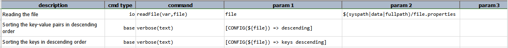

**Output:** 
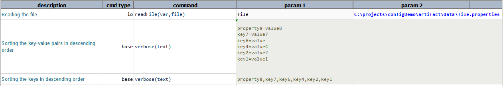

#### `keys()`
Returns all the key names as [LIST](LISTexpression).

**Example** 
**Config File:** file.properties 

Script 
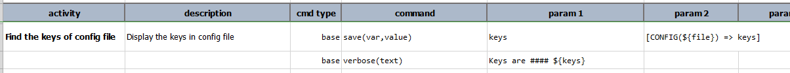

Output 
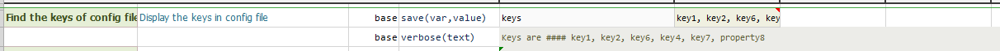

-----

#### `remove(key)`
removes the `key` and returns the updated CONFIG data.

**Example** 
**Config File:** file.properties 

Script 
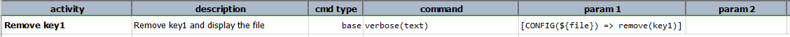

Output 

-----

#### `save(filePath)`
saves the current state of this CONFIG as a "properties" file to `filePath`.

**Example** 
**Config File:** file.properties 

Script 

Output 

-----

#### `set(key, value)`
sets `value` to the given `key` and returns the updated CONFIG data.

**Example** 
**Config File:** file.properties 

Script 
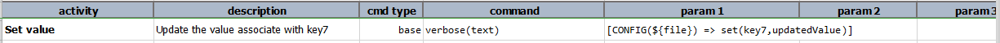

Output 

out.properties 
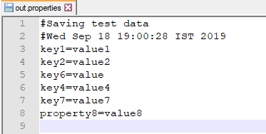

-----

#### `store(var)`
save current CONFIG expression to a data variable.  If the specified `var` exists, its value will be overwritten. 
Using this operation, one can put an expression on pause and resume it at a later time.

**Example** 
**Config File:** file.properties 

Script 
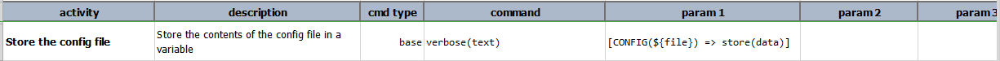

Output 
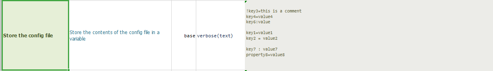

-----

#### `text()`
returns the content of the CONFIG data as text.

**Example** 
**Config File:** file.properties 

Script 
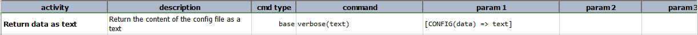

Output 
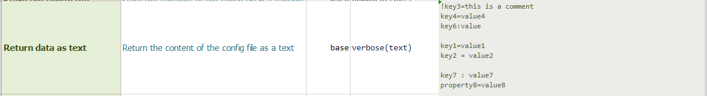

-----

#### `value(key)`
returns the corresponding value as text.

**Example** 
**Config File:** file.properties 

Script 
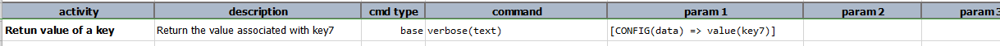

Output 

-----

