## Description
<a href="https://en.wikipedia.org/wiki/Comma-separated_values" class="external-link" target="_nexial_link">CSV, or Comma-Separated Values</a>, 
is text-based file format to store tabular data.  In many ways this file format can be viewed as a simplified, 
no-format, version of Excel.   Using this file format, one can store tabular data (i.e. 2-dimensional) of various 
types and sizes.  This expression, then, can help to manipulate a CSV file content as part of automation.

As popular as CSV has been since 
<a href="https://en.wikipedia.org/wiki/FORTRAN#FORTRAN_77" class="external-link" target="_nexial_link">FORTRAN 77</a> 
(yes, 1978), it might surprise some to know that there isn't yet a standard for it.  The closet of a standard would be 
<a href="https://tools.ietf.org/html/rfc4180" class="external-link" target="_nexial_link">RFC 4180</a>, 
which is a proposal and a formalization of CSV as a specification, but not yet accepted as specification.  As such, 
there are many, and some subtle, variations out there and many are staunchly supported by technology communities and 
companies alike. The most popular varieties of CSV would be:

- **Excel CSV** - the CSV format produced by Microsoft Excel when using its Export functionality.  In essence, such 
CSV file format:
  - uses comma as delimiter
  - uses double quote for non-numeric value
  - uses carriage return (`\r\n`) as record separator
  - regard empty lines as an empty records
  - allow subsequent lines to be longer than the first line (usually represents the header columns)        
- **RFC 4180** - the proposed CSV file submitted to IETF. Essentially, this CSV file format:  
  - uses comma as delimiter
  - uses double quote for non-numeric value
  - uses carriage return (`\r\n`) as record separator
  - regard empty lines as an empty records
- **<a href="https://en.wikipedia.org/wiki/Tab-separated_values" class="external-link" target="_nexial_link">TDF or TSV</a>** - 
  The tab-delimited format, which uses the  `TAB` character instead of comma as field value delimiter.  This is also 
  the default CSV format for MySQL export. Such format:
  - uses `TAB` character as delimiter
  - uses double quote for non-numeric value
  - uses carriage return (`\r\n`) as record separator
  - regard empty lines as an empty records
  - ignore spaces between fields

Nexial CSV expression uses the **Excel CSV as the default format**, but can be configured to handle other formatting 
subtleties (see the `parse()` operation below).


## Different ways to initiate CSV expression
An CSV expression can be initiated in various ways:

|syntax                        |explanation                                                                            |
|------------------------------|---------------------------------------------------------------------------------------|
|`[CSV(${file}) => ...]`       |Initiate a CSV expression via an external file.<br/><br/>This file can be expressed via a variable (syntax: `${var_points_to_my_csv_file}`), <br/>or as the fully qualified path (e.g. `C:\my_files\data.csv`). Such expression will read<br/>in the entire content of the specified CSV file. Note that the specified file is considered as<br/>"disconnected", meaning that changes to the CSV content will not automatically/directly affect<br/>the CSV file until a **`save()`** operation is issued.|
|`[CSV(${csv_content}) => ...]`|Initiate a CSV expression via CSV content (expressed as text).<br/><br/>The content can be expressed via a variable (syntax: `${csv_content}`).|
|`[CSV(var) => ...]`           |Continue a previously initiated CSV expression denoted by `var`.<br/><br/>Note that var **`does not`** follow the `${...}` syntax. Simply specify the variable name<br/>to instruct Nexial to resume a previously initiated CSV expression (that was saved via the<br/>**`store()`** operation). See **`store()`** operation below for more details.|

<br/>
##### **IMPORTANT: It is almost always necessary to invoke the `parse()` operation first _prior_ to other operations.**

The official CSV specification of Microsoft/CSV does not default to using header. Hence one should consider something like the following:

`[CSV(...) => parse(header=true) ... ...]`

See `parse()` below for more details.


### Operations

#### `asciiTable`
Render CSV content into a ASCII-based table. Also known/usable as 'ascii-table'. See example for details. Also, 
[`htmlTable`](#htmltable) is a related operation to generate HTML table.

**Example**<br/>
Script:<br/>
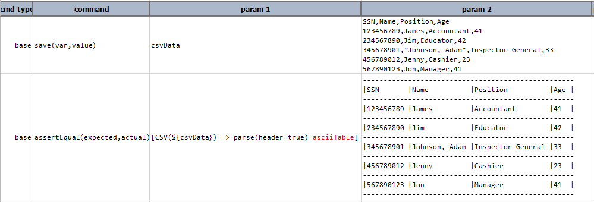

Output:<br/>
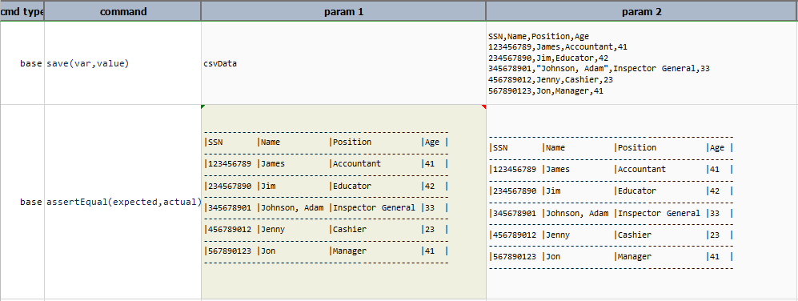

-----

#### `column(columnNameOrIndex)`
Get all the data belonging to the same column as a [`LIST`](LISTexpression). For CSV without header information, 
use column index (0-based). 

**Example**<br/>
In this example, `column(Name)` retrieves the data belonging to the corresponding column in the table. 
If `header=true` then it displays the data belonging to that column excluding the column name else if `header=false` 
then it includes column name along with the data belonging to that column as shown in the output of `column(2)` when 
header is set to true and false.

Script:<br/>
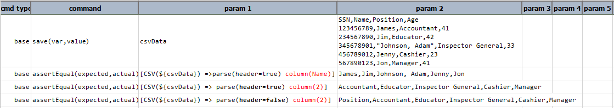

Output:<br/>
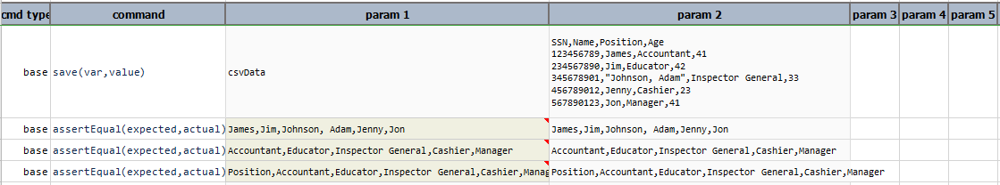

-----

#### `columnCount`
Number of columns to the current state of the CSV content.

**Example**<br/>
Script:<br/>
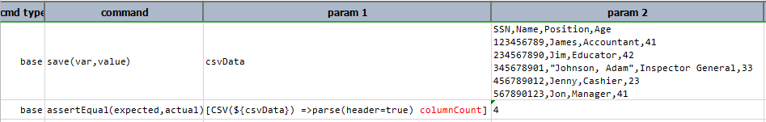

Output:<br/>
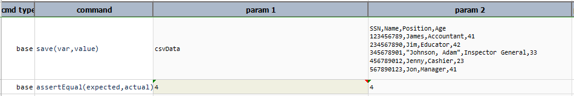

-----

#### `config` 
Convert CSV content into [`CONFIG`](CONFIGexpression) instance.

**Example**<br/>
Suppose the following CSV data:

```csv
SSN,Name,Position,Age
123456789,James,Accountant,41
234567890,Jim,Educator,42
345678901,"Johnson, Adam",Inspector General,33
456789012,Jenny,Cashier,23
567890123,Jon,Manager,41
```

By performing `config` operation data is converted into config format that is key/value pair as shown: 

 ```config
 Position=Accountant,Educator,Inspector General,Cashier,Manager
 Age=41,42,33,23,41
 SSN=123456789,234567890,345678901,456789012,567890123
 Name=James,Jim,Johnson, Adam,Jenny,Jon
 ```

Now, on this `config` instance any operation of [`CONFIG Expression`](CONFIGexpression) can be performed.
 
Script:<br/>
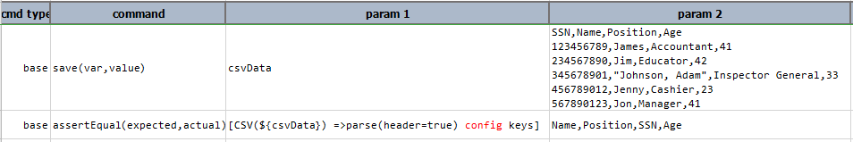

Output:<br/>
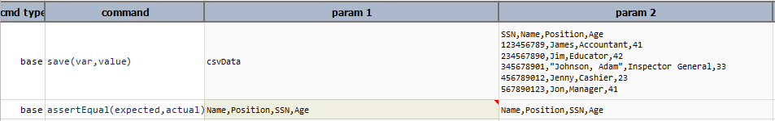

-----

#### `distinct`
Remove all duplicate rows from the CSV content.

**Example**<br/>
Script:<br/>
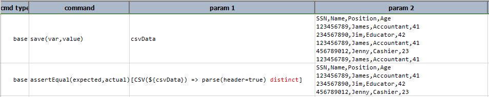

Output:<br/>
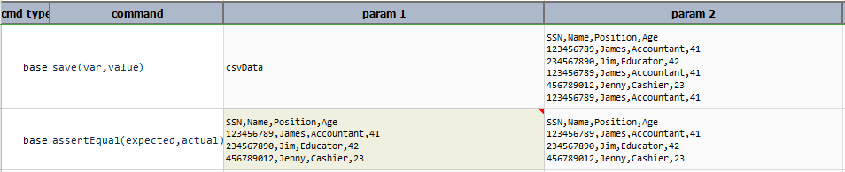

-----

#### `excel(file,sheet,startCell)`
Import CSV into the `sheet` of the specified Excel starting from `startCell` position. The cell position is 
specified using conventional Excel cell like `A3`, `P11`, from which the CSV content will be intended. If current
CSV content contains header, then it will be included in the import as the first row. Both `file` and `sheet` can
reference non-existing resources, which Nexial will create on-the-fly.

**Example**<br/>
Suppose the following csv file `csvFile.csv`:<br/>
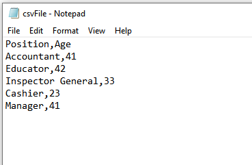

and an Excel file `Excel_Data.xlsx`, before performing `excel(file,sheet,startCell)` operation.<br/>
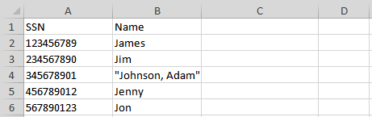

With the following script, we can add CSV content into a Excel worksheet:
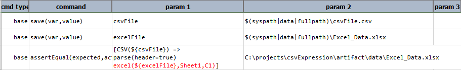

The `csv` content is added to the `excel` file, to its `Sheet1` worksheet, starting from the cell `C1`.<br/>
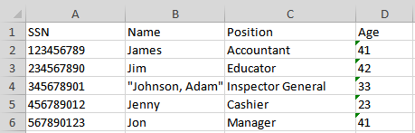

Here's the corresponding Nexial output:<br/>
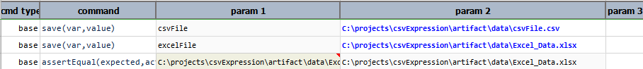 

-----

#### `fetch(conditions)`
Fetch the first row that matched the specified [conditions](../flowcontrols/filter#specification). These conditions are 
evaluated on the columns based their respective name or index. The condition follows the syntax as laid out in 
[Nexial Filter](../flowcontrols/filter).

**Example**<br/>
In this example, `fetch(Name = Jim)` displays the complete row where `Name` is equal to `Jim`. If the `condition`
specified does not exists in the data then complete expression prints as it is in the output, as shown in the output 
of `fetch(Name = Peter)`.

Script:<br/>
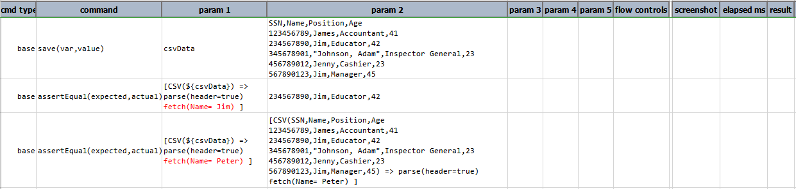

Output:<br/>
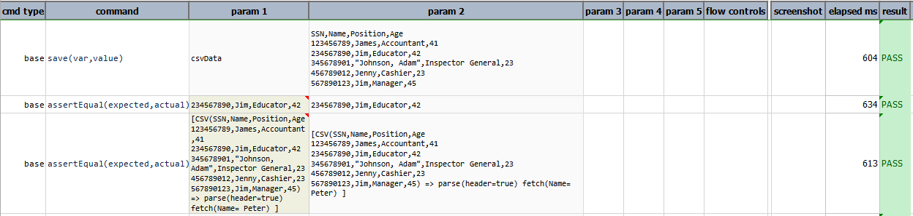 

-----

#### `filter(conditions)`
Keep only the rows that matches the specified [conditions](../flowcontrols/filter#specification). These 
[conditions](../flowcontrols/filter#specification) are evaluated on the columns based their respective name or index. One 
can use the reserved word `[ANY FIELD]` to target any field. For example, `filter([ANY FIELD] contain USA)` means 
filter a row if any of its fields contains `USA`.

**Example**<br/>
In this example, `filter(Age start with 4)` displays all the details where age starts with 4 including header. 
If the `condition` specified contains no data then only headers are displayed as a result, as shown in 
the output of `filter(Name start with A)`.   

Script:<br/>
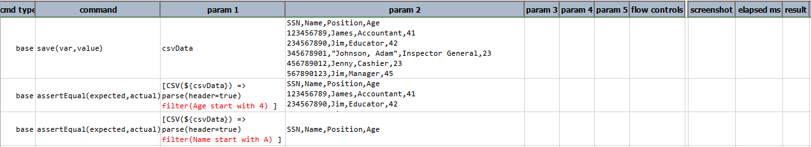

Output:<br/>
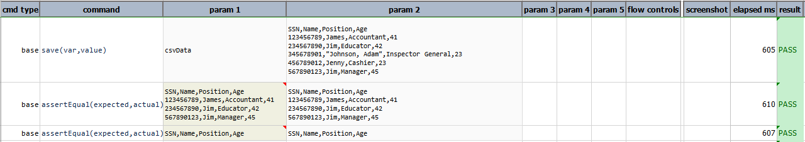

-----

#### `groupCount(columns)`
Create a new CSV using the specified column(s) and a new column (last column) as the count of occurrences. Multiple 
columns are separated by comma (`,`). The newly formed CSV will named the last column (the count) as `Count`. 

**Example**<br/>
Let's see an example. Suppose we have a [CSV file of various sales information](CSV_sample1.csv), like this:<br/>
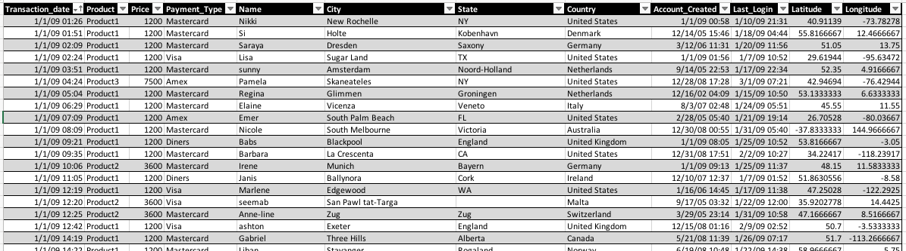<br/>

To create a CSV file that would count up the occurrences of different `Country`, we can do something like this:<br/>
`[CSV(${sample_csv}) => parse(header=true) group-count(Country) text]`

The above would parse the CSV file denoted as `${sample_csv}` and perform a "group count" on the column `Country`. 
The final CSV file looks something like this:<br/>
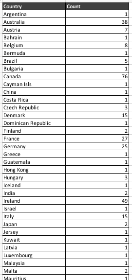

You can download the same CSV file [here](CSV_groupCount1.csv).

It is possible to include multiple columns for grouping, such as `groupCount(Country,State)`, which would yield 
results like this:<br/>
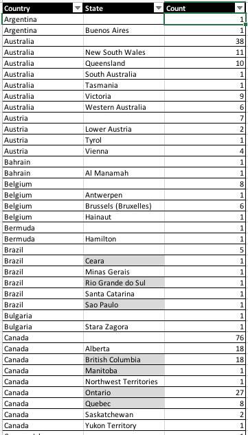

Script:<br/>
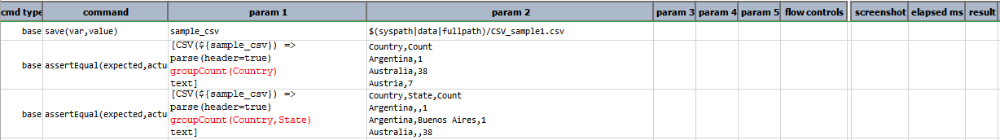

Output:<br/>
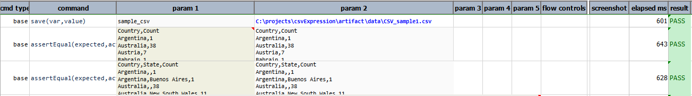

-----

#### `groupSum(columns)`
Create new CSV using the specified column(s) to group rows of same values. The last specified column is considered as 
the one holding the values to aggregate, and will be named as `Sum`.

This operation is similar to [`groupCount(columns)`](#groupcount(columns)) except, instead of counting occurrence of 
equivalent data, this operation groups the equivalent data and sums up another corresponding numeric column. In 
other words, it's akin to saying "Look at all the values in Column A, group them by their values so that equivalent 
values are in the same group. Then find the corresponding Column B (assuming numeric value) and sum up the values 
thereof by the associated group".

**Example**<br/>
Let's look at an example. Suppose we have a [CSV file of various sales information](CSV_sample1.csv):<br/>


We can group by `Country` and sum the corresponding `Price` column, like this:<br/>
`[CSV(${sample_csv}) => parse(header=true) group-sum(Country,Price) text]`

The result CSV would look something like this:<br/>
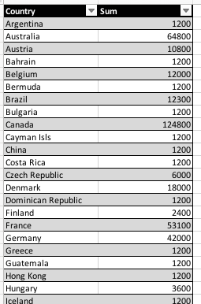<br/>

As show, the data in `Country` is grouped together and the corresponding `Price` summed by under the column named 
`Sum`. Just like `groupCount(columns)`, it is possible specify multiple columns for multi-level grouping and summing.

Note that **the last column must be the target column to sum, and it must be a "numeric" column**.

Script:<br/>
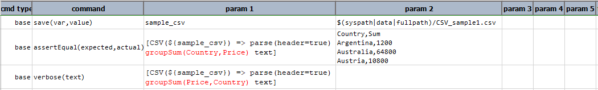

Output:<br/>
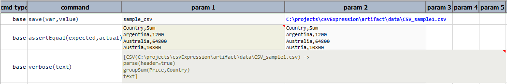

-----

#### headers
Retrieves the column names of the current CSV content as a **[`LIST`](LISTexpression)**. If current CSV is not 
parsed with `header=true`, then `null` is returned.

**Example**<br/>
This operation displays the column names only when `parse(header=true)` else complete expression is displayed.

Script:<br/>
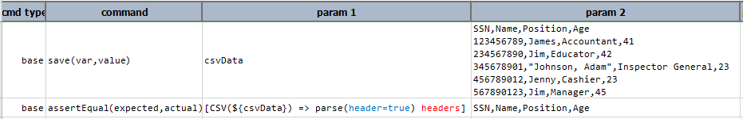

Output:<br/>
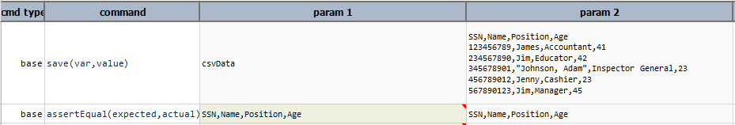

-----

#### htmlTable
Render CSV content into a HTML table. Also known/usable as `html-table`. For text-only rendering, 
consider using [`asciiTable`](#asciitable) operation instead. Let's see an example:<br/>

Suppose the following CSV:<br/>
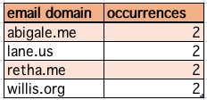

Using `[CSV(...) => html-table text]`, we can render the same CSV into something like the following:<br/>
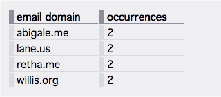

Note that some amount of CSS is needed to format the generated HTML as shown above. In this case, the CSS looks
like this:<br/>
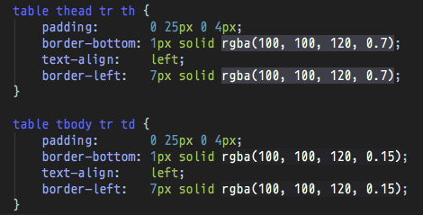

**Example**<br/>
In this example `csvData` is converted into html content and then saved to specified path `html_Output.html`.

Script:<br/>
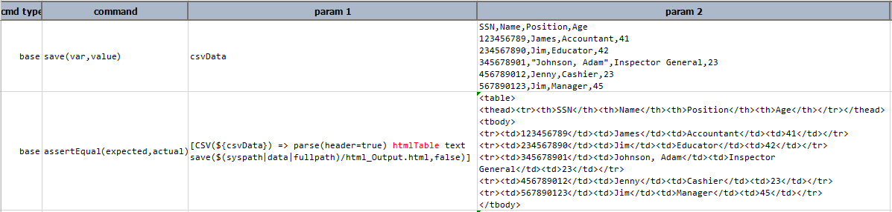

Output:<br/>
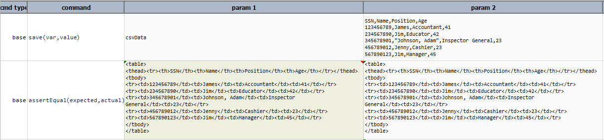

Html Output obtained by above script is stored in `html_Output.html`, which can be viewed as html document 
 or as a table in the browser. Both are as follows:<br/>
1. `html code` <br/>
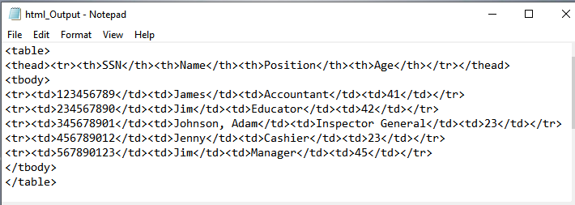

2. `html output`<br/>
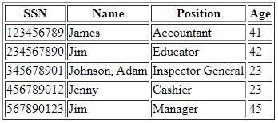

-----

#### json
Convert current state of the CSV content to a JSON document.Technically speaking, it's a JSON array (to represent rows) 
with multiple JSON document (each for one row).The CSV content in question may be one or more rows, with or without 
headers. Below are some examples of the transformation from different CSV document to JSON:

**Example**<br/>

| example            | CSV                                                   | JSON                                                  |
|+-------------------|+------------------------------------------------------|+------------------------------------------------------|
|CSV with header     | 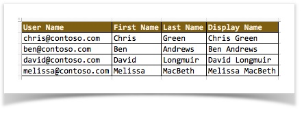 |  |
|CSV without header  | 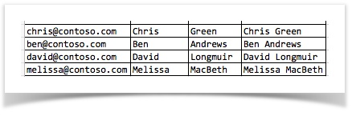 |  |
|+-------------------|+------------------------------------------------------|+------------------------------------------------------|

<br/>
As shown above, CSV with header produces JSON with names (node names), and CSV without header produces JSON array of 
array without name/label references.

Script:<br/>
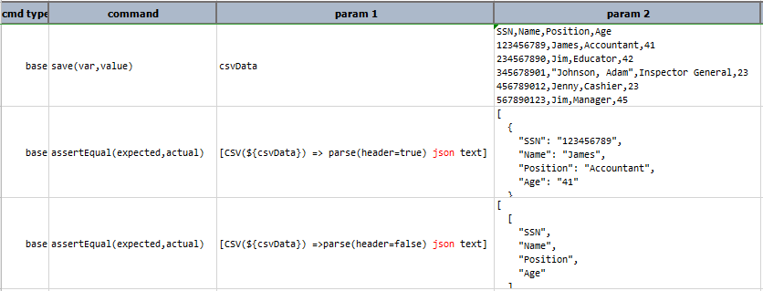

Output:<br/>
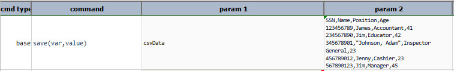
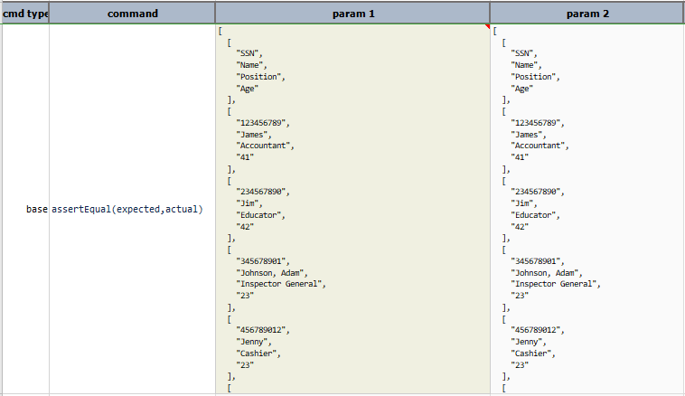
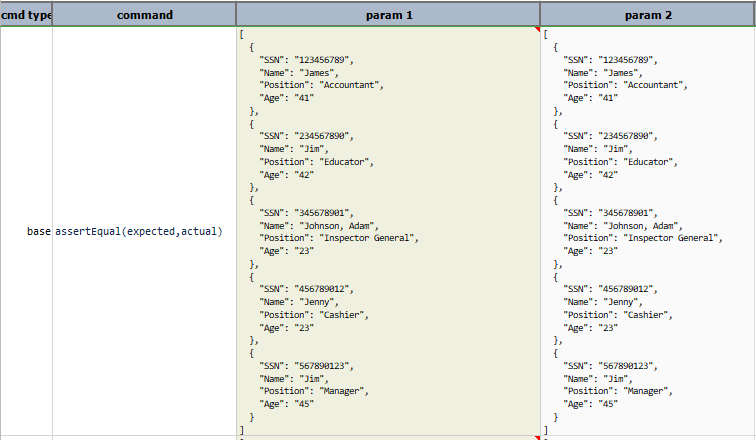

-----

#### length
Synonymous to **[`size`](#size)** and **[`rowCount`](#rowcount)**.

**Example**<br/>
If `header=false` then header is included in calculating the length or rowcount, else if `header=true` then header is 
not included in calculating the value of length as shown in this example:  

Script:<br/>
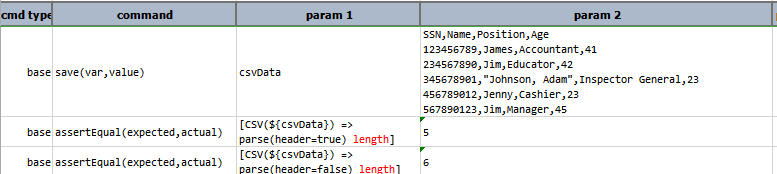

Output:<br/>
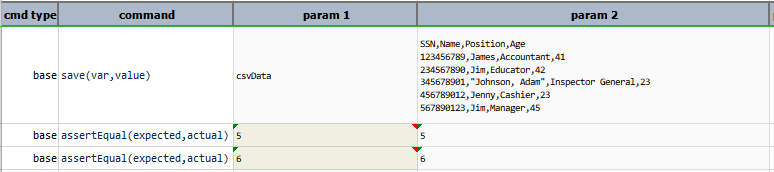

-----

#### merge(var,keyColumns)
Merge the CSV data represented by `var` into existing CSV content. The `keyColumns`, if specified, is used to merge 
the 2 CSV content in such a way that the record of the same key(s) are merged together. For merging 2 CSV content based 
on multiple "key" columns, specified these columns (1) in the order of importance, and (2) separated by 
[`nexial.textDelim`](../systemvars/index#nexial.textDelim).

In general, there are 3 uses of this operation:

1. **merge two CSV content have no header**<br/>
   In this case, records will be merged line-by-line with no regard to the data value.
   
   **Example**:<br/> 
```text
[CSV( ${csv file to merge from} ) => parse store(merge_from)]
... ...
[CSV( ${csv file to merge into} ) => parse(header=false) merge(merge_from) store(merge_into)]
```
    <table border="1" cellspacing="0" cellpadding="5">
    <thead>
    <tr>
        <th>data variable</th>
        <th>snapshot</th>
    </tr>
    </thead>
    <tbody>
    <tr>
        <td><code>csv file to merge into</code></td>
        <td>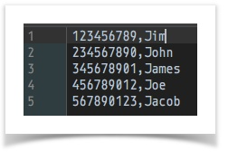</td>
    </tr>
    <tr>
        <td><code>csv file to merge from</code></td>
        <td></td>
    </tr>
    <tr>
        <td><code>merge into</code> (<b>AFTER</b> merge)</td>
        <td>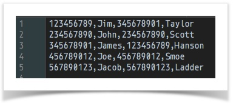</td>
    </tr>
    </tbody>
    </table>
    <br/>
   
   Script:<br/>
   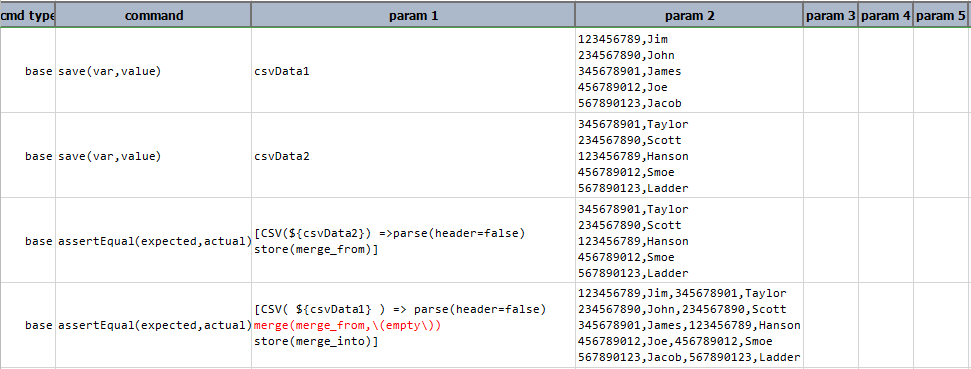
   Note that in this example **`\(empty\)`** as the `keyColumns` signifies that no shared column is between these 2 CSV 
   files. Alternatively, omit the `keyColumns` parameter entirely, as in `merge(merge_from)`.
   
   Output:<br/>
   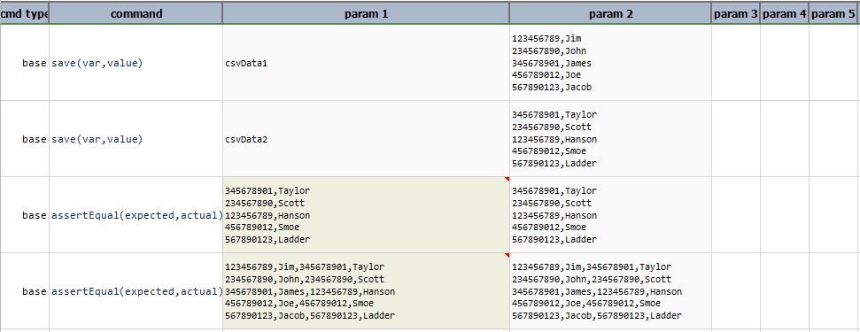

2. **merge two CSV content with headers, but without `keyColumns`**<br/>
   In this case, `header` exists in both CSV file, but they do not share any common column from the merge can be based 
   on.
   
   **Example**:<br/>
```text
[CSV( ${csv file to merge from} ) => parse(header=true) store(merge_from)]
... ...
[CSV( ${csv file to merge into} ) => parse(header=true) merge(merge_from) store(merge_into)]
```
    <table border="1" cellspacing="0" cellpadding="5">
    <thead>
    <tr>
        <th>data variable</th>
        <th>snapshot</th>
    </tr>
    </thead>
    <tbody>
    <tr>
        <td><code>csv file to merge into</code></td>
        <td>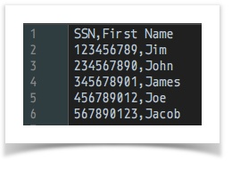</td>
    </tr>
    <tr>
        <td><code>csv file to merge from</code></td>
        <td>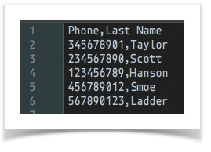</td>
    </tr>
    <tr>
        <td><code>merge into</code> (<b>AFTER</b> merge)</td>
        <td></td>
    </tr>
    </tbody>
    </table>
    <br/>
   
   Script:<br/>
   
   Note that passing  **`\(empty\)`** as the `keyColumns` signifies that no shared column is between these 2 CSV 
   files. Alternatively, omit the `keyColumns` parameter entirely, as in `merge(merge_from)`.
   
   Output:<br/>
   
   
3. **merge two CSV content with headers and share same `keyColumns`**<br/>
   In this case, header exists for both CSV data and they also share (at least) one common column whereby merge can use 
   it to align the records.
   
   **Example**<br/>
```text
[CSV( ${csv file to merge from} ) => parse(header=true) store(merge_from)]
... ...
[CSV( ${csv file to merge into} ) => parse(header=true) merge(merge_from,SSN) 
                                        store(merge_into)]
```
    <table border="1" cellspacing="0" cellpadding="5">
    <thead>
    <tr>
        <th>data variable</th>
        <th>snapshot</th>
    </tr>
    </thead>
    <tbody>
    <tr>
        <td><code>csv file to merge into</code></td>
        <td></td>
    </tr>
    <tr>
        <td><code>csv file to merge from</code></td>
        <td></td>
    </tr>
    <tr>
        <td><code>merge into</code> (<b>AFTER</b> merge)</td>
        <td></td>
    </tr>
    </tbody>
    </table>
    <br/>
   Notice that the merged CSV is matching up the First Name and Last Name based on `SSN`, even though the order of these 
   `SSN` are not the same.

   Script:<br/>
   
   
   Output:<br/>
   
 
4. (more like _3a_) **merge two CSV content with headers and share multiple `keyColumns`**<br/>
   Similar to the above usage, Nexial also supports the merging of 2 CSV content with multiple key columns.  As such,
   both CSV content will be sorted against the specified key columns before the content are merged together. Consider
   the following example:<br/>
   
   Script:<br/>
   
   
   Output:<br/>
   In the first example (line 4), we are merging two CSV content using `SSN`, `First Name`, and `Last Name`. The output
   for this command looks like this:<br/>
   <br/>
   
   In the second example (line 5), we mare merging the same two CSV content using `Last Name`, `First Name` and then 
   `SSN`. Note that the key columns affected the sorting order:<br/> 
   <br/>
   <br/>
   Observe that the order of the merged CSV content is different than the previous output.
 
-----

#### parse(config)
(Re)Parse current CSV data with consideration towards the specified configurations. By default, Nexial uses the Excel 
CSV (see [above](#description)) as the file format to parse a CSV file. Using this operation, one can change the way a 
CSV file is parsed. The `config` will be specified in the form of:
1. `name=value|name=value|name=value|...`
2. `name=value,name=value,name=value,...`

  - **`delim`** - the character (single) to use as separator between field values. For example, `delim=\,` would use 
    comma as delimiter, `delim=;` would use semi-colon as delimiter. Default is comma (`,`). Nexial also support 
    auto-detection of delimiter, so you can omit `delim` to simplify your automation. 

  - **`quote`** - the character (single) to use to wrap non-numeric (such as text) values. Default is double quote.
    `quote='` would force Nexial to consider single quote as the "wrapping" for non-numeric values. Nexial also 
    supports auto-detection of value quoting, so you ca omit quote to simplify your automation.

  - **`header`** - true or false to signify if the first line should be treated as column names. If `header=false`, 
    then field values can only be referenced by index (zero-based). Default is `false`.

  - **`recordDelim`** - determine the character(s) between 2 records. Default is carriage return (`\r\n`). Nexial 
  supports auto-detection of line delimiter, so you can omit `recordDelim` to simplify your automation.

  - **`maxColumns`** - instruct Nexial to allocate beyond the default max columns (512) in order to process very wide
    CSV file. Note that changing this value will have both memory footprint and performance implication. This setting
    is usually not needed.
    
  - **`maxColumnWidth`** - instruct Nexial to allocate beyond the default max column width (4096) in order to process 
    column(s) with lots of characters. Note that changing this value will have both memory footprint and performance 
    implication. This setting is usually not needed.
    
  - **`trim`** - instruct Nexial to retain or trim of any leading and/or trailing whitespaces per parsed value. By 
    default, Nexial will trim each parsed value so <code>&nbsp;California </code> would be stored as `California`.
    The `trim` option is by default `true`. But at times it is critical to retain all the data found from its original 
    sources. As such, one can specify `trim=false` to retain leading/trailing whitespaces.

  - **`keepQuote`** - instruct Nexial to retain the double quotes around the column data even if they are not necessary. 
    By default Nexial will remove the double quotes around the data of a field unless they are deemed necessary such as
    the case for `"Johnson, Pete"` or `"San \"May-Eye\"'s Spot"`. By setting `keepQuote` as `true`, Nexial will retain
    the double quotes as found on the initial CSV data.

**Example**<br/>
`[CSV(${text}) => parse(delim=\|, header=true, recordDelim=\r\n, trim=true, keepQuote=true) text upper]` would read:
1. convert text into a CSV component, using the default Excel CSV format.
2. re-parse the same text but this time using **`|` as the field delimiter**, the 
  **carriage return (DOS) as the record/row delimiter** and treat the **first line as the header**. Note that 
  comma needs to be escape since it is also used as a parameter separator. Hence `delim=\|`.
3. `trim` removes all the leading and/or trailing whitespaces.
4. `keepQuote` retain the double quotes of field `country` as nexial will remove these quotes by default.
5. `text` convert the CSV component into text and then `upper` operation of text expression is performed on it.

Script:<br/>


Output:<br/>


-----

#### removeColumns(namesOrIndices)
Remove the entire column qualified via namesOrIndices parameter, which can be a list of column names or column 
positions (zero-based). Multiple columns are separated by comma (`,`).

**Example**<br/>
Script:<br/>


Output:<br/>


-----

#### removeRows(conditions)
Remove all rows that meet the specified [conditions](../flowcontrols/filter#specification). For example, consider the 
following CSV file:<br/>


**`[CSV(${csv_file}) => removeRows(city = Scottsdale|raisedAmt < 200000)]`** would remove all the rows where city is 
`Scottsdale` and `raisedAmt` is less than `200000`. The result should look like this:<br/>


One can use the reserved word `[ANY FIELD]` to target any field. For example, `removeRows([ANY FIELD] contain USA)` 
means remove a row if any of its fields contains `USA`.

The `conditions` parameter follows the syntax as laid out in [Nexial Filter](../flowcontrols/filter).

Alternatively, one can also remove one or more rows based on the rows' index. Row index is 0-based.

**Example**<br/> 
Suppose we have the following CSV file:
```csv
User Name,First Name,Last Name,Display Name,Job Title
chris@contoso.com,Chris,Green,Chris Green,Manager
ben@contoso.com,Ben,Andrews,Ben Andrews,Director
david@contoso.com,David,Longmuir,David Longmuir,Vice President
cynthia@contoso.com,Cynthia,Carey,Cynthia Carey,Senior Director
melissa@contoso.com,Melissa,MacBeth,Melissa MacBeth,Supervisor
```

`[CSV(${csv}) => parse(header=true) removeRows(3,2,0) text]` would yield:
```csv
User Name,First Name,Last Name,Display Name,Job Title
ben@contoso.com,Ben,Andrews,Ben Andrews,Director
melissa@contoso.com,Melissa,MacBeth,Melissa MacBeth,Supervisor
```

However, `[CSV(${csv}) => parse(header=false) removeRows(3,2,0) text]` would yield:
```csv
chris@contoso.com,Chris,Green,Chris Green,Manager
cynthia@contoso.com,Cynthia,Carey,Cynthia Carey,Senior Director
melissa@contoso.com,Melissa,MacBeth,Melissa MacBeth,Supervisor
```

Note that CSV parsed without header would yield the first line as row `0`.

Script:<br/>


Output:<br/>


-----

#### renameColumn(find,replace)
Rename a column, as defined by `find`, with new value as defined by `replace`. The column position is maintained.

**Example**<br/>
In this example, column name `Position` is changed to `Title`.

Script:<br/>


Output:<br/>


-----

#### render(template)
Generate text based on the infusing of CSV data and a designated "template".  

**Example**<br/>
Suppose:
1. We have a CSV file with the following content:<br/>
csvData.txt:<br/>


2. We want to convert it (in reality, expand) to lines of text where each line represents one single record "merged", 
   like:
   <pre>Here is <b>Tempe, AZ office</b>, which is located in <b>51 w 3rd st #105, Tempe AZ 85182 USA</b>, we call ourselves <b>PHX</b>.</pre>

THEN we can use the following as the "template":
<pre>Here is <b>${description}</b>, which is located in <b>${fullAddress}</b>, we call ourselves <b>${code}</b>.</pre>

template.txt:<br/>


HENCE the expression `[CSV(${file}) => parse(...) render(${template})]` would yield:<br/>

Nexial works behind the scene to replace each token (data variable) found in the template with record data found in 
each CSV record. For as many records as there are, Nexial will perform the same "merge" to produce many lines of text.

Script:<br/>


Output:<br/>


-----

#### replaceColumnRegex(searchFor,replaceWith,columnNameOrIndices)
For the specified column (by name or by position), search for `searchFor` regular expression and replace matches by 
`replaceWith`. Regex group supported.

**Example**<br/>
`[CSV(${...}) => parse(...) replaceColumnRegex((\d+)(\d\d),$1.$2,1)]` 
would search in the 2nd column of the CSV for a match against the pattern "a series of at least 3 consecutive digits" 
and replace it with the same digits with a decimal point place just before the second-to-last digit. In other words, 
`12345` would become `123.45`.

The parameter `columnNameOrIndices` may be expressed as `*` to indicate **ALL** columns. As such, Nexial would apply the
intended search-and-replace routine against all columns of the target CSV.

Script:<br/>


Output:<br/>


-----

#### retainColumns(columnNamesOrIndices)
Retain only the specified columns (by name or by position, separated by commas) in a CSV. Think of this operation as 
the opposite of `removeColumns(namesOrIndices)`. Any incorrectly referenced columns will be ignored.

The parameter `columnNameOrIndices` may be expressed as `*` to indicate **ALL** columns. As such, Nexial would 
essentially perform a "no-op" since all the columns would be retained.

**Example**<br/>
In this example, `retainColumns(Name,Position)` retrieves column `Name` and `Position`, `retainColumns(0,1)`
retrieves column at index `0` and `1` and `retainColumns(*)` retrieve all the columns of `csvData`.

Script:<br/>


Output:<br/>


-----
 
#### row(index)
Retrieves one row of data as a **[`LIST`](LISTexpression)**. `index` is zero-based. If `index` is not valid or too 
large, then null will be returned.

**Example**<br/>
The `index` must be present in the given `csvData`. If index is not present in the csvData then complete
expression is printed as shown in the example of `row(10)`.

Script:<br/>


Output:<br/>


-----

#### rowCount
Number of rows to the current state of the CSV content. Synonymous to **[`size`](#size)** and **[`length`](#length)**.

**Example**<br/>
Script:<br/>


Output:<br/>


-----

#### pack
Remove all empty rows from current CSV content. This could either be blank lines or lines with only field delimiter 
(such as comma).

**Example**<br/>
Script:<br/>


Output:<br/>


-----

#### save(file,append)
Save current CSV content to `path`. If `path` resolves to an existing file, `append` set as `true` will append current 
CSV content to the said file. `append` is optional and defaults to `false`.

**Example**<br/>
In this example,
1. `csvData` is sorted in ascending order using **[`sortAscending`](#sortascendingcolumn)**
2.  then sorted data is saved to specified path `Sample.csv`

Script:<br/>


Output:<br/>


Sample.csv:<br/>


-----

#### saveRowData(rowIndex)
Save the row data corresponding to the specified `rowIndex` as data variable. The corresponding header names are treated
as data variable names. Note that this operation can only be operated on CSV data that are [parsed](#parseconfig) with 
header.

**Example**<br/>
In this example, `saveRowData(1)` store values of that row in the corresponding header. If 
the specified row index does not exist as in the example `saveRowData(6)` then it takes previous values of 
the variable.

Script:<br/>


Output:<br/>


-----

#### size
Retrieves the number of rows in current CSV content. Synonymous to **[`rowCount`](#row(index))** and 
**[`length`](#length)**.

**Example**<br/>
Script:<br/>


Output:<br/>


-----

#### sortAscending(column)
Sort the entire CSV content by the specified column, in ascending order. Note that the target **CSV MUST HAVE HEADERS**!

**Example**<br/>
Script:<br/>


Output:<br/>


-----

#### sortDescending(column)
Sort the entire CSV content by the specified column, in descending order. Note that the **TARGET CSV MUST HAVE HEADERS**!

**Example**<br/>
Script:<br/>


Output:<br/>


-----

#### store(var)
Save current CSV expression (including content) to a data variable. If the specified var exists, its value will be 
overwritten. Using this operation, one can put an expression on pause and resume it at a later time.

**Example**<br/>
In this example,
1. `filter(Age start with 4)` retrieves all the row having age in the range of 40's
2. `store(Data)` save all the retrieved rows
3. `sortDescending(Age)` sort the data stored in the `Data` variable

Script:<br/>


Output:<br/>


-----

#### surround(parameters)
Surround the data of all target columns with specified character(s). The `parameters` has 2 parts: 
1. The character(s) to use to surround the column data, such as `"`, `'` or `:: `. The specified character(s) will be 
   added to the beginning and end of the matching column. Note that if the target column data is already surrounded with
   the specified characters, Nexial will ignore such column.
2. The target columns to be affected. These can be specified either by column position (0-based) or column names (must 
   be parsed via `parse(header=true)`). If all columns are targeted, one may use `*` to represent all columns.

The result of this operation will yield [TEXT](TEXTexpression) data.

**Examples**

Consider the following CSV file:
```csv
SSN,Name,Position,Age
123456789,James,Accountant,41
234567890,Jim,Educator,42
345678901,"Johnson, Adam",Inspector General,33
456789012,Jenny,Cashier,23
567890123,Jon,Manager,41
```

- **Example 1**: `[CSV(${csv}) => parse(header=true) surround(",1,2)]` yields:
```csv
SSN,Name,Position,Age
123456789,"James","Accountant",41
234567890,"Jim","Educator",42
345678901,"Johnson, Adam","Inspector General",33
456789012,"Jenny","Cashier",23
567890123,"Jon","Manager",41
```
Since column positioning is 0-based, `1,2` means second and third column. Nexial is not surrounding `"Johnson, Admin"` 
with double quote since it is surrounded by double quote.

Script:<br/>


Output:<br/>


- **Example 2**: `[CSV(${csv}) => parse(header=true) surround(',Name,Age)]` yields:
```csv
SSN,Name,Position,Age
123456789,'James',Accountant,41
234567890,'Jim',Educator,'42'
345678901,'"Johnson, Adam"',Inspector General,'33'
456789012,'Jenny',Cashier,'23'
567890123,'Jon',Manager,'41'
```
Since the specified columns were not surrounded with single quote, all the specified columns are now surround with 
single quote.

Script:<br/>


Output:<br/>


- **Example 3**: `[CSV(${csv}) => parse(header=true) surround( ,*)]` yields:
```csv
SSN,Name,Position,Age
 123456789, James , Accountant , 41
 234567890, Jim , Educator , 42
 345678901, "Johnson, Adam" , Inspector General , 33
 456789012, Jenny , Cashier , 23
 567890123, Jon , Manager , 41
```
`*` means all columns.

Script:<br/>


Output:<br/>


- **Example 4**: `[CSV(${csv}) => parse(header=false,keepQuote=true) surround(",2)]` yields:
```csv
SSN,Name,"Position",Age
123456789,James,"Accountant",41
234567890,Jim,"Educator",42
345678901,"Johnson, Adam","Inspector General",33
456789012,Jenny,"Cashier",23
567890123,Jon,"Manager",41
```
Since this CSV was parsed with `header=false` and `keepQuote=true`, the first row is considered part of CSV data and
`"Johnson, Adam"` still has the double quotes around it.

Script:<br/>


Output:<br/>


-----

#### text
Transform the current CSV data to text. This would be the plain text rendition of the CSV content. Note that the 
latest CSV format as specified via the **[`parse(config)`](#parse(config))** operation is observed and will affect the 
text output.

Script:<br/>


Output:<br/>


-----

#### transpose
Transpose current CSV content so that row datas are displayed as column data, and column's as row's.

Script:<br/>


Output:<br/>


-----

#### xml(root,row,cell)
Convert current state of the CSV content to a XML document. It's a 2-level XML document, with the first level 
representing 'rows' and second level 'one row'. The first level node name is specified through `root` parameter while 
the second level node name is specified through row `parameter`. For each column, `cell` is used to specify its node 
name. It is possible to omit any of the `root`, `row`, `cell` specification - simply use a space to use the default 
shown below:
  - `root` - default node name is rows
  - `row` - default node name is row
  - `cell` - default node name is cell

**Examples**:<br/>
**`[CSV(${csv_file}) => XML( , , )]`** would transform a CSV file to a XML document where the root node is rows, the 
next level node name is row and each of its element is named as cell. 

The CSV content in question may be one or more rows, with or without headers. Here is an example of transforming from 
one CSV document (with header) to a XML document (for example, **`[CSV(${csv_file}) => XML(team,members,member)]`**):<br/>
<br/>


The generated XML document has 'team' has the `root` node name (which represent all rows), 'members' as the node name 
that encapsulate each row and 'member' as the node name that represents each cell. In addition, an attribute is 
generated to reference the column name (e.g., User Name, Address, etc.) and another attribute named index is also 
generate to represent the column position of each cell value.

In contrast, transforming a CSV content without header to a XML document would look a bit differently. Below is 
an example of using **`[CSV(${csv_file}) => XML( , , ,)]`**:

<br/>
<br/>
As shown above, the column names are missing and default node names are applied.

Script:<br/>


Output:<br/>


---

### Examples

**Example 1: Using filter to limit the rows of a CSV file.**
- For more details about initializing a CSV structure, please read the section on 
  [Initiate CSV expression](CSVexpression#different-ways-to-initiate-csv-expression).
- For more details about filter condition, please read [Nexial Filter](../flowcontrols/filter).

Suppose a file named expression-example1.csv exists in the artifact/data directory with the following content:	   


We can use the `filter()` operation to limit the rows of this CSV file. Here are 3 examples of filter applied to the same 
file:


Note that the [`parse(config)`](#parse(config)) operation is only invoked one (2nd line). Using the 
[`store(var)`](#store(var)) operation, we can reuse the CSV structure (in 3rd and 4th line). In this example, we 
assigned `myCSV` to the parsed CSV structure in line 2.
- The first filter operation limits to rows where the column `First Name` is exactly `David`. In this case, there 
  should only be 1 row (row 3 of the input CSV file) matched.
- The second filter operation limits to rows where the column Mobile Phone contains `-6641` **AND** the column `Fax` 
  ends with `9825`. The row 1 of input CSV file contains `123-555-6641` in its `Mobile Phone` column - this is the 
  only match for the first condition. However this same line does not match the second condition (`Fax` ends with 
  `9825`). Hence this filter yields no rows matched.
- The third filter operations limits to rows where **any field** ends with `3`. As such we see that row 3 of the 
  input CSV file is a match since its `Office Phone` ends with 3 and its Fax ends with 3 (either match would suffice). 
  Other than that there isn't another match.

Here's the output that depicts the same analysis above:


`filter2.txt` is empty, as expected. Here's the content of `filter1.txt` and `filter3.txt`, respectively.
<br/>


---

<script>jQuery(document).ready(function () { newOperationSelect(); });</script>
