### Description
DATE provides operations related to formatting or manipulating a date.  To use this Nexial expression, one would start 
by specifying a **DATE** instance with one of the following:

- **`[DATE({date}) => ... ...]`** \- start a new **DATE** instance using standard date format **`MM/dd/yyyy HH:mm:ss`**.
  For example, `[DATE(04/01/2017 05:43:11) => ...])` starts a Nexial expression on a date of April 1st, 2017 5:43:11 AM. 
- **`[DATE(now) => ... ...]`** or **`[DATE(right now) => ... ...]`** \- start a new **DATE** instance assuming 
  standard date format **`MM/dd/yyyy HH:mm:ss`** and using current date/time.
- **`[DATE({date},{format}) => ... ...]`** \- start a new **DATE** instance using the specified date format.  The 
  date/time formatting follows 
  <a href="http://docs.oracle.com/javase/8/docs/api/java/text/SimpleDateFormat.html" class="external-link" target="_nexial_external">the standard Java date/time convention</a>. 
  For example, `[DATE(2017/04/01,yyyy/MM/dd) => ...]` starts a Nexial expression on a date of April 1st, 2017.  
  Technically such date is implicitly set to a time of 00:00:00.
- **`[DATE({date},epoch) => ... ...]`** \- start a new **DATE** instance assuming the specified date value is an 
  <a href="https://en.wikipedia.org/wiki/Unix_time" class="external-link" target="_nexial_external">epoch</a> 
  (or timestamp). 

### Operations

#### `addDay(days)`
Add `days` to the current _day_ part of the date instance.

**Example** 
Script 
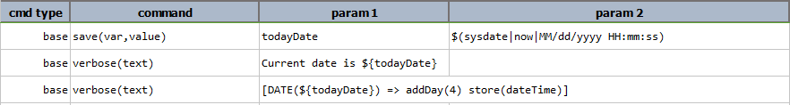

Output 
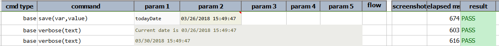

-----

#### `addHour(hours)`
Add `hours` to the current _hour_ part of the date instance.  Note that the value represents 

**Example** 
Script 
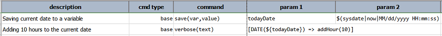

Output 
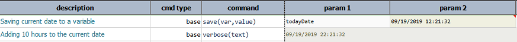

-----

#### `addMinute(minutes)`
Add minutes to the current minute part of the date instance.

**Example** 
Script 
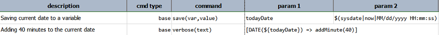

Output 
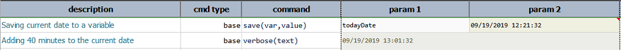

-----

#### `addMonth(months)`
Add months to the current month part of the date instance.

**Example** 
Script 
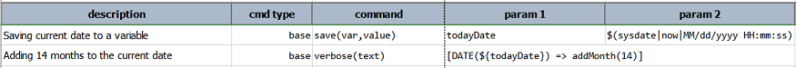

Output 
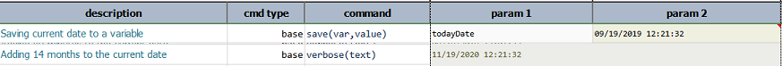

-----

#### `addSecond(second)`
Add seconds to the current second part of the date instance.

**Example** 
Script 
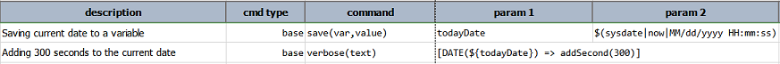

Output 
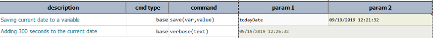

-----

#### `addYear(years)`
Add years to the current year part of the date instance.

**Example** 
Script 
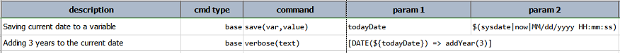

Output 
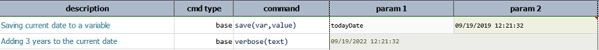

-----

#### `format(targetFormat)`
Transform the same date instance into another textual form, using the specified  targetFormat. 
Use epoch to format date as timestamp. Use informal to format date in colloquial, non-exact manner that mimic human 
conversation. For example, informal format would output about a minute ago instead of 00:00:57, or about a month and a 
half ago rather than 2018/08/24 00:01:32. The informal format is suitable to use in conjunction with the 
sound » speak(text) command.

**Example** 
Script 
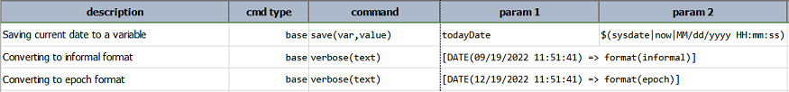

Output 
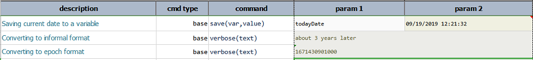

-----

#### `setDay(days)`
Set the day part of the date instance.

**Example** 
Script 
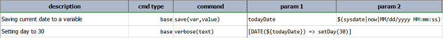

Output 
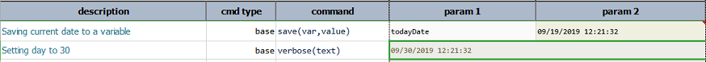

-----

#### `setDOW(days)`
Set the day of the week part of the date instance.  Use the numeric value mapped to the day of the week: 1=SUNDAY, 
2=MONDAY, 3=TUESDAY, 4=WEDNESDAY, 5=THURSDAY, 6=FRIDAY, 7=SATURDAY.

**Example** 
Script 
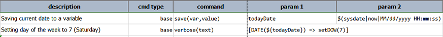

Output 

-----

#### `setHour(hours)`
Set the hour part of the date instance.  Note that the value represents the 24-hour system (i.e. 22 means 10 p.m.).

**Example** 
Script 

Output 
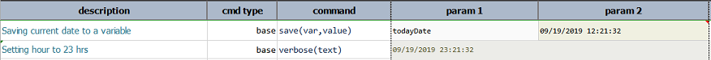

-----

#### `setMinute(minutes)`
Set the minute part of the date instance.
 
**Example** 
Script 
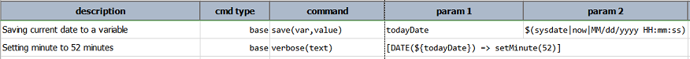

Output 
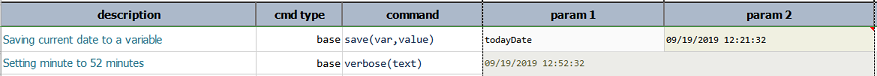

-----

#### `setMonth(months)`
Set the month part of the date instance.

**Example** 
Script 
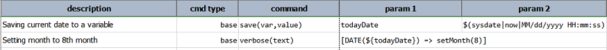

Output 
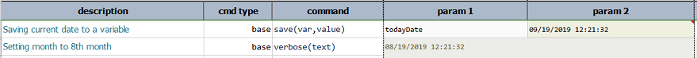

-----

#### `setSecond(seconds)`
Set the second part of the date instance.

**Example** 
Script 
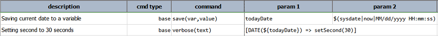

Output 
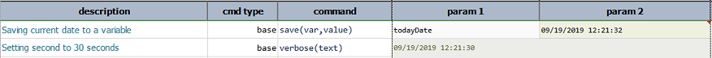

-----

#### `setYear(years)`
Set the year part of the date instance.

**Example** 
Script 
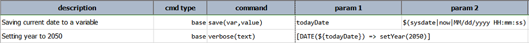

Output 
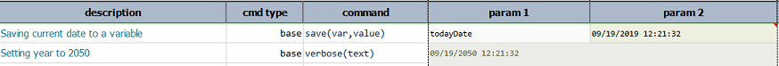

-----

#### `store(var)`
Save current DATE expression to a data variable.  If the specified var exists, its value will be overwritten. 
Using this operation, one can put an expression on pause and resume it at a later time.

**Example** 
Script 
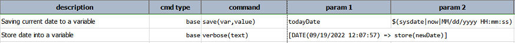

Output 
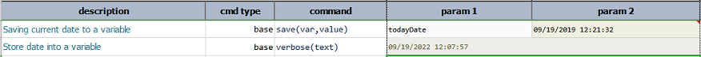

-----

#### `text`
Transform the date instance to its textual form, which would most likely be the way it was initially specified.

**Example** 
Script 
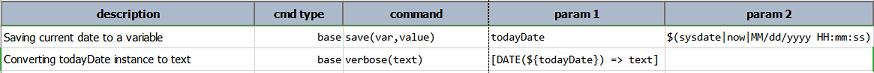

Output 
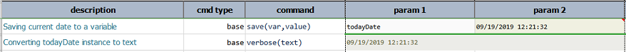

-----

