### Description
In many ways the Excel document works and feels like a [CSV](CSVexpression) document.  Most significant differences 
would be formatting, formula and sheets.  For the purpose of test automation, Nexial focuses only on the 
"_CSV-like, tabular data set"_ part of Excel spreadsheets.  To start using this expression, a reference to the full 
path of the target Excel file is needed.  Here are a few examples:

`[EXCEL(C:\my_project\my_data\my_excel.xlsx) => ...]`

`[EXCEL( ${spreadsheet location} ) => ...]` 

The second example uses a data variable to encapsulate the location of an Excel spreadsheet.

### Specifying cell location and range
Within this expression, it is quite common to reference a specific cell or a contiguous set of cells using the 
conventional Excel address format.  To specify a range, use the range format as follows:

`[column letter][row number]:[column letter][row number]`

For example, `C4:T25` would represent a contiguous range of cells starting from `C4`, spread breadth-wise to `T4` and 
then spread depth-wise to `T25`.  This would make up an "area" of 18x22, or 396, cells:

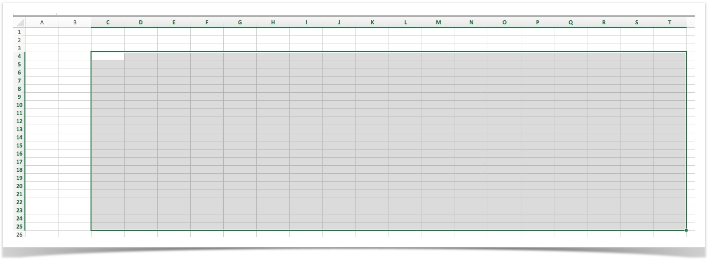

To specify the location of a cell, simply use the format: `[column letter][row number]`.

### Operations

#### clear(range)
Clear off any existing value from the cells found in the range specified by `range`.  After clearing off any existing 
value from the target cells, cell values can be recaptured (via  **[`read(sheet,range)`](#read(sheet,range))**) again to 
ensure relevancy.

**Example**

**Input File:** `properties.xlsx` 

**Script:** Clear the cells in the selected range and write the result into a csv file 
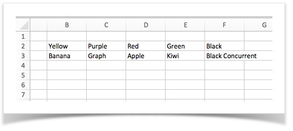

**Output:** Output CSV 
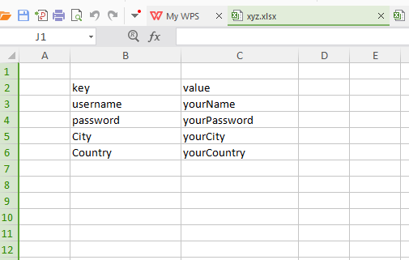

-----

#### columnCount
Return the number of columns captured.

**Example**

**Input File:** `properties.xlsx` 
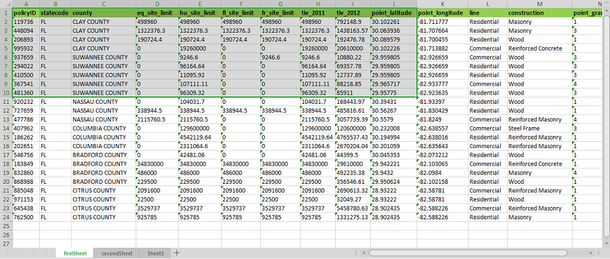

**Script:** Return the number of columns in the selected range 
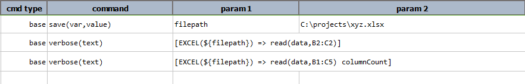

**Output:** 
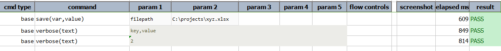

-----

#### csv
Transform current EXCEL content into **[`CSV`](CSVexpression)**. Field delimiter will be set to the current value of
[`nexial.textDelim`](../systemvars/index#nexial.textDelim) (default to comma), and record delimiter will be set to
CRLF (`\r\n`).

**Example**

**Input File:** `properties.xlsx` 

**Script:** Clear the cells in the selected range and write the remainder of the sheet into a csv file 

**Output:** Output CSV 

-----

#### csvWithHeader
Transform current EXCEL content into **[`CSV`](CSVexpression)**, using the first row as header. Field delimiter will 
be set to the current value of [`nexial.textDelim`](../systemvars/index#nexial.textDelim) (default to comma), and 
record delimiter will be set to CRLF (`\r\n`).

**Input File:** `properties.xlsx` 

**Script:**  
Creating a CSV file with first row as headers after clearing the selected cells. 
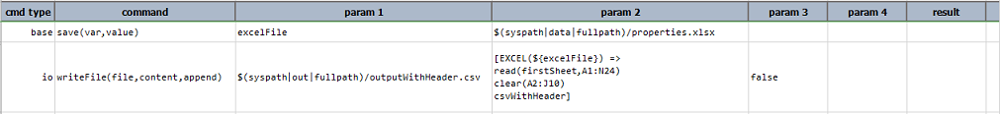

Output CSV 
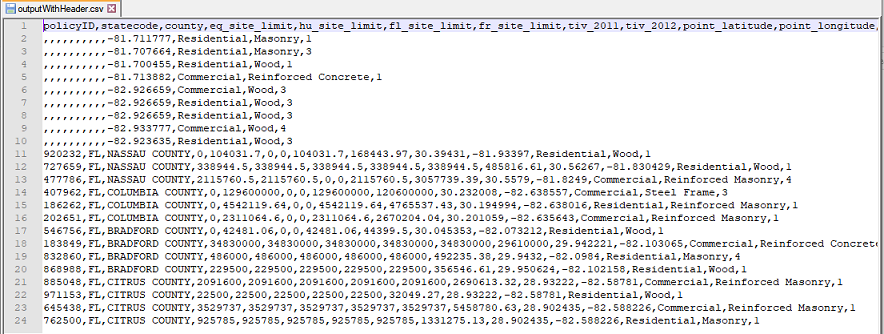

Converting the CSV file to a json using [`CSV Expressions`](../expressions/CSVexpression#json). 
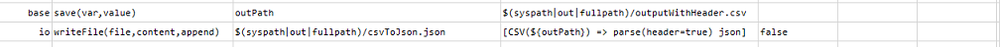

Output JSON 
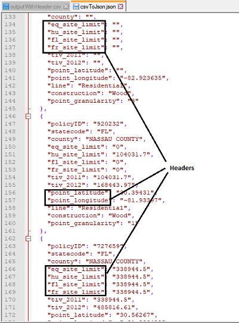

-----

#### firstCell(column,regex,maxRow)
Find the first cell in the specified `column` that satisfies `regex` and transform it to a 
[TEXT expression](TEXTexpression). The `column` parameter is expected to be in the form of `A`, `B`, `C`, etc. - 
mimicking how columns are represented in Excel. The `regex` parameter act as a filter to find the first matching
cell. The `maxRow` is required to ensure that Nexial performs sufficient (but not burdensome) scanning of available
rows.

Note that this operation **MUST** be preceded with a call to [`read(sheet,range)`](#readsheetrange).
  
**Example**

**Input File:** `properties.xlsx` 
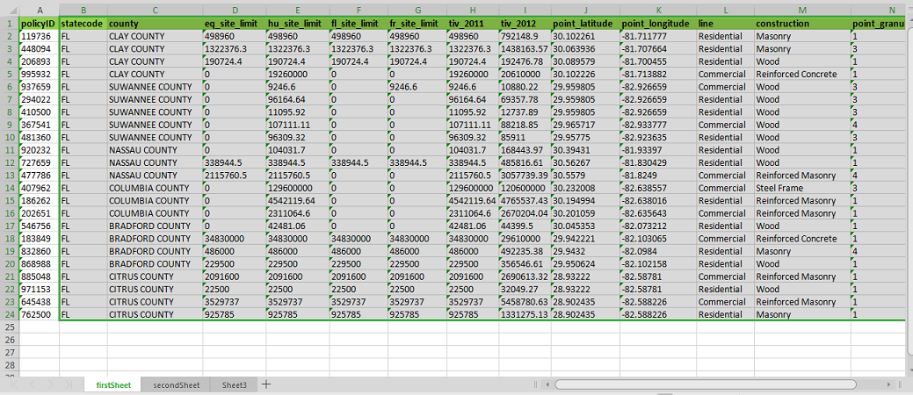

**Script:** Find the first cell in the `county` column starting with `BRAD` in the selected range. 
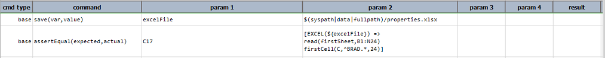

**Output:** 
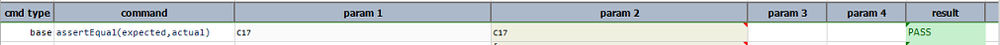

**Script:** Trying to locate the cell which exists outside `maxRow`  
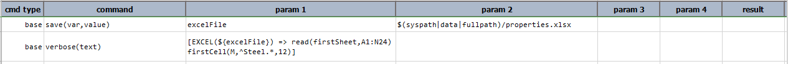

**Output:** 
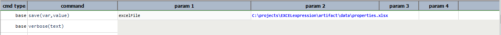

**Script:** Providing an invalid `maxRow` 
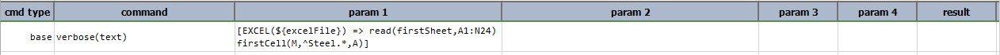

**Output** 
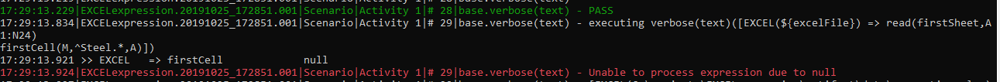

**Script:** Providing an invalid regex as input
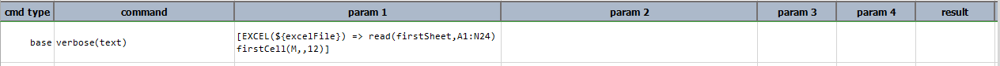

**Output:**  
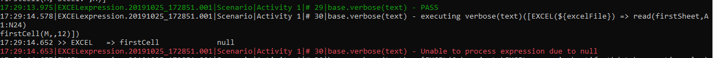

-----

#### json(firstRowAsHeader)
Transform current EXCEL content into **[`JSON`](JSONexpression)**. This operation provides 2 forms of transformations.
When `firstRowAsHeader` is set to `false`, the current EXCEL content is converted into a JSON array containing one or 
more JSON array. For example,
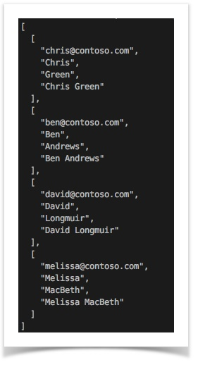

However, if `firstRowAsHeader` is set to `true`, then the first row of the current EXCEL content is assumed to be a
header row. The transformed JSON document would thus be a JSON array containing one or more JSON document, like this:
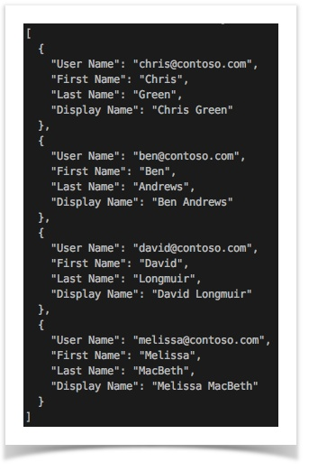

See [CSV &raquo; `json()`](CSVexpression#json) for additional details.

**Example**

**Input File:** `properties.xlsx` 
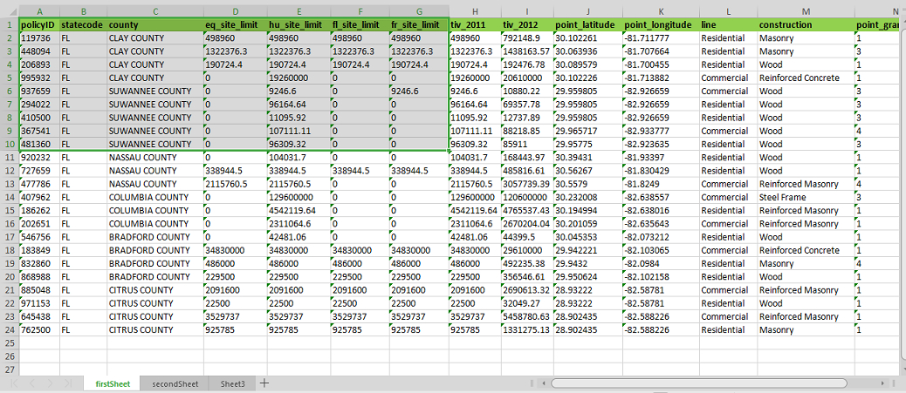

**Script:** Transform the selected range into JSON 
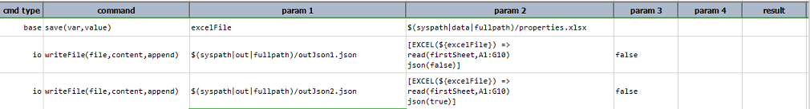

**Output:** Output JSONs 
Without header: outJson1.json 
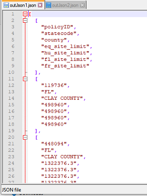

With Header: outJson2.json 
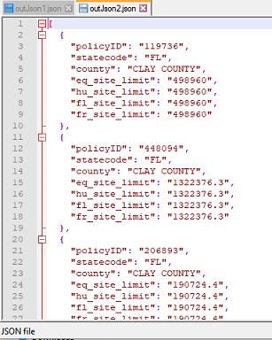

-----

#### pack
Trim (remove beginning and trailing spaces) the values of the cells captured by the [`read(sheet,range)`](#readsheetrange) 
operation and remove any blank rows in the captured cells.

**Example**

**Input File:** `properties.xlsx` 
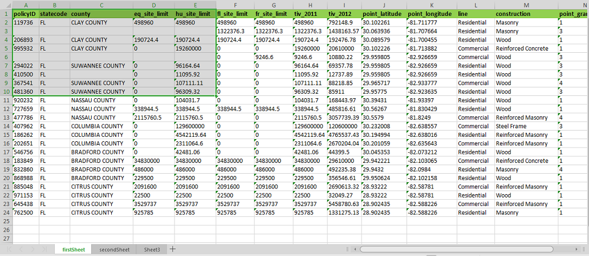

**Script:** Retrieve the cells in the selected range and perform the `pack` operation. 
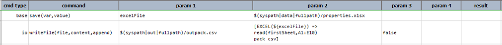

**Output File** outpack.csv 
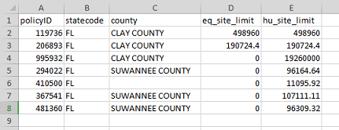

-----

#### read(sheet,range)
Read a contiguous set of cell values in a worksheet denoted by `sheet`, in a range denoted by `range`. See [above](#description) 
for more details on specifying cell range.   All the cells in the specified range will be read, regardless if those cells 
contain any value.  After this operation, **`text`** will render the captured value as `LIST` of `LIST`.

**Example**

**Input File:** `properties.xlsx` 
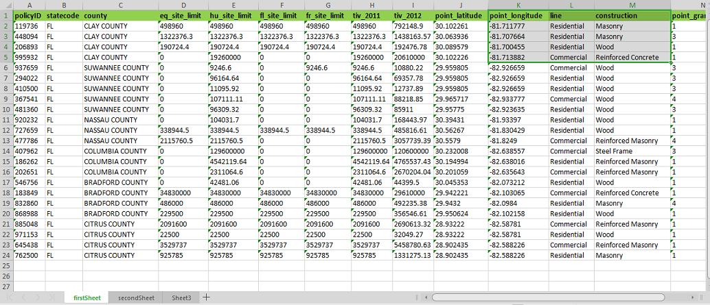

**Script:** Return the cell values in the selected range. 
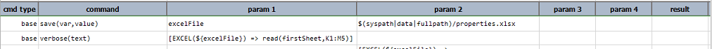

**Output:** 
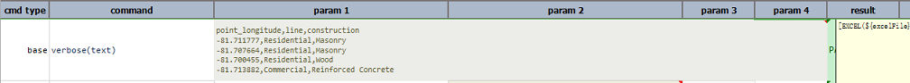

-----

#### replace(search,replace)
Of all the cells captured through [`read(sheet,range)`](#readsheetrange), replace all instances of `search` with 
`replace`. Note that the replaced cells are only kept in memory. Use [`csv`](#csv), [`csvWithHeader`](#csvwithheader)
or [`save(file,sheet,start)`](#savefilesheetstart) to store the modified cell data externally.

**Example**

**Input File:** `properties.xlsx` 
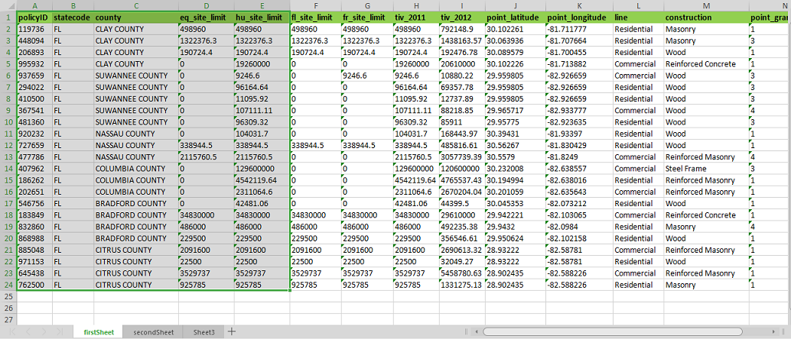

**Script:** Read the cells in the selected range and replace all instances of `SUWANNEE` with `NEW`. 
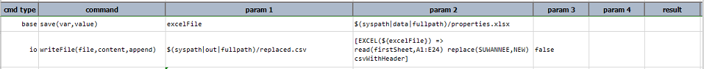 

**Output CSV** replaced.csv 
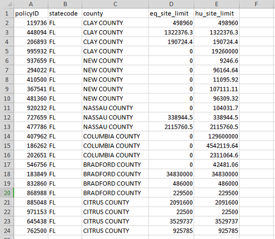

-----

#### rowCount
Return the number of rows captured.

**Example**

**Input File:** `properties.xlsx` 

**Script:** Read the cells in the selected range and return the number of rows in the range. 
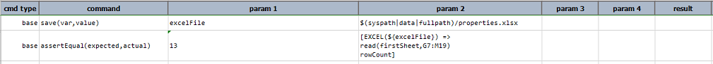

**Output:** 
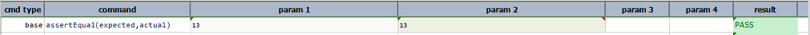

-----

#### save(file,sheet,start)
Save the captured cell values to a Excel `file` (existing or new), using the specified `sheet` as the target worksheet 
and `start` as the start cell position where the captured cell values will be saved to.  For example, 
`[EXCEL(${file}) => read(Sheet1,A5:M10) save(${file},Sheet1,A11:M16)]` would effectively copy cell value from `A5:M10` 
to `A11:M16` (same sheet).

**Example**

**Input File:** `properties.xlsx` 
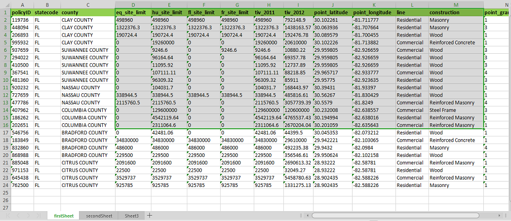

**Script:** Read the cells in the selected range from the input file and save them to the sheet `Sheet1` in `savedFile.xlsx` 
starting from the cell D3 
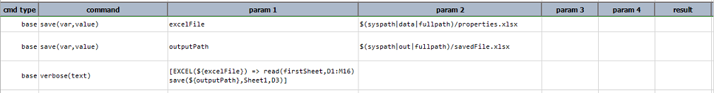

**Output File:** savedFile.xlsx
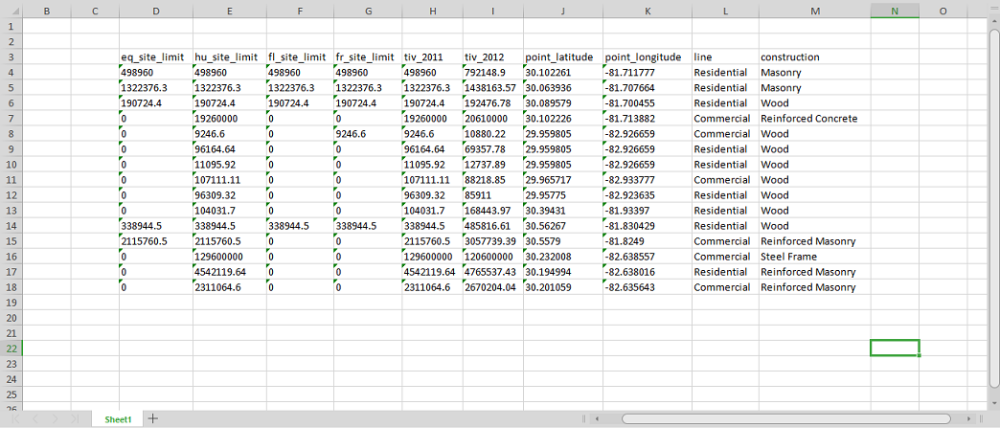

-----

#### store(var)
Save current EXCEL expression to a data variable.  If the specified `var` exists, its value will be overwritten. Using 
this operation, one can put an expression on pause and resume it at a later time.

**Example**

**Input File:** `properties.xlsx` 

**Script:**  
1. Store the operation to read the sheet and clear the cells in the range A2:J10 in variable `myExp`.
2. Use the variable `myExp` to write the result of above operations into a CSV file with header. 

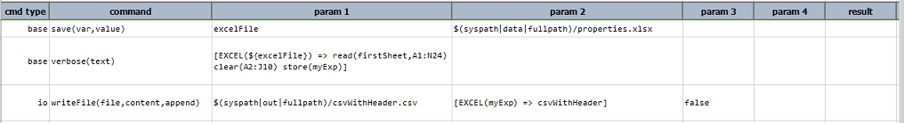

**Output CSV:** csvWithHeader.csv
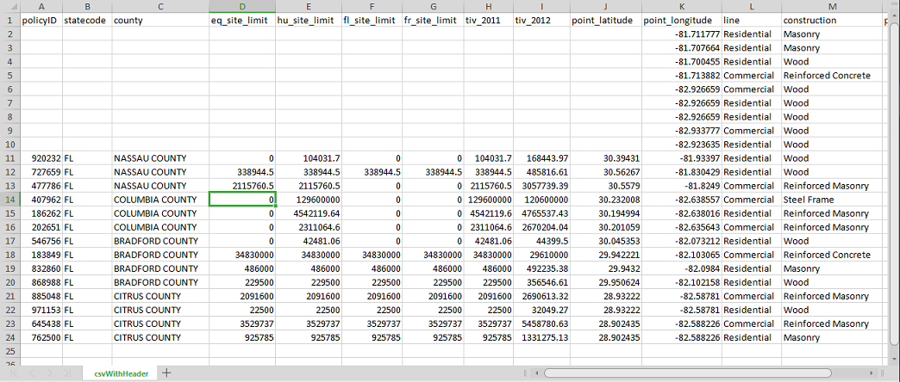

-----

#### text
Transform the current EXCEL cell data to text.  This would be the plain text rendition of the referenced cell data. 
Note that if **`text`** is called prior to the **[`read(sheet,range)`](#read(sheet,range))**  operation, then only the 
location of the underlying Excel file will be returned.  In order to return the cell content, the 
**[`read(sheet,range)`](#read(sheet,range))** operation must be invoked.

**Example**

**Input File:** `properties.xlsx` 
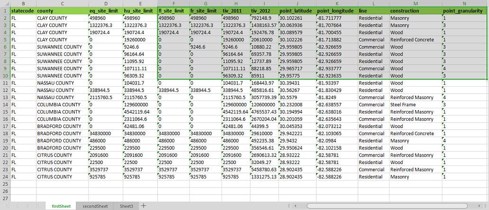

**Script:** Select the cells in the selected range and transform it into text. 
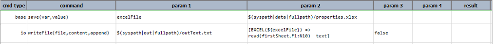

**Output File:** outText.txt 
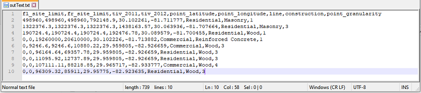

-----

#### transpose
Transpose captured cell values so that row data is displayed as column data, and column data as row data.

**Example**

**Input File:** `properties.xlsx` 
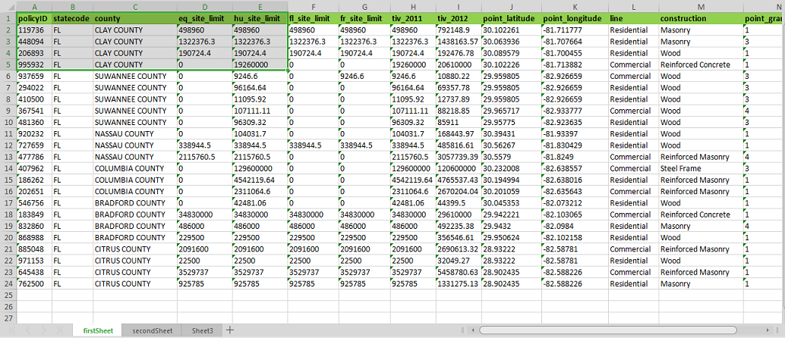

**Script:** Transpose the selection of cells in the selected range and write the result into a CSV file. 
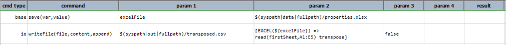

**Output File:** transposed.csv 
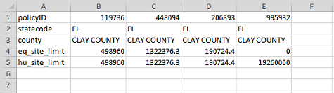

-----

#### worksheets
Retrieves a list of worksheets in the referenced Excel file in the order in which they are present in the Excel file.

**Example**

**Input File:** `properties.xlsx` 
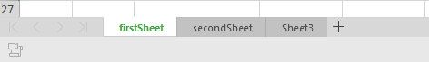

**Script:** Count the number of worksheets in the given Excel file. 
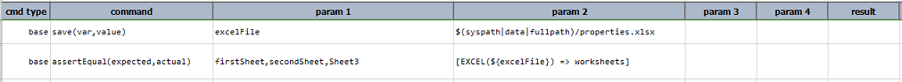

**Output:** 
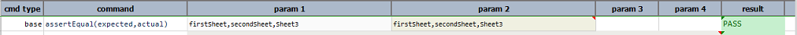

-----

#### writeAcross(start,value1,value2,value3,...)
Starting from the cell location specified via `start`, save into cells the values as specified via 
`value1`, `value2`, `value3`, ... by moving to the right for each value specified.  For example,  
`[EXCEL( ${file} ) => read(Sheet1,B2:F20) writeAcross(B3,Banana,Grape,Apple,Kiwi,Black Concurrent]` would write the 
list of fruits (Banana, Grape, Apple, Kiwi, and Black Concurrent) into Sheet1, starting from `B3`.  Therefore  `Banana` 
is stored to `B3`, `Grape` is stored to `C3`, Apple to `D3`, and so on:

**Example**

**Input File:** `secondSheet` of `properties.xlsx`  

**Script:** Enter new values in the cells A5 through E5. 

**Output:** 

-----

#### writeDown(start,value1,value2,value3,...)
Store `value1`, `value2`, so on, starting from the cell position denoted by `start`.  See  
**[`writeAcross(start,value1,value2,value3,...)`](#writeacross(start,value1,value2,value3,...))** for more details.

**Example**

**Input File:** `Sheet3` of `properties.xlsx`  

**Script:** Enter new values in the cells B2 through B6. 

**Output:** 

-----

