### Description
The <a href="https://en.wikipedia.org/wiki/INI_file" class="external-link" target="_nexial_link">**INI** file format</a> is an informal standard for configuration files for 
some platforms or software. INI files are simple text files with a basic structure composed of sections, properties, 
and values.  Here are some examples:

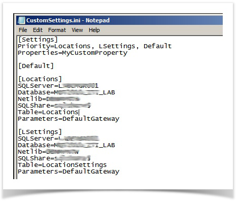

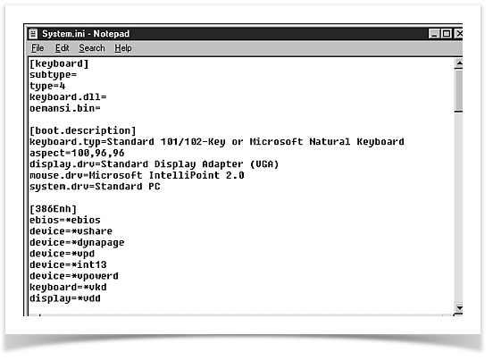

### Operations

#### `comment`
Returns the comment from the INI configuration data

**Example** 
Suppose we have the following `sample.ini` file. In INI file format semicolon(`;`) 
at the beginning of the line indicate a comment.

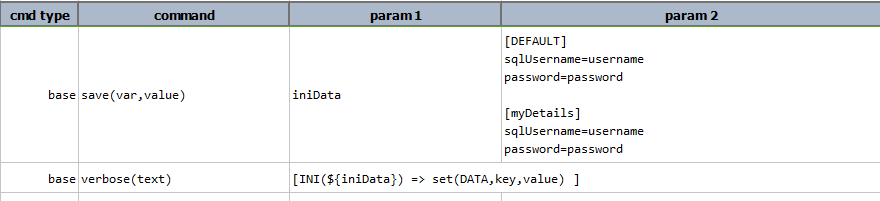

Script: 
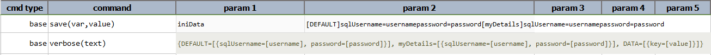

Output: 
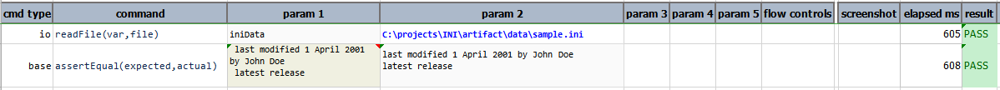

-----

#### `merge(mergeFileOrContent)`
Merges the content of the INI data

**Example** 
In this example, `iniData1` and `iniData2` contains different INI data and `merge`
is used to combine both the data. Data must be in INI file format otherwise
it displays `Unable to process expression due to parse error`. If the data to be merge
is already present in the INI data then to avoid duplicate content no merge 
operation is performed. When both INI content has duplicate keys then the current value
replace the previous value. As shown in this example `iniData1` and `iniData4` has same
key `user`. So, after performing `merge` operation the current value of `user` is `hf`.

Script: 
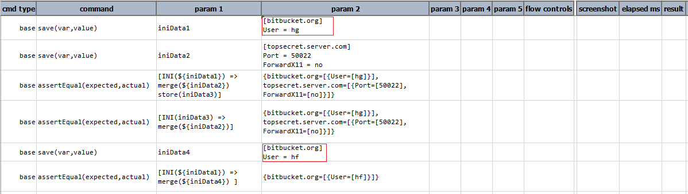

Output: 
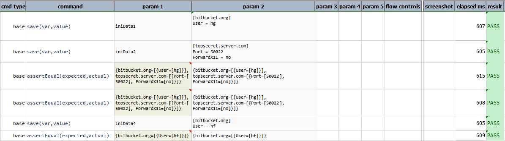

-----

#### `newComment(comment)`
Adds the given comment to the INI data

**Example** 
In this example, `newComment` is added in the existing ini data.
As comment lines are ignored, [`comment`](#comment) operations is used to extract 
comment from the ini data.

Script: 
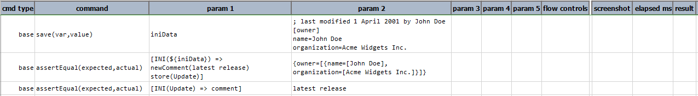

Output: 
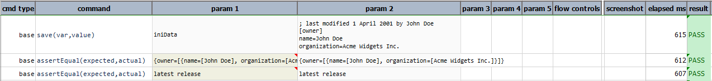

-----

#### `remove(section,key)`
Removes the key from the given section and returns the INI data

**Example** 
In this example, `remove(owner,name)` removes the `name=John Doe` from the `owner`
section, `remove(database,port)` removes both the port values `port=14` and `port=16` from the `database` section.
If key is not present in the specified section then it shows the complete INI data as shown in `remove(owner,port)`.

Script: 
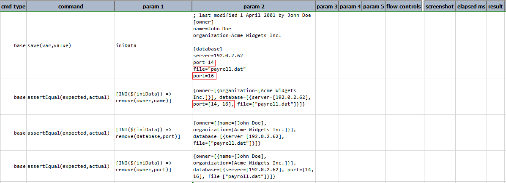

Output: 
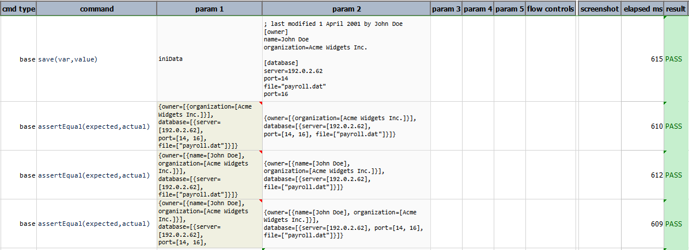

-----

#### `save(filepath)`
Saves the INI data to the given file path

**Example** 
In this example, the data of the `iniData` is saved to the given path `output.ini`.

Script: 
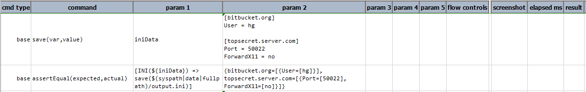

Output: 
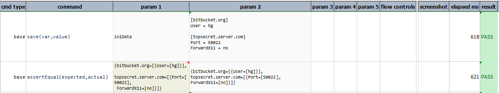
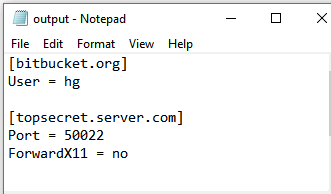

-----

#### `set(section,key,value)`
Sets the key and value in the given section. If section is not available, creates 
the section and sets the key and value.

**Example** 
In this example, `[bitbucket.org]` section is created having `User = hg` as 
key and value. If section is already present in the data then the key and value are added at the
end of the section. As shown in this example `port=[50022]` is already present in the section
`topsecret.server.com` and again added at the end of the section.

Script: 
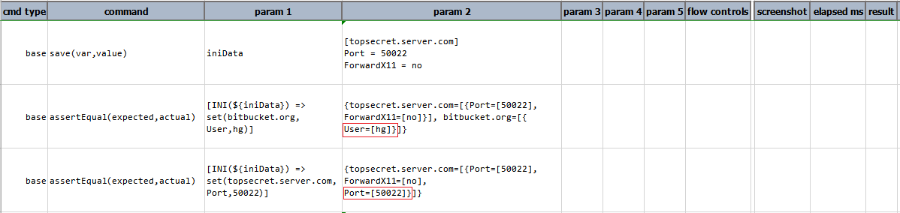

Output: 
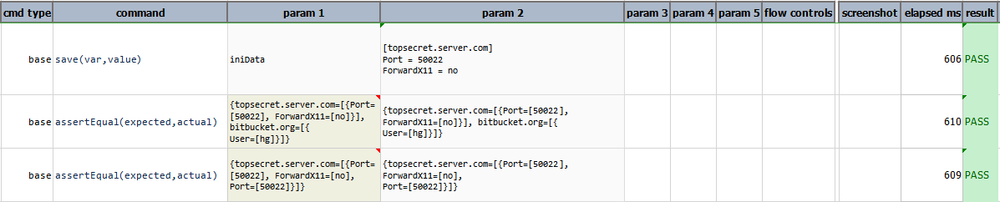

-----

#### `store(var)`
Save current INI expression to a data variable.  If the specified `var` exists, its value will 
be overwritten.  Using this operation, one can put an expression on pause and resume it at a later time.

**Example** 
In this example, [`remove(section,key)`](#removesectionkey) operation is performed to 
`remove(database,port)` and the `UpdatedData` is stored to extract all the values 
from the `database` section by using [`values(section)`](#removesectionkey)
operation. 

Script: 
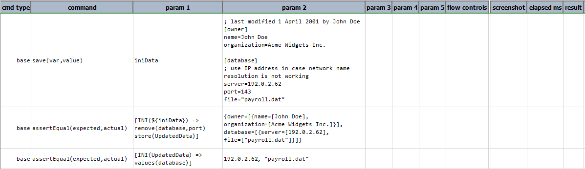

Output: 
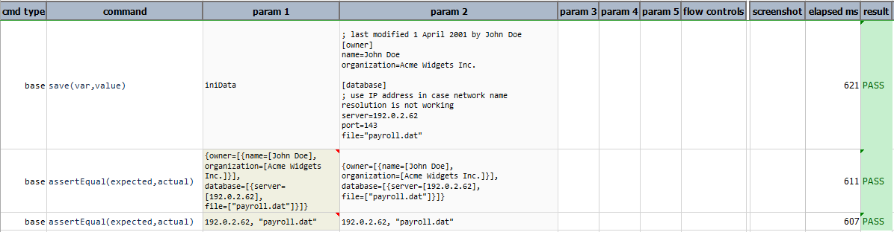

-----

#### `text`
Returns the content of the INI data as text

**Example** 
In this example, the `iniData` is first converted to text and then 
[upper](TEXTexpression#upper) operation is performed on it. 

Script: 
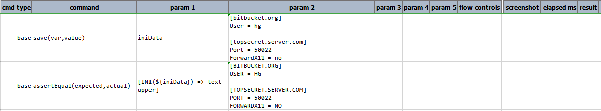

Output: 
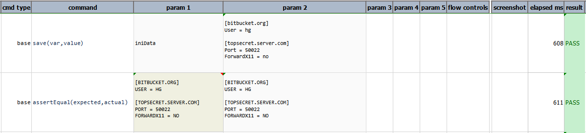

-----

#### `value(section,key)`
Gets the value of corresponding key from the given section

**Example** 
In this example, value of the `name` is extracted from the section `owner`. If the specified section has 
more than one key having the same name then always the initial value is replaced by the last value. As shown in this 
example key `port` has two different values `14` and `16`. So, the last value that is `port=16` is the updated 
value of `port`.

Script: 
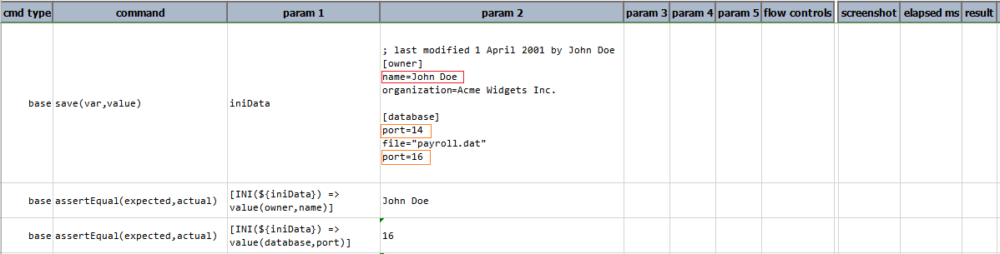

Output: 
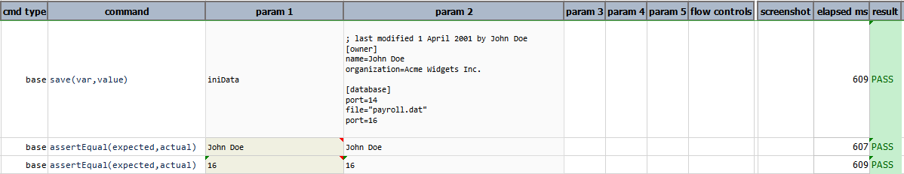

-----

#### `values(section)`
Gets all the values available in the given section

**Example** 
In this example, all the values of `database` section are extracted.
The order of the values will be in the order found in the INI file, under the specified section.

Script: 
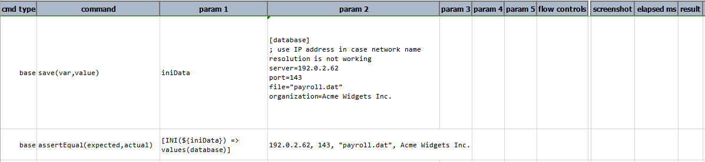

Output: 
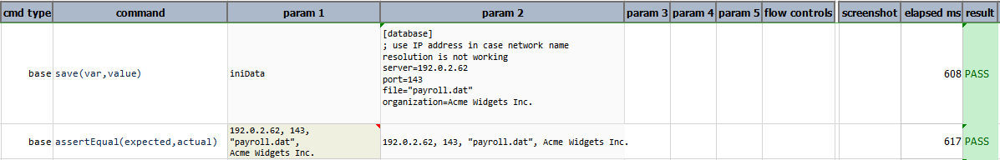

-----

