### **Description**
JSON provides transformational operations on a 
<a href="http://json.org/" class="external-link" target="_nexial_external">JSON document</a>, which can be a JSON 
object or JSON array.

A word on JSON object and JSON array:

Here's an excerpt from <a href="http://json.org/" class="external-link" target="_nexial_external">http://json.org</a>

> JSON is built on two structures:
> -  **A collection of name/value pairs**. In various languages, this is realized as an _object_, record, struct, 
     dictionary, hash table, keyed list, or associative array.
> -  **An ordered list of values**. In most languages, this is realized as an _array_, vector, list, or sequence.

A JSON object can be loosely defined as a collection of name-value pairs whose value may be another collection of 
name-value pairs.  For example,
```json
{
   "red": "#f00",
   "green": "#0f0",
   "blue": "#00f",
   "cyan": "#0ff",
   "magenta": "#f0f",
   "yellow": "#ff0",
   "black": "#000"
}
```

A JSON array, in contract, is a list of values which can be collection of name/value pairs, primitives or even more 
array.  Here's an example:
```json
{
   "palette": [
      { "colorName": "red", "hexValue": "#f00" },
      { "colorName": "green", "hexValue": "#0f0" },
      { "colorName": "blue", "hexValue": "#00f" },
      { "colorName": "cyan", "hexValue": "#0ff" },
      { "colorName": "magenta", "hexValue": "#f0f" },
      { "colorName": "yellow", "hexValue": "#ff0" },
      { "colorName": "black", "hexValue": "#000" }
   ]
}
```
JSON is a very popular document format, especially with the advent of 
<a href="https://en.wikipedia.org/wiki/Representational_state_transfer" class="external-link" target="_nexial_target">REST</a> 
(also see <a href="http://www.restapitutorial.com/lessons/whatisrest.html" class="external-link" target="_nexial_target">this</a>).  
It is considered as _lighter_, easier to read and to manage than XML while, in many ways, providing the same 
capabilities as XML.  Via Nexial expression for JSON, one can process JSON documents as part of automation using 
Nexial [`jsonpath`](../jsonpath).  Such capability is useful towards REST api testing and processing.

To manipulate JSON document, check out [`Nexial jsonpath`](../jsonpath) for more details.


### Operations

#### **`addOrReplace(jsonpath,input)`**
Reference a specific position or element in current JSON via `jsonpath`, and then add or replace it with `input`. 
The end result would be the modified JSON document/array. Refer to 
[json &raquo; `addOrReplace(json,jsonpath,input,var)`](../commands/json/addOrReplace(json,jsonpath,input,var)#rules) 
for additional details and the rules of adding or replacing element in an existing JSON document.

**Example**
- Note: While entering the json input, each comma should be preceded by a backslash (`\`). Also, empty `jsonpath` or
 `input` is represented using space. 
 
**Adding input values to the JSON**<br/>

**Script**: Adding to an empty json using empty jsonpath<br/>
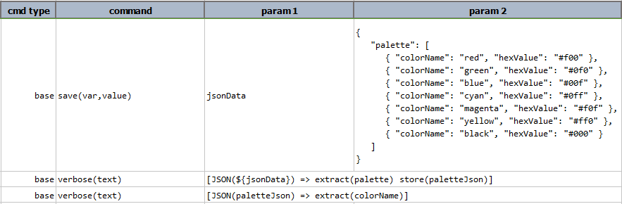
**Output**:<br/>
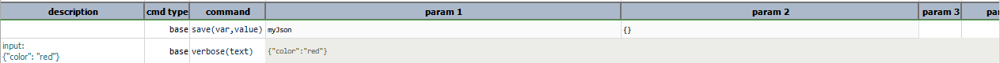

**Script**: Adding to a json using empty jsonpath<br/>
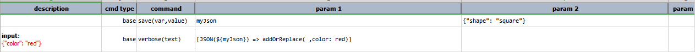
**Output**:<br/>
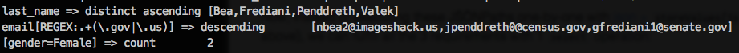

**Script**: Adding to an existing node<br/>

**Output**:<br/>
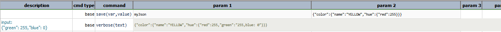

**Script**: Adding a json array<br/>
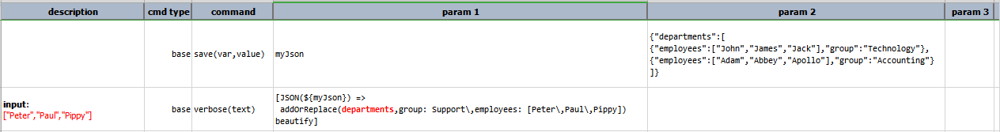
**Output**:<br/>
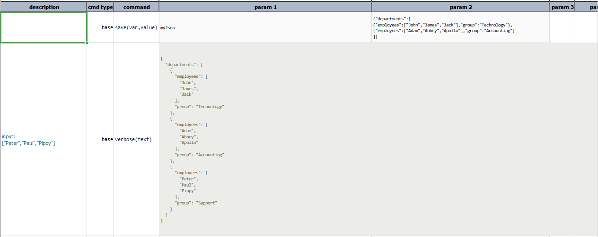

**Script**: Adding more values to an existing json array<br/>
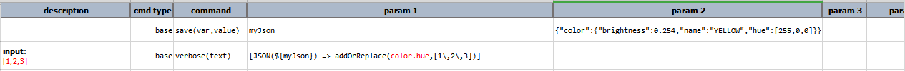
**Output**:<br/>
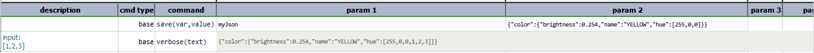

**Script**: Adding a name-value pair and a json array<br/>
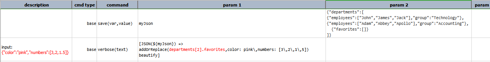
**Output**:<br/>
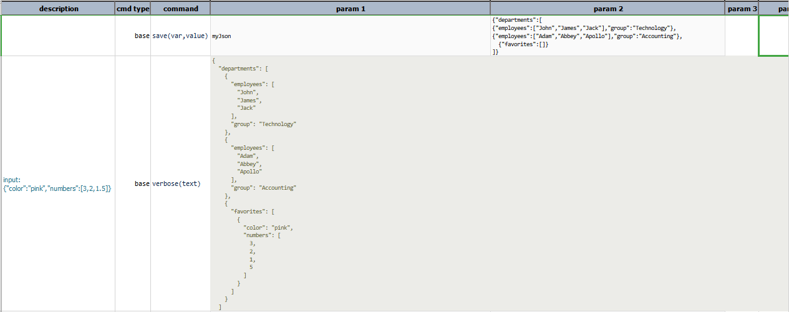

**Script**: Adding a json object to an existing json array<br/>

**Output**:<br/>
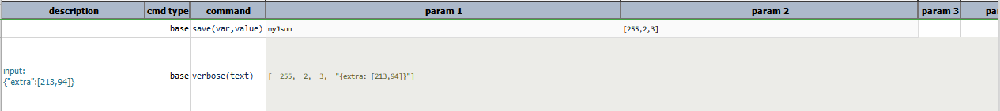

**Replacing portions of the JSON file with input values**<br/>

**Script**: Replacing a json array with `null`<br/>
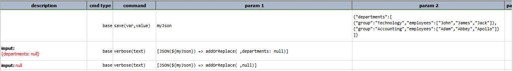
**Output**:<br/>
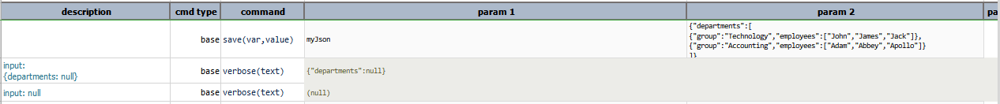

**Script**: Replacing an existing json array with another json array<br/>
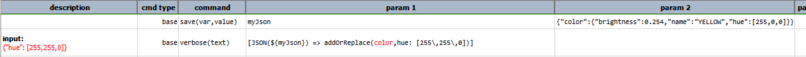
**Output**:<br/>
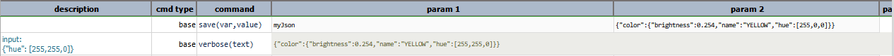

**Script**: Replacing a json object in a json array with another json object<br/>
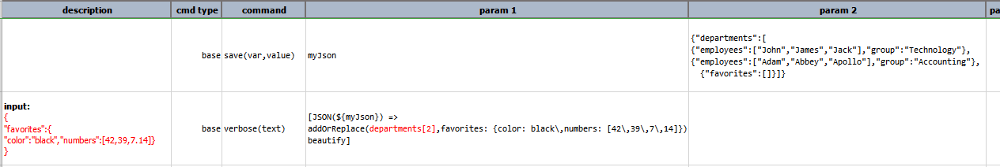
**Output**:<br/>
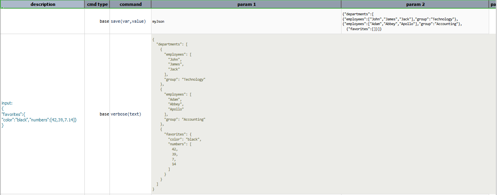

**Script**: Replacing an existing json object with another json object<br/>
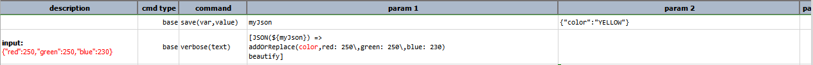
**Output**:<br/>
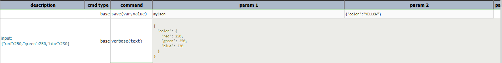

**Script**: Replacing an element in a json array with another json array (nested json array)<br/>
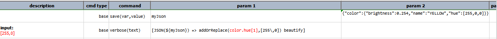
**Output**:<br/>
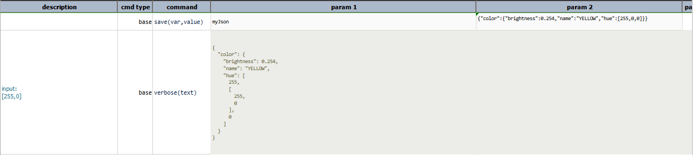

**Trying to add/replace values at non existing nodes**<br/>

**Script**: Adding/Replacing at non existing node in a json document<br/>

**Output**:<br/>
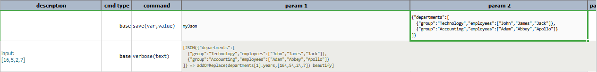

**Script**: Adding/Replacing at non existing node in a json array<br/>
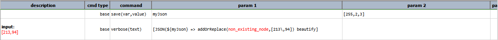
**Output**:<br/>
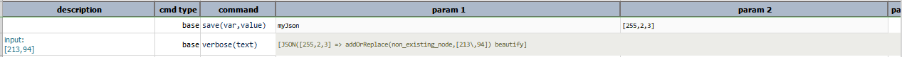

-----

#### **`beautify`**
"pretty" formatting on current JSON document to improve readability.

**Example**<br/>
Input JSON:<br/>
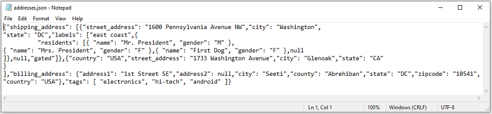

**Script**:<br/>
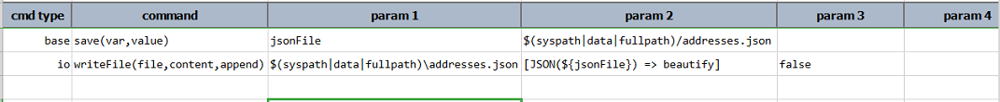

**Output** JSON:<br/>
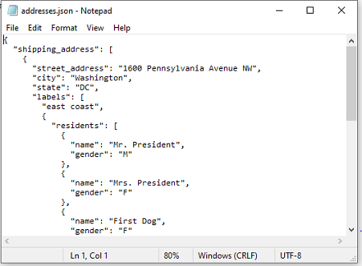

-----

#### **`compact(removeEmpty)`**
Remove all null or empty (i.e. empty string) elements from current JSON. When `removeEmpty` is set to `true`, this 
operation will remove any node with only empty text (like `{ "name": "" }`). This operation is functionally equivalent
to the [JSON &raquo; `compact(var,json,removeEmpty)`](../commands/json/compact(var,json,removeEmpty)) command. Check
the command page for more details and examples.

**Example**<br/>
Suppose we have the following json document, named `config.json`.
```json
{
  "config": {
    "location1": [
      { "code": "CA", "state": "California" }
    ],
    "location2": { },
    "config1": {
      "client": 12345,
      "active": true
    },
    "config": [],
    "dataListing": ["", "", null, "", { } ]
  }
}
```

**Script**:<br/>
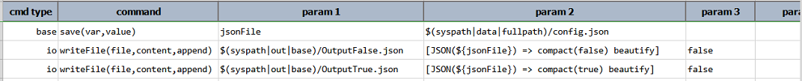

**Output** file when `removeEmpty` is `false`:<br/>
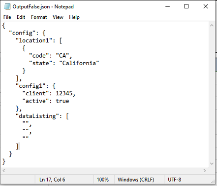

**Output** file when `removeEmpty` is `true`:<br/>
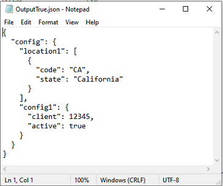

-----

#### **`count(jsonpath)`**
Counts the number of nodes present that matched with specified `jsonpath`. This effectively also transforms the current
expression to [NUMBER](NUMBERexpression).

**Example**<br/>
Suppose we have the following JSON document named `sampleData.json`.
```json
{
	"id": "0001",
	"type": "donut",
	"name": "Cake",
	"ppu": 0.55,
	"batters":
		{
			"batter":
				[
					{ "id": "1001", "type": "Regular" },
					{ "id": "1002", "type": "Chocolate" },
					{ "id": "1003", "type": "Blueberry" },
					{ "id": "1004", "type": "Devil's Food" }
				]
		},
	"topping":
		[
			{ "id": "5001", "type": "None" },
			{ "id": "5002", "type": "Glazed" },
			{ "id": "5005", "type": "Sugar" },
			{ "id": "5007", "type": "Powdered Sugar" },
			{ "id": "5006", "type": "Chocolate with Sprinkles" },
			{ "id": "5003", "type": "Chocolate" },
			{ "id": "5004", "type": "Maple" }
		]
}

```

**Script**:<br/>
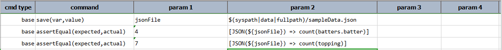

**Output**:<br/>
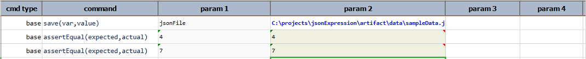

-----

#### **`extract(jsonpath)`**
Extract a portion of the JSON document based on the specified [`jsonpath`](../jsonpath). Depending on the JSON in 
question and the specified JSON path, the result could either be `null` (none matched), text (matched to a textual 
value), JSON object or JSON array.

**Example**
Suppose we have the following JSON document, named `addresses.json`.
```json
{
  "shipping_address": [
    {
      "street_address": "1600 Pennsylvania Avenue NW",
      "city": "Washington",
      "state": "DC",
      "labels": [
        "east coast",
        {
          "residents": [
            {
              "name": "Mr. President",
              "gender": "M"
            },
            {
              "name": "Mrs. President",
              "gender": "F"
            },
            {
              "name": "First Dog",
              "gender": "F"
            },
            null
          ]
        },
        null,
        "gated"
      ]
    },
    {
      "country": "USA",
      "street_address": "1733 Washington Avenue",
      "city": "Glenoak",
      "state": "CA"
    }
  ],
  "billing_address": {
    "address1": "1st Street SE",
    "city": "Seeti",
    "county": "Abrehiban",
    "state": "DC",
    "zipcode": "10541",
    "country": "USA"
  },
  "tags": [
    "electronics",
    "hi-tech",
    "android"
  ]
}
``` 

Here, we extract a null value, a text value, a JSON object and a JSON array in that order.

**Script**:<br/>
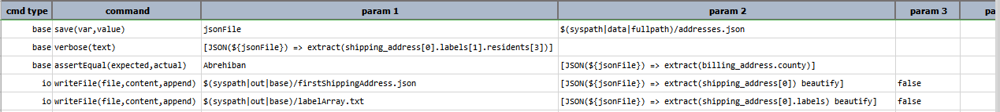

**Output**:<br/>
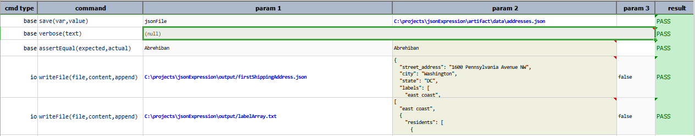

firstShippingAddress.json:<br/>
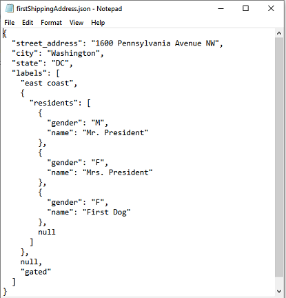

labelArray.txt:<br/>
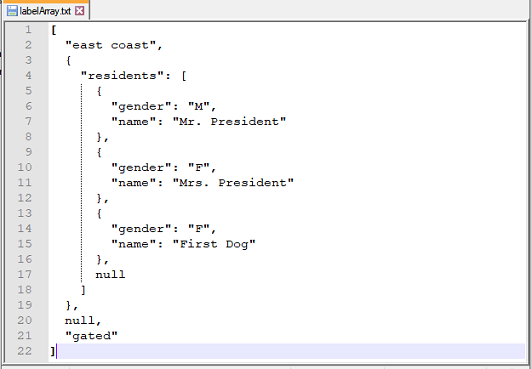

-----

#### **`keys(jsonpath)`**
Extract the immediate keys of the resolved JSON object matching the specified [`jsonpath`](../jsonpath). This operation
first reduces the current JSON document to its fragment that match the specified [`jsonpath`](../jsonpath). Then if the 
resolved JSON fragment is a valid JSON object, it returns a list of the immediate keys (meaning current level only) to 
such JSON fragment. If the specified [`jsonpath`](../jsonpath) does not resolve to a JSON object (such as JSON array or 
single value), then this operation resolves to an empty list. Either way this operation transform the current `JSON`
data type to a [`LIST`](LISTexpression) data type.

For example, suppose we have the following JSON document assigned to a data variable named `json`:
```json
{
  "shipping_address": [
    {
      "street_address": "1600 Pennsylvania Avenue NW",
      "city": "Washington",
      "state": "DC",
      "labels": [
        "east coast",
        {
          "residents": [
            { "name": "Mr. President", "gender": "M" },
            { "name": "Mrs. President", "gender": "F" },
            { "name": "First Dog", "gender": "F" },
            null
          ]
        },
        null,
        "gated"
      ]
    },
    {
      "country": "USA",
      "street_address": "1733 Washington Avenue",
      "city": "Glenoak",
      "state": "CA"
    }
  ],
  "billing_address": {
    "address1": "1st Street SE",
    "address2": null,
    "city": "Seeti",
    "county": "Abrehiban",
    "state": "DC",
    "zipcode": "10541",
    "country": "USA"
  },
  "tags": [ "electronics", "hi-tech", "android" ]
}
```

Here are some possible use of this operations:

**Example 1**

| expression                                                    | result            | comments                         |
|:--------------------------------------------------------------|:------------------|:---------------------------------|
|`[JSON(${json}) => keys(shipping_address.labels.residents[2])]`|`LIST(name,gender)`|keys of the 3rd JSON fragment under `residents`|

**Script**:<br/>
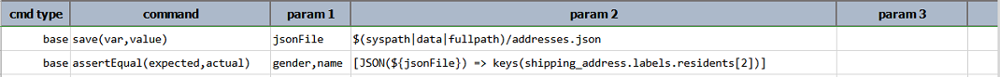
**Output**:<br/>
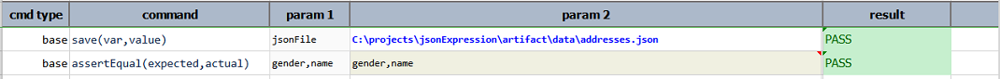

**Example 2**

| expression                                                    | result            | comments                         |
|:--------------------------------------------------------------|:------------------|:---------------------------------|
|`[JSON(${json}) => keys(shipping_address.labels.residents[3])]`|`LIST()`           |keys of the 4th JSON fragment under `residents`, which has no keys|

**Script**:<br/>
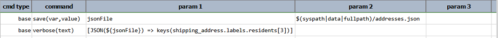
**Output**:<br/>
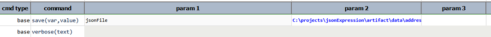

**Example 3**

| expression                                                    | result            | comments                         |
|:--------------------------------------------------------------|:------------------|:---------------------------------|
|`[JSON(${json}) => keys(shipping_address.labels[1])]`          |`LIST(residents)`  |keys of the 2nd JSON fragment under `labels`|

**Script**:<br/>
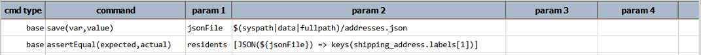
**Output**:<br/>
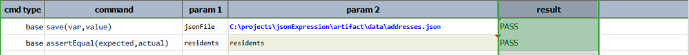

**Example 4**

| expression                                                    | result            | comments                         |
|:--------------------------------------------------------------|:------------------|:---------------------------------|
|`[JSON(${json}) => keys(shipping_address[1])]`                 |`LIST(country,street_address,city,state)`|keys of the 2nd JSON fragment under `shipping_address`|

**Script**:<br/>
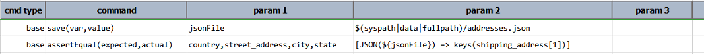
**Output**:<br/>
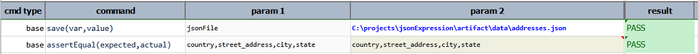

**Example 5**

| expression                                                    | result            | comments                         |
|:--------------------------------------------------------------|:------------------|:---------------------------------|
|`[JSON(${json}) => keys(billing_address)]`                     |`LIST(address1,address2,city,county,state,zipcode,country)`|keys of `billing_address` JSON fragment|

**Script**:<br/>
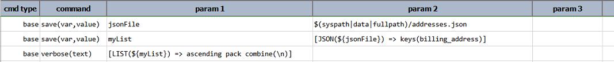
**Output**:<br/>
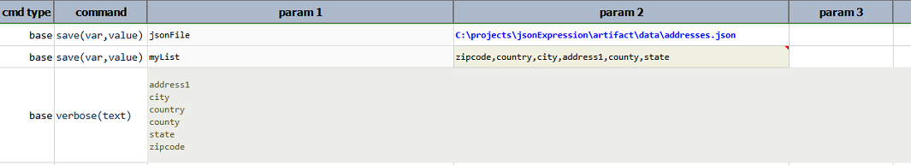


**Note**:
1. The resolved JSON keys do not necessarily render in the same order as found in the originating JSON document. You may 
   want to consider [LIST &raquo; `ascending`](LISTexpression#ascending) or 
   [LIST &raquo; `descending`](LISTexpression#descending) to re-order the keys.
2. The same functionality is also available as a command - 
   [json &raquo; `storeKeys(json,jsonpath,var)`](../commands/json/storeKeys(json,jsonpath,var))

-----

#### **`list`**
Transform a JSON Array or text to a [`LIST`](LISTexpression). Works best with JSON Array that contains single text 
value (e.g. `["apple","orange","banana"]`). Does not work with a JSON object.

**Example**
Suppose we have the following json document, named `addresses`
```json
{
  "shipping_address": [
    {
      "street_address": "1600 Pennsylvania Avenue NW",
      "city": "Washington",
      "state": "DC",
      "labels": [
        "east coast",
        {
          "residents": [
            { "name": "Mr. President", "gender": "M" },
            { "name": "Mrs. President", "gender": "F" },
            { "name": "First Dog", "gender": "F" },
            null
          ]
        },
        null,
        "gated"
      ]
    },
    {
      "country": "USA",
      "street_address": "1733 Washington Avenue",
      "city": "Glenoak",
      "state": "CA"
    }
  ],
  "billing_address": {
    "address1": "1st Street SE",
    "address2": null,
    "city": "Seeti",
    "county": "Abrehiban",
    "state": "DC",
    "zipcode": "10541",
    "country": "USA"
  },
  "tags": [ "electronics", "hi-tech", "android" ]
}
```

**Script**:<br/>
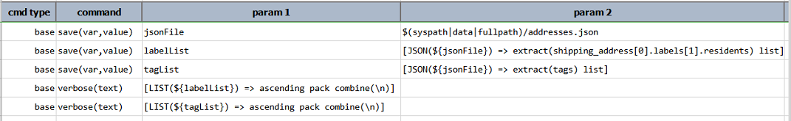

**Output**:<br/>
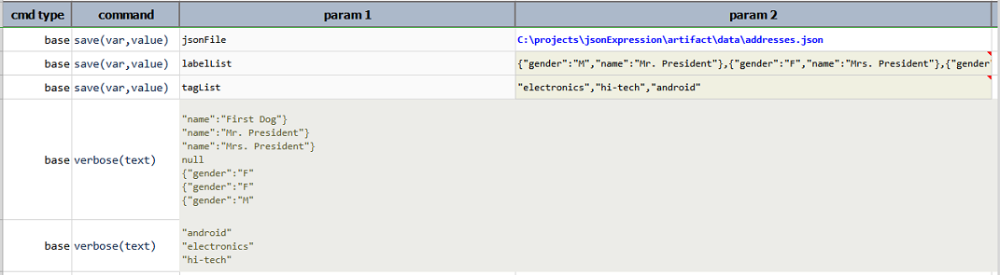

-----

#### **`minify`**
Compressed current JSON document; suitable for efficient data transfer.

**Example**
Suppose, we have a json document named `config.json`
```json
{
  "config": {
    "location1": [
      { "code": "CA", "state": "California" }
    ],
    "location2": { },
    "config1": {
      "client": 12345,
      "active": true
    },
    "config": [],
    "dataListing": ["", "", null, "", { } ]
  }
}
```

**Script**:<br/>
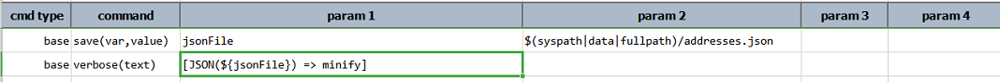

**Output**:<br/>


-----

#### **`pack`** 
Remove any `null` JSON node (essentially JSON node without value); akin to _compacting_ a document. 
  Consequently, this operation also "beautifies" the current JSON document.
  
**Example**<br/>
**Input File**:<br/>


**Script**:<br/>


**Output** File:<br/>


-----

#### **`remove(jsonpath)`**
Deletes JSON nodes that matched to the specified `jsonpath`.

**Example**
Suppose, we have the following json document, named `sampleData.json`
```json
{
	"id": "0001",
	"type": "donut",
	"name": "Cake",
	"ppu": 0.55,
	"batters":
		{
			"batter":
				[
					{ "id": "1001", "type": "Regular" },
					{ "id": "1002", "type": "Chocolate" },
					{ "id": "1003", "type": "Blueberry" },
					{ "id": "1004", "type": "Devil's Food" }
				]
		},
	"topping":
		[
			{ "id": "5001", "type": "None" },
			{ "id": "5002", "type": "Glazed" },
			{ "id": "5005", "type": "Sugar" },
			{ "id": "5007", "type": "Powdered Sugar" },
			{ "id": "5006", "type": "Chocolate with Sprinkles" },
			{ "id": "5003", "type": "Chocolate" },
			{ "id": "5004", "type": "Maple" }
		]
}
```

**Script**:<br/>


**Output** file:<br/>


-----

#### **`replace(jsonpath,replaceWith)`**
Replace the first match of the JSON in question based on the specified `jsonpath` with the specified `replaceWith`.  
Depending on the JSON in question and the specified JSON path, the match could either be `null` (none matched), text 
(matched to a textual value), JSON object or JSON array.  Since `replaceWith` is treated as text, the end result of 
the JSON document in question could become structurally different. 

**Example**
Suppose, we have the following json document, named `addresses.json`.
```json
{
  "shipping_address": [
    {
      "street_address": "1600 Pennsylvania Avenue NW",
      "city": "Washington",
      "state": "DC",
      "labels": [
        "east coast",
        {
          "residents": [
            { "name": "Mr. President", "gender": "M" },
            { "name": "Mrs. President", "gender": "F" },
            { "name": "First Dog", "gender": "F" },
            null
          ]
        },
        null,
        "gated"
      ]
    },
    {
      "country": "USA",
      "street_address": "1733 Washington Avenue",
      "city": "Glenoak",
      "state": "CA"
    }
  ],
  "billing_address": {
    "address1": "1st Street SE",
    "address2": null,
    "city": "Seeti",
    "county": "Abrehiban",
    "state": "DC",
    "zipcode": "10541",
    "country": "USA"
  },
  "tags": [ "electronics", "hi-tech", "android" ]
}
```
**Script**: Replacing the `labels` array with `null`<br/>


Resulting json:<br/>


**Script**: Replacing the `city` under `shipping_address`<br/>


**Resulting json**:<br/>


-----

#### **`save(path,append)`**
Save current JSON content to `path`. If `path` resolves to an existing file, `append` set as `true` will append 
current JSON content to the said file. `append` is optional and defaults to `false`.


**Example**
Suppose, we have the following json document, named `desserts.json`.
```json
{
"dessert":
[
	{
		"id": "0001",
		"type": "donut",
		"name": "Cake",
		"ppu": 0.55,
		"batters":
			{
				"batter":
					[
						{ "id": "1001", "type": "Regular" },
						{ "id": "1002", "type": "Chocolate" },
						{ "id": "1003", "type": "Blueberry" },
						{ "id": "1004", "type": "Devil's Food" }
					]
			},
		"topping":
			[
				{ "id": "5001", "type": "None" },
				{ "id": "5002", "type": "Glazed" },
				{ "id": "5005", "type": "Sugar" },
				{ "id": "5007", "type": "Powdered Sugar" },
				{ "id": "5006", "type": "Chocolate with Sprinkles" },
				{ "id": "5003", "type": "Chocolate" },
				{ "id": "5004", "type": "Maple" }
			]
	},
	{
		"id": "0002",
		"type": "donut",
		"name": "Raised",
		"ppu": 0.55,
		"batters":
			{
				"batter":
					[
						{ "id": "1001", "type": "Regular" }
					]
			},
		"topping":
			[
				{ "id": "5001", "type": "None" },
				{ "id": "5002", "type": "Glazed" },
				{ "id": "5005", "type": "Sugar" },
				{ "id": "5003", "type": "Chocolate" },
				{ "id": "5004", "type": "Maple" }
			]
	}
]
}
```

**Script**: Save the `topping` json array to `topping.json`<br/>


**Output**: `topping.json`<br/>


-----

#### **`select(jsonpaths)`**
Performs multiple JSON path extractions and transforms the result into [CSV](CSVexpression) with the JSON path as the 
first column and the corresponding result as the second column. For example, suppose we have the following JSON document
(_Marketing data_):<br/>

```json
[
  {
    "id": 1,
    "first_name": "Jeanette",
    "last_name": "Penddreth",
    "email": "jpenddreth0@census.gov",
    "gender": "Female",
    "ip_address": "26.58.193.2"
  },
  {
    "id": 2,
    "first_name": "Giavani",
    "last_name": "Frediani",
    "email": "gfrediani1@senate.gov",
    "gender": "Male",
    "ip_address": "229.179.4.212"
  },
  {
    "id": 3,
    "first_name": "Noell",
    "last_name": "Bea",
    "email": "nbea2@imageshack.us",
    "gender": "Female",
    "ip_address": "180.66.162.255"
  },
  {
    "id": 4,
    "first_name": "Willard",
    "last_name": "Valek",
    "email": "wvalek3@vk.com",
    "gender": "Male",
    "ip_address": "67.76.188.26"
  }
]
```
**Example**

And, we want to extract the following information:
1. A unique list of last names in ascending order 
2. All US government email addresses in descending order
3. A count of all female customers

Using a combination of [JSONPath](../jsonpath/index) and [JSONPath Function](../jsonpath/index#jsonpath-function),
we can achieve the above requirement:
```
1. last_name => distinct ascending
2. email[REGEX:.+\(\.gov|\.us\)] => descending
3. [gender=Female] => count
```

Now, instead of executing these JSONPaths one-by-one with 
[json &raquo; `storeValues(json,jsonpath,var)`](../commands/json/storeValues(json,jsonpath,var)) or
`extract(jsonpath)` (see above), we can fulfill all the 3 requirements with 1 `select` operation:

**Script**:<br/>


**Output**:<br/>
The last step utilizes the `select` operation to perform multiple JSONPath extraction (`jsonpaths`). The **Output**
is as follows:


Note that any extraction that results in a list of values, such will be enclosed between `[...]`

-----

#### **`store(var)`**
Save current JSON expression to a data variable. If the specified `var` exists, its value will be overwritten. 
Using this operation, one can put an expression on pause and resume it at a later time.

**Example**

**Script**:<br/>


**Output**:<br/>


-----

#### **`text`**
Transform a JSON document to its textual representation. JSON object will be enclosed in `{...}`, JSON array in `[...]`, 
and all else in its native textual representation.

**Example**
Suppose, we have the following json document, named `marketingData.json`
```json
[
  {
    "id": 1,
    "first_name": "Jeanette",
    "last_name": "Penddreth",
    "email": "jpenddreth0@census.gov",
    "gender": "Female",
    "ip_address": "26.58.193.2"
  },
  {
    "id": 2,
    "first_name": "Giavani",
    "last_name": "Frediani",
    "email": "gfrediani1@senate.gov",
    "gender": "Male",
    "ip_address": "229.179.4.212"
  },
  {
    "id": 3,
    "first_name": "Noell",
    "last_name": "Bea",
    "email": "nbea2@imageshack.us",
    "gender": "Female",
    "ip_address": "180.66.162.255"
  },
  {
    "id": 4,
    "first_name": "Willard",
    "last_name": "Valek",
    "email": "wvalek3@vk.com",
    "gender": "Male",
    "ip_address": "67.76.188.26"
  }
]
```

****Script**:**:<br/>


****Output**:**:<br/>


-----

<script>jQuery(document).ready(function () { newOperationSelect(); });</script>
