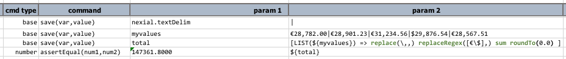
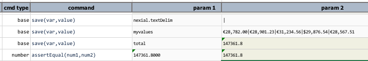

### Description
LIST represents expression intended to transform/manipulate a list of _things_.  This expression starts by specifying 
a list separated by [`nexial.textDelim`](../systemvars/index#nexial.textDelim) 

For example: 

Here, we are forcing `nexial.textDelim` as comma (`,`), although it is unlikely necessary.  Then we set `myList` to 
a list of US states. The last command uses a `LIST` expression to sort the US states.  Here's the output: 

### Operations
#### append(items)
- Add the specified `items` to the end of the current list.

#### ascending
- Re-order the list in ascending order, based on the 
  <a href="https://en.wikipedia.org/wiki/Lexicographical_order" class="external-link" target="_nexial_link">natural lexicographical order</a>.

#### average
- Calculate the average of all the numbers found in the list as a [`NUMBER`](NUMBERexpression).   Non-numeric items in 
  the list will be ignored, and not count towards the calculation of the average.  In almost all cases, this will be a 
  decimal number.

#### count
- Find the number of items in this list as a [`NUMBER`](NUMBERexpression). Alias to [`length`](#length).

#### combine(delim)
- Same as [`text`](#text), but with customized separator (`delim`).

#### descending
- Re-order the list in descending order, based on the 
  <a href="https://en.wikipedia.org/wiki/Lexicographical_order" class="external-link" target="_nexial_link">natural lexicographical order</a>.

#### distinct
- Remove all duplicate items in the list.

#### first
- Retrieve the first item in the list as a [`TEXT`](TEXTexpression).

#### index(item)
- Transform the current list to a [`NUMBER`](NUMBERexpression) representing the position of the specified `item` in 
  the list.

#### insert(index,item)
- Insert new `item` to existing list at position specified by `index`. 

#### intersect(list)
- Transform the current list by creating a new list that contains only the items found in both `list`.  See 
  <a href="https://en.wikipedia.org/wiki/Union_(set_theory)" class="external-link" target="_nexial_link">Intersection (set theory)</a> for more details.

#### item(index)
- Retrieve the item on the list based on its `index`.  If invalid `index` is specified, an empty string is returned.

#### join(list)
- Transform the current list by appending `list` to it; same as [`append(items)`](#append(items)).

#### last
- Retrieve the last item in the list as a [`TEXT`](TEXTexpression).

#### length
- Find the length of this list as a [`NUMBER`](NUMBERexpression). Alias to [`count`](#count).

#### max
- Find the largest number in the list as a [`NUMBER`](NUMBERexpression).

#### min
- Find the smallest number in the list as a [`NUMBER`](NUMBERexpression).

#### pack
- Remove all empty or null items in the list.

#### prepend(items)
- Add the specified `items` to the beginning of the current list.

#### remove(index)
- Remove an item of the list denoted by the item's `index`.

#### removeItems(items)
- Remove one or more items from the list.

#### replace(searchFor,replaceWith)
- For the portion of all items that matches `searchFor`, replace it with `replaceWith`.

#### replaceItem(searchFor,replaceWith)
- Replace all items that exactly matches `searchFor` with `replaceWith`.  For example, list = 
  `CA,NY,AL,AK,HI,CA,AS,KR,CT,CS,CS,CA`.  `[LIST($list) => replaceItem(CA,TX)]` would return a list as 
  `TX,NY,AL,AK,HI,TX,AS,KR,CT,CS,CS,TX`.

#### replaceRegex(searchFor,replaceWith)
- Replace the content of all items that match the regular expression  `searchFor`, with `replaceWith`.

#### replica(count)
- Transform the current list to multiple copies of itself (append the list to itself).  The 
  `count` is used to specify the number of times to repeat.  For example, `[LIST(a,b,c) => replace(2)]` would yield a 
  list of `a,b,c,a,b,c,a,b,c`.

#### replicaUntil(size)
- Transform the current list to multiple copies of itself (append the list to itself), 
  until the length of the list is the same as `size`.  For example, `[LIST(a,b,c) => replicaUntil(7)]` would yield 
  a list of `a,b,c,a,b,c,a`.

#### reverse
- Reverse the order of the items in the list.

#### store(var)
- Save current LIST expression to a data variable.  If the specified `var` exists, its value will be overwritten.  
  Using this operation, one can put an expression on pause and resume it at a later time.

#### sublist(start,end)
- Transform current list by downsizing it to a subset between `start` index and `end` index.

#### sum
- Add up all the numbers found in the list as a [`NUMBER`](NUMBERexpression).  Depending on the numbers found, the 
  resulting number (the sum) could be a whole or decimal number.

#### text
- Transform list into text using current text delimiter (denoted via 
  [`nexial.textDelim`](../systemvars/index#nexial.textDelim)) as separator between item list items.

#### union(list)
- Transform the current list by appending to it the items in the specified `list` that are not found.  In essence, 
  this operation creates a new list that contains all the items in both list without any repeats. See 
  <a href="https://en.wikipedia.org/wiki/Union_(set_theory)" class="external-link" target="_nexial_link">Union (set theory)</a> 
  for more details.
  

### Example
Suppose we want to sum up a list of numbers (_In this example, we are not considering currency conversion_):
- €28,782.00
- €28,901.23
- €31,234.56
- $29,876.54
- €28,567.51

Here's how one might approach the automation:

**Script**: 

Since the values contains commas (`,`), we should not consider `,` as the delimiter (default). Hence the first step is 
to substitute `,` with another delimiter (`|`).

As an example, we are creating the list of values manually here in Step 2. One might derive at this list of values via 
of the commands that support LIST such as:
- [base &raquo; `split(text,delim,saveVar)`](../commands/base/split(text,delim,saveVar))
- [excel &raquo; `saveData(var,file,worksheet,range)`](../commands/excel/saveData(var,file,worksheet,range))
- [json &raquo; `storeValues(json,jsonpath,var)`](../commands/json/storeValues(json,jsonpath,var))
- [web &raquo; `saveValues(var,locator)`](../commands/web/saveValues(var,locator))
- [web &raquo; `saveTextArray(var,locator)`](../commands/web/saveTextArray(var,locator))
- [xml &raquo; `storeValues(xml,xpath,var)`](../commands/xml/storeValues(xml,xpath,var))

The bulk of the work is in the 3rd step, where we employ multiple operations:
1. Replace `,` with nothing - effectively removing the `,` character. Note that `,` is also the parameter separator - 
   hence the slightly unusual syntax `replace(\,,)`. It reads: "replace commas (the escaped comma (`\,`)) with nothing". 
2. Replace the `€` and `$` with nothing - effectively removing them. Here we are using the `replaceRegex` operation to 
   remove multiple characters with one operation. As a matter of personal preference, one could use multiple `replace` 
   operations to achieve the same result. 
3. Now that `,` `€` and `$` characters have been removed, our values now can be treated as numbers. We can simply 
   apply the `sum` operations to derive the total value. Note that after the `sum` operation, we have effectively 
   switch from a LIST expression to [NUMBER expression](NUMBERexpression).
4. The [NUMBER expression](NUMBERexpression), among other operations, allows for customized numeric rounding. Here we 
   are rounding the total to 1 decimal place via the `roundTo` operation.
5. Finally we are storing the value to a variable named as `total`.

Step 4 shows how the rounded `total` value can be compared with another numeric value that contains different 
decimal precision. Unlike the text-based assertion commands in [`base`](../commands/base), the assertion commands in 
[`number`](../commands/number) perform numerical comparison so that numbers of different precision may be treated as the
same if they are numerically equivalent.

The output further illustrates the explanation above and confirms the expectation.

**Output**: 

