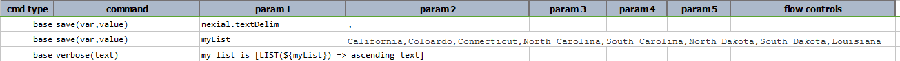

### Description
LIST represents expression intended to transform/manipulate a list of _things_.  This expression starts by specifying 
a list separated by [`nexial.textDelim`](../systemvars/index#nexial.textDelim) 

For example: 

Here, we are forcing `nexial.textDelim` as comma (`,`), although it is unlikely necessary.  Then we set `myList` to 
a list of US states. The last command uses a `LIST` expression to sort the US states.  Here's the output: 

### Operations
- **`append(items)`** \- add the specified `items` to the end of the current list.
- **`ascending`** \- re-order the list in ascending order, based on the 
  <a href="https://en.wikipedia.org/wiki/Lexicographical_order" class="external-link" target="_nexial_target">natural lexicographical order</a>.
- **`average`** \- calculate the average of all the numbers found in the list as a [`NUMBER`](NUMBERexpression).  
  Non-numeric items in the list will be ignored, and not count towards the calculation of the average.  In almost all 
  cases, this will be a decimal number.
- **`combine(delim)`** \- same as `text`, but with customized separator (`delim`).
- **`descending`** - re-order the list in descending order, based on the 
  <a href="https://en.wikipedia.org/wiki/Lexicographical_order" class="external-link" target="_nexial_target">natural lexicographical order</a>.
- **`distinct`** \- remove all duplicate items in the list.
- **`first`** \- retrieve the first item in the list as a [`TEXT`](TEXTexpression).
- **`index(item)`** \- transform the current list to a [`NUMBER`](NUMBERexpression) representing the position of the 
  specified `item` in the list.
- **`insert(index,item)`** \- insert new `item` to existing list at position specified by `index`. 
- **`intersect(list)`** \- transform the current list by creating a new list that contains only the items found in 
  both `list`.  See 
  <a href="https://en.wikipedia.org/wiki/Union_(set_theory)" class="external-link" target="_nexial_target">Intersection (set theory)</a> for more details.
- **`item(index)`** \- retrieve the item on the list based on its `index`.  If invalid `index` is specified, an empty 
  string is returned.
- **`join(list)`** \- transform the current list by appending `list` to it; same as `append(items)`.
- **`last`** \- retrieve the last item in the list as a [`TEXT`](TEXTexpression).
- **`length`** \- find the length of this list as a [`NUMBER`](NUMBERexpression).
- **`max`** \- find the largest number in the list as a [`NUMBER`](NUMBERexpression).
- **`min`** \- find the smallest number in the list as a [`NUMBER`](NUMBERexpression).
- **`pack`** \- remove all empty or null items in the list.
- **`prepend(items)`** \- add the specified `items` to the beginning of the current list.
- **`remove(index)`** \- remove an item of the list denoted by the item's `index`.
- **`removeItems(items)`** \- remove one or more items from the list.
- **`replace(searchFor,replaceWith)`** \- for the portion of all items that matches `searchFor`, replace it with 
  `replaceWith`.
- **`replaceItem(searchFor,replaceWith)`** \- replace all items that exactly matches `searchFor` with `replaceWith`.  
  For example,   
  list = `CA,NY,AL,AK,HI,CA,AS,KR,CT,CS,CS,CA`  
  `  [LIST($list) => replaceItem(CA,TX)]` would return a list as `TX,NY,AL,AK,HI,TX,AS,KR,CT,CS,CS,TX` 
- **`replaceRegex(searchFor,replaceWith)`** \- replace the content of all items that match the regular expression 
  `searchFor`, with `replaceWith`.
- **`replica(count)`** \- transform the current list to multiple copies of itself (append the list to itself).  The 
  `count` is used to specify the number of times to repeat.  For example, `[LIST(a,b,c) => replace(2)]` would yield a 
  list of `a,b,c,a,b,c,a,b,c`.
- **`replicaUntil(size)`** \- transform the current list to multiple copies of itself (append the list to itself), 
  until the length of the list is the same as `size`.  For example, `[LIST(a,b,c) => replicaUntil(7)]` would yield 
  a list of `a,b,c,a,b,c,a`.
- **`reverse`** \- reverse the order of the items in the list.
- **`store(var)`** \- save current LIST expression to a data variable.  If the specified `var` exists, its value will 
  be overwritten.  Using this operation, one can put an expression on pause and resume it at a later time.
- **`sublist(start,end)`** \- transform current list by downsizing it to a subset between `start` index and `end` 
  index.
- **`sum`** \- add up all the numbers found in the list as a [`NUMBER`](NUMBERexpression).  Depending on the numbers 
  found, the resulting number (the sum) could be a whole or decimal number.
- **`text`** \- transform list into text using current text delimiter (denoted via 
  [`nexial.textDelim`](../systemvars/index#nexial.textDelim)) as separator between item list items.
- **`union(list)`** \- transform the current list by appending to it the items in the specified `list` that are not 
  found.  In essence, this operation creates a new list that contains all the items in both list without any repeats.  
  See [Union (set theory)](https://en.wikipedia.org/wiki/Union_(set_theory)) for more details.
  
