### Description
NUMBER treats its data a number, from which mathematical or numerical operations may be performed.

**Note**: Where the argument to the operations listed below is `numbers`, the expected separators between numbers
is comma (`,`). Spaces between numbers are allowed. For example,

```text
[NUMBER(92) => add(44, 92, 71.23, 801.23, -1092) minus(11, 44.002) multiply( 15.01, 0.902 ) divide(5.0190, 0.07092)]
```

The arithmetic operations are conducted from left to right, without arithmetic order of precedence. The above 
example would yield `-1770.2978788893238`.


### Operations

#### **`abs(numbers)`**
transform current number as a positive number. 

This means that a positive number will remain as is. A negative number will be negated (i.e. multiply by `-1`), 
transforming into its positive "counterpart".

**Example**<br/>
Script:<br/>
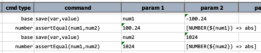

Output:<br/>
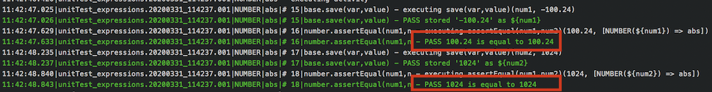

-----

#### **`add(numbers)`**
add one or more numbers to current number.

**Example**<br/>
Script:<br/>
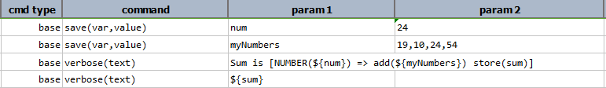

Output:<br/>
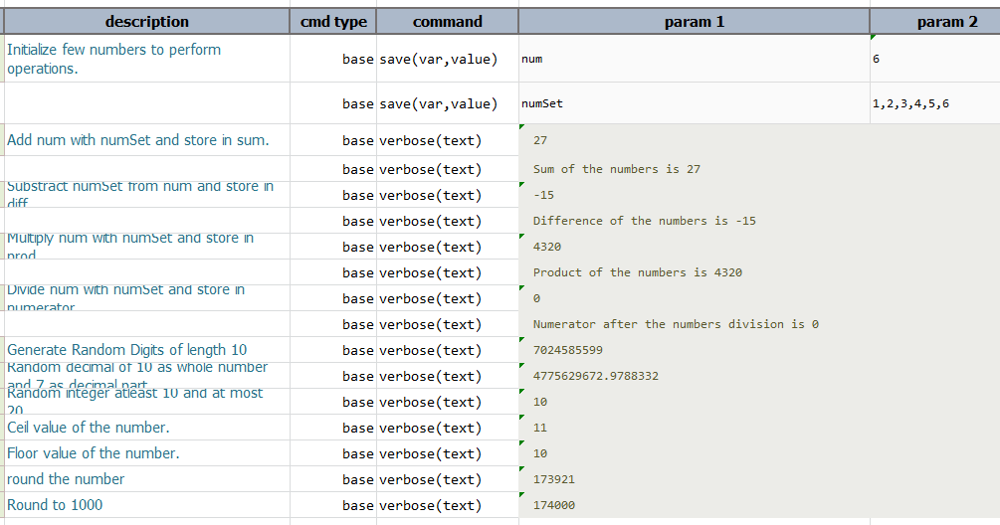

-----

#### **`ceiling`**
round up current number.

**Example**<br/>
Script:<br/>
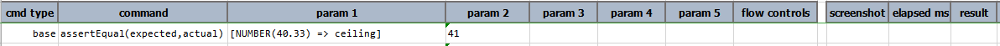

Output:<br/>
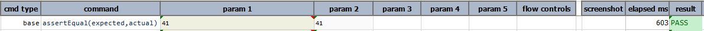

-----

#### **`divide(numbers)`**
divide one or more numbers from current number, in the order specified.

**Example**<br/>
Script:<br/>
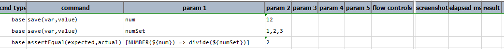

Output:<br/>
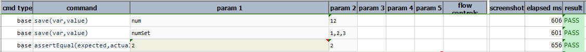

When any number is `divided by 0`. Then, output is `unable to process expression due to null`.<br/>
Mathematically, any number divided by 0 is an invalid statement.

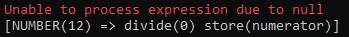

-----

#### **`floor`**
round down current number.

**Example**<br/>
Script:<br/>
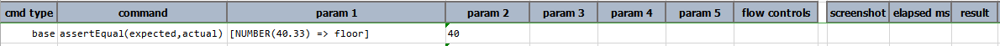

Output:<br/>


-----

#### **`minus(numbers)`**
subtract one or more numbers from current number, in the order specified.

**Example**<br/>
Script:<br/>
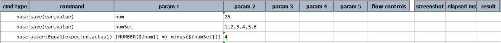

Output:<br/>
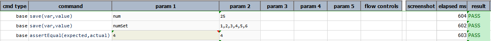

-----

#### **`multiply(numbers)`**
multiple one or more numbers to current number, in the order specified.

**Example**<br/>
Script:<br/>
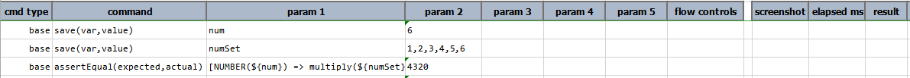

Output:<br/>
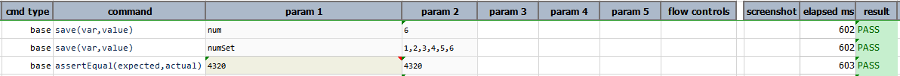

-----

#### **`randomDigits(length)`** 
generate a random string of digits of the specified `length`.

**Example**<br/>
Script:<br/>
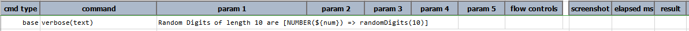

Output:<br/>
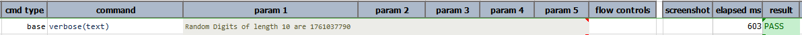

-----

#### **`randomDecimal(wholeLength,fractionLength)`**
generate a random decimal number which contains a whole number of length as specified by `wholeLength`, and decimal 
number of length as specified by `fractionLength`.

**Example**<br/>
Script:<br/>
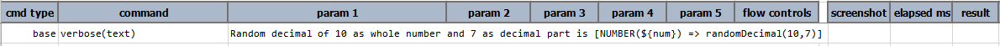

Output:<br/>
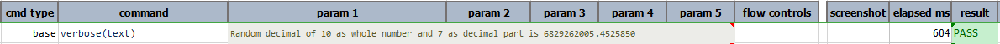

-----

#### **`randomInteger(atLeast,atMost)`**
generate a random integer number within the range of `atLeast` and `atMost`.

**Example**<br/>
Script:<br/>


Output:<br/>
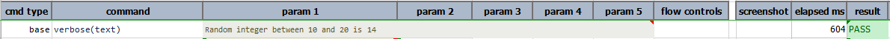

-----

#### **`whole`**
transform current number to a whole number (integer) by dropping any existing decimal value.

**Example**<br/>
Script:<br/>
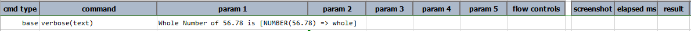

Output:<br/>
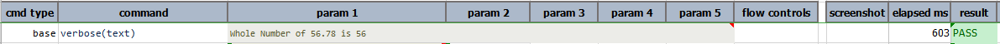

-----

#### **`roundTo(closestDigit)`**
transform current number by rounding it to the `closestDigit`. The `closestDigit` is used to specify "the closest 
digit", "the closest tenth", "the closest hundredth", etc.  For example,  `[NUMBER(173921.22) => roundTo(1000)]` would 
yield `174000`. However to retain decimals, one would specify `0.` followed by number of desired decimal places instead. 
`[NUMBER(173921.22) => roundTo(0.0)]` would yield `173921.2`. 

**Example**<br/>
Script:<br/>
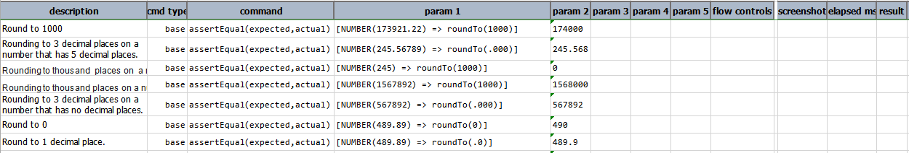

Output:<br/>
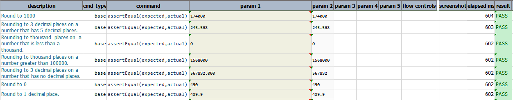

-----

#### **`store(var)`**
save current NUMBER expression to a data variable.  If the specified `var` exists, its value will be overwritten. 
Using this operation, one can put an expression on pause and resume it at a later time.

**Example**<br/>
Script:<br/>
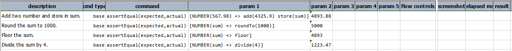

Output:<br/>
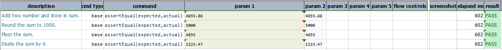

-----

#### **`text`**
transform current number to text

**Example**<br/>
In this example, [TEXT expression](TEXTexpression) operation is performed by 
changing the number into text format.<br/>
Script:<br/>
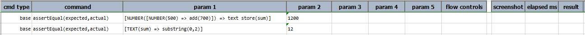

Output:<br/>
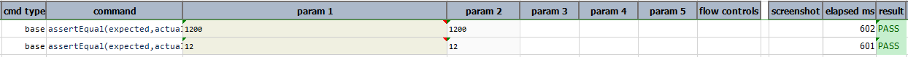

-----

<script>jQuery(document).ready(function () { newOperationSelect(); });</script>

