### Description
`TEXT`, as the name suggest, treats its input as text.  All its operations treat their respective input as text as well.


### Operations
#### **`after(criteria)`**
Retain the portion of text after the specified `criteria`.

**Example**<br/>
Script:<br/>
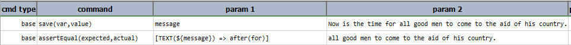

Output:<br/>
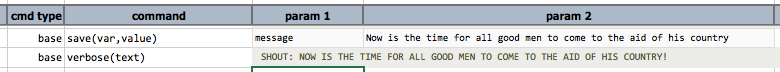

-----

#### **`append(text,text,text,...)`**
Add one or more text to the end of `text`.

**Example**<br/>
Script:<br/>
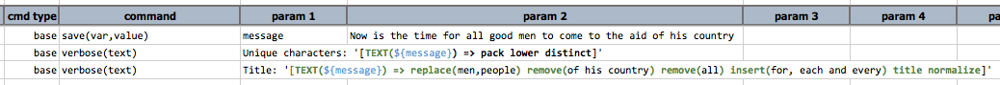

Output:<br/>
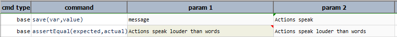

-----

#### **`appendIfMissing(appendWith)`**
Add `appendWith` to the end of current text ONLY if `appendWith` is currently not at the end of text.

**Example**<br/>
Script:<br/>
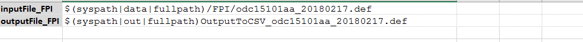

Output:<br/>
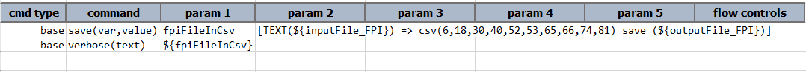

-----

#### **`base64decode`**
BASE64 decode text.

**Example**<br/>
Script:<br/>
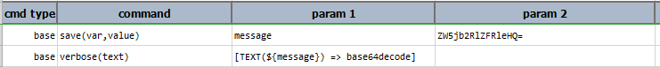

Output:<br/>
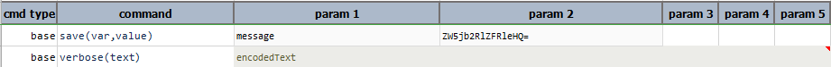

-----

#### **`base64decodeThenSave(file,append)`**
Or, **`base64decode-then-save(file,append)`**. 
BASE64 decode current `TEXT` content and saving the decoded bytes to `file`. This operation assumes that current `TEXT` 
content is BASE64 encoded, and that the decoded content is binary (e.g. Excel, PDF or Image file). Use `append` to 
append the decoded content to an existing file.

**Example**<br/>
Script:<br/>
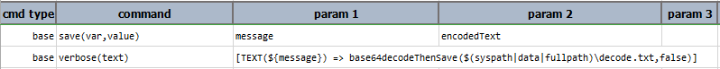

Output:<br/>
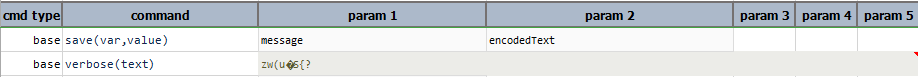

Saving the decoded bytes to the path specified in the `file` parameter.

decode.txt:<br/>
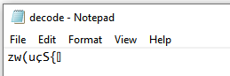

-----

#### **`base64encode`**
BASE64 encode text.

**Example**<br/>
Script:<br/>
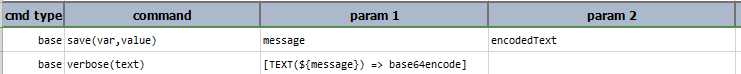

Output:<br/>
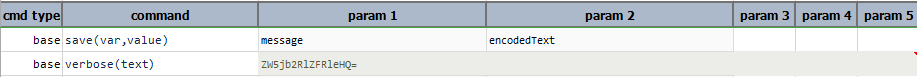

-----

#### **`before(criteria)`**
Retain the portion of text before the specified `criteria`.

**Example**<br/>
Script:<br/>
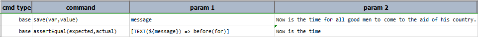

Output:<br/>
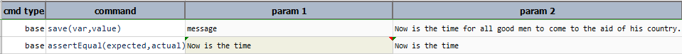

-----

#### **`between(start,end)`**
Retain the portion of text that is between the specified `start` and `end` text.

**Example**<br/>
Script:<br/>
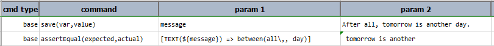

Output:<br/>
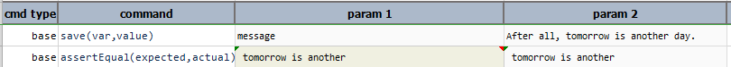

-----

#### **`count(searchFor)`**
Transfer into a [`NUMBER`](NUMBERexpression) data type that contains the number of occurrence for `searchFor`.

**Example**<br/>
Script:<br/>
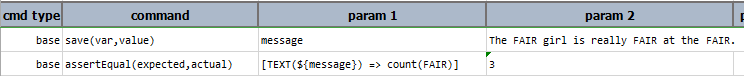

Output:<br/>
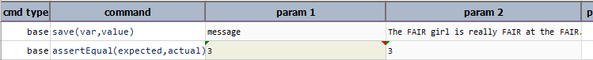

-----

#### **`csv(position1,position2,...)`**
Converts the given text content to csv format, separated by the given position numbers for each line.

**Example**<br/>
Text input could be a text itself or a path to text file.

Text Input:<br/>
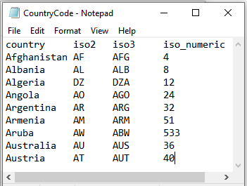

Script:<br/>
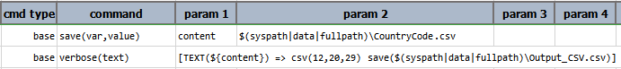

Output:<br/>
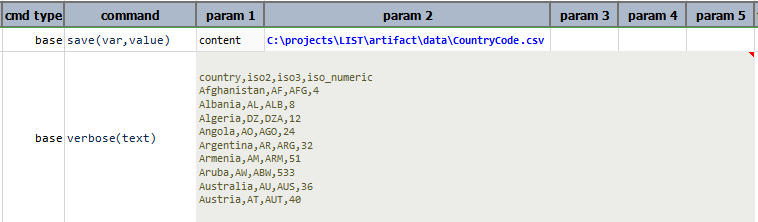

In this example, after converting to csv format, it saves the csv content to the given output file path.

Text Output:<br/>
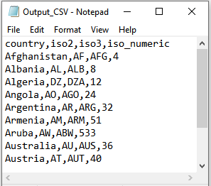

-----

#### **`distinct`**
Remove any duplicate characters from text.

**Example**<br/>
Script:<br/>


Output:<br/>
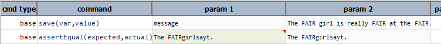

-----

#### **`extract(beginRegex,endRegex,inclusive)`**
Extract from current text all instances of text found between `beginRegex` and `endRegex`. Both `beginRegex` and 
`endRegex` are regular expressions. Set `inclusive` as `true` to include the text that matches `beginRegex` and 
`endRegex`. This operation effectively transforms current TEXT expression into a [`LIST`](LISTexpression) expression.

**Example**<br/>
Script:<br/>
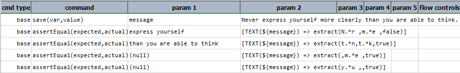

Output:<br/>


-----

#### **`insert(after,text)`**
Search for `after` in text, and if found, add the specified text to it.  If `after` is not found, no changes will be 
made to text.

**Example**<br/>
Chain up a `remove` and a `insert`. In this example, after removing the word "all", insert operation will insert 
"each and every" after the word "for".<br/>

Script:<br/>
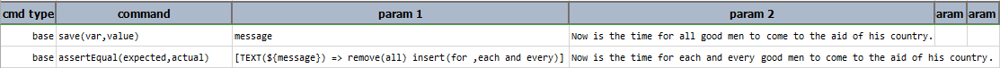

Output:<br/>
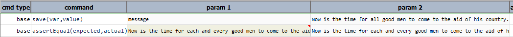

-----

#### **`json`**
Transform existing text into a [JSON expression](JSONexpression). If 
[`nexial.expression.resolveURL`](../systemvars/index#nexial.expression.resolveURL) is set to `true` and the current 
text content is a URL, Nexial will automatically download from such URL and transform the download content as 
[JSON expression](JSONexpression). 

**Example**<br/>
In this example, the text is converted to json format, to perform json operations on it.<br/>
Script:<br/>
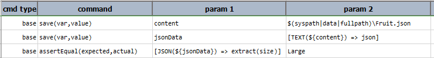

Output:<br/>
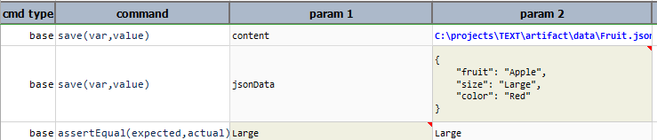

-----

#### **`length`**
Transfer into a [`NUMBER`](NUMBERexpression) data type that contains the length of text.

**Example**<br/>
Script:<br/>
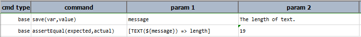

Output:<br/>
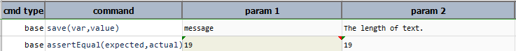

-----

#### **`list(delim)`**
Transfer into a [`LIST`](LISTexpression) data type by converting text into a list, using  `delim` as the character to split.

**Example**<br/>
Script:<br/>


Output:<br/>
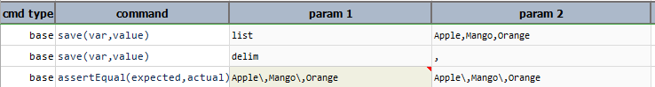

-----

#### **`lower`**
Turn text into lowercase equivalent.

**Example**<br/>
Script:<br/>
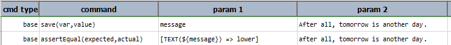

Output:<br/>
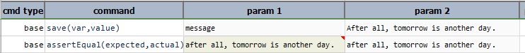

-----

#### **`number`**
Transfer into a [`NUMBER`](NUMBERexpression) data type by converting text into a numeric value. Failure to explicitly 
convert text into number will result in an ERROR condition.

**Example**<br/>
Script:<br/>
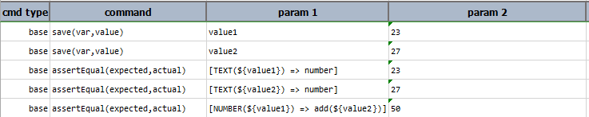

Output:<br/>
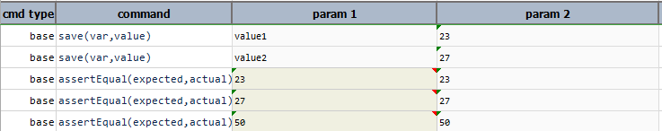

-----

#### **`normalize`**
Remove any leading or trailing whitespaces and also remove duplicate whitespace characters in text. The end result is 
that text will not contain any occurrences of successive spaces.

**Example**<br/>
Script:<br/>
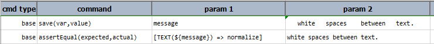

Output:<br/>
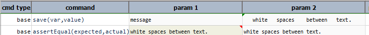

-----

#### **`pack`**
Remove all whitespace characters (tab, space, line feed, carriage return) from text.

**Example**<br/>
Script:<br/>
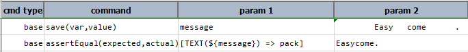

Output:<br/>
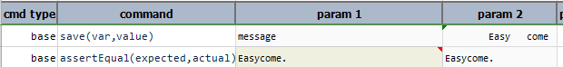

-----

#### **`parseAsCsv(configs)`**
Parse the current text content as CSV. This operation supports the same parsing options found in 
[CSV &raquo; `parse(configs)`](CSVexpression#parseconfig).

**Example**<br/>
In this example, the `parseAsCsv(configs)` operation is invoked on a TEXT expression. The next operation, `store(var)`,
is issued against the now-transformed CSV expression. This is evident by the fact that the subsequent operation is
`column-count`, which is an operation from [CSV Expression](CSVexpression). Furthermore, the "stored" data variable is
recalled in the next command as a CSV expression, from which the `row-count` operation is issued.

Script:<br/>
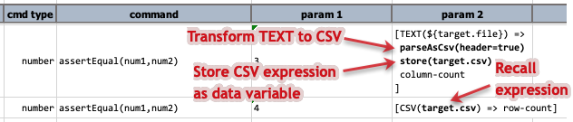

-----

#### **`prepend(text,text,text,...)`**
Add one or more text to the beginning of `text`.

**Example**<br/>
Script:<br/>
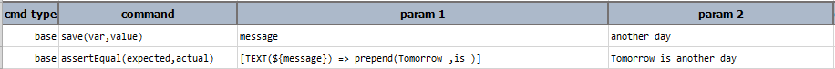

Output:<br/>
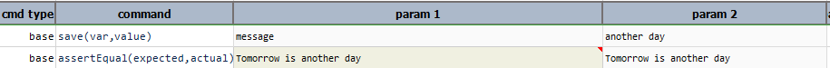

-----

#### **`prependIfMissing(prependWith)`**
Add `prependWith` to the beginning of current text ONLY if `prependWith` if currently not at the beginning of text.

**Example**<br/>
Script:<br/>
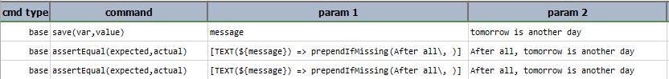

Output:<br/>
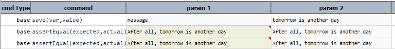

-----

#### **`remove(criteria)`**
Remove any and all occurrences of `criteria`.

**Example**<br/>
Script:<br/>
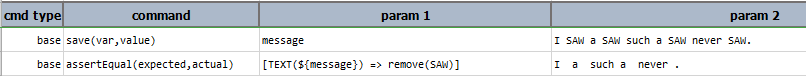

Output:<br/>
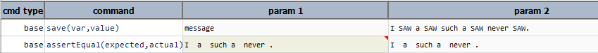

-----

#### **`removeEnd(ending)`**
Or **`remove-end(ending)`**. Remove ending character sequence (substring) of text that matches `ending`.

**Example**<br/>
Script:<br/>


Output:<br/>
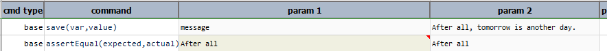

-----

#### **`removeRegex(regex)`**
Remove character(s) that matches `regex`.

**Example**<br/>
Script:<br/>
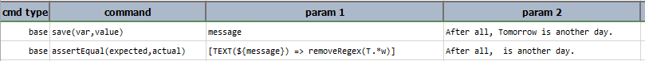

Output:<br/>
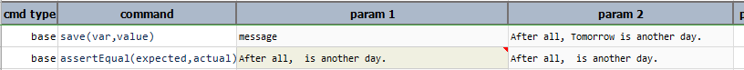

-----

#### **`removeStart(start)`**
Or **`remove-start(start)`**
Remove starting character sequence (substring) of text that matches `start`.

**Example**<br/>
Script:<br/>


Output:<br/>


-----

#### **`replace(searchFor,replaceWith)`**
As the name suggest, this operation will search for `searchFor` and replace matches with `replaceWith`.

**Example**<br/>
Script:<br/>


Output:<br/>


-----

#### **`replaceRegex(searchRegex,replaceWith)`**
Perform a regex-search on text using `searchRegex` and replace all matches with `replaceWith`.  Note that grouping 
character `(` and `)` should be escaped as `\(...\)`.  For example,  `[TEXT(...) => replaceRegex(\(chicken\),beef)]`

**Example**<br/>
Script:<br/>


Output:<br/>


-----

#### **`retain(keep)`**
Retain only the characters found in `keep`.

**Example**<br/>
Script:<br/>


Output:<br/>


-----

#### **`retainRegex(regex)`**
Retain only the characters matched to `regex`.

**Example**<br/>
Script:<br/>


Output:<br/>


-----

#### **`save(path,append)`**
Save current text content to `path`. If `path` resolves to an existing file, `append` set as `true` will append 
current text content to the said file. `append` is optional and defaults to `false`.

**Example**<br/>
Script:<br/>


Output:<br/>


In this example, "Now is the time for all good people to come to the aid of his country." is saved to the given 
path, after the execution of next test step "Actions speak louder than words." is appended after the content of 
first line as `append` is set to `true`.
<br/>


-----

#### **`store(var)`**
Save current TEXT expression to a data variable.  If the specified `var` exists, its value will be overwritten. Using 
this operation, one can put an expression on pause and resume it at a later time.

**Example**<br/>
Script:<br/>


Output:<br/>


-----

#### **`substring(start,end)`**
Retain the portion of text from the `start` position (zero-based) to the `end`  position (exclusive).

**Example**<br/>
Script:<br/>


Output:<br/>


-----

#### **`title`**
Turn text into Title Case, while the first letter of every word is capitalized.

**Example**<br/>
Script:<br/>


Output:<br/>


-----

#### **`trim`**
Remove any non-printable character in the beginning or ending of text.

**Example**<br/>
Script:<br/>


Output:<br/>


-----

#### **`upper`**
Turn text into UPPERCASE equivalent.

**Example**<br/>
Script:<br/>


Output:<br/>


-----

#### **`xml`**
Transform existing text into a [XML expression](XMLexpression). If 
[`nexial.expression.resolveURL`](../systemvars/index#nexial.expression.resolveURL) is set to `true` and the current 
text content is a URL, Nexial will automatically download from such URL and transform the download content as 
[XML expression](XMLexpression). One may use this operation to parse the HTML content as a XML document. 

**Example**<br/>
In this example, the text is converted to xml format, to perform xml operations on it.<br/>
Suppose the following XML document `bookStore.xml`:
```xml
<?xml version="1.0" encoding="UTF-8"?>
<bookstore>  
  <book>  
    <title>Everyday Italian</title>  
    <author>Giada De Laurentiis</author>
    <year>2005</year>  
  </book> 
  <book>  
    <title>Learning XML</title>
    <author>Erik T. Ray</author>  
    <year>2003</year>  
  </book>  
</bookstore>
```
Script:<br/>


Output:<br/>


-----

<script>jQuery(document).ready(function () { newOperationSelect(); });</script>

