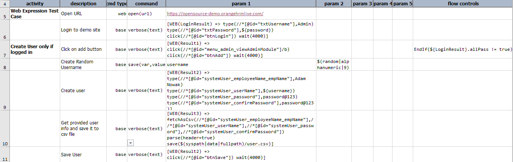
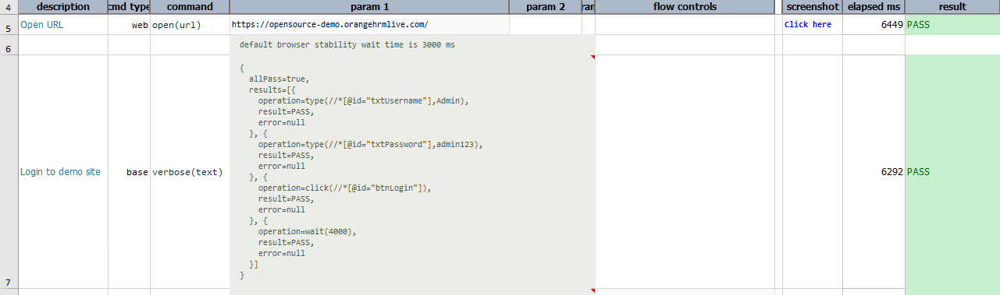
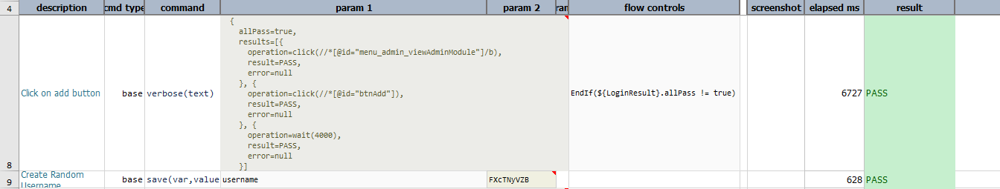
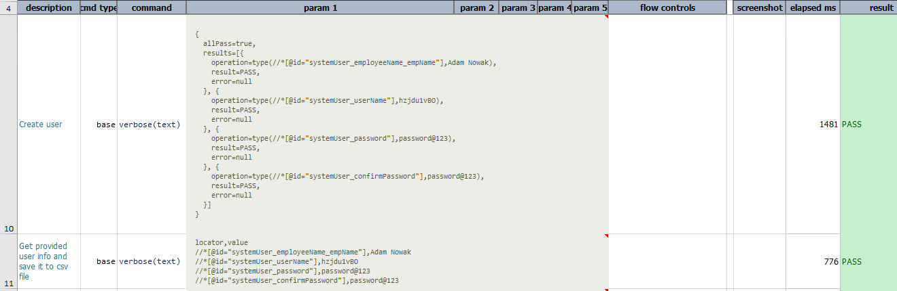
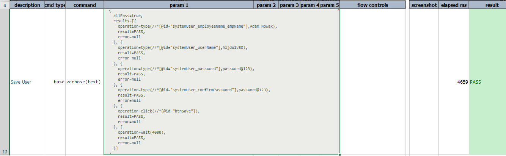

### Description
WEB expression allows one to express the processing of one or more Web automation operations in pipeline format.
Web expression must be in following format:<br>
`[WEB(webResult) => type(locator,value) click(locator)]`<br>
Here, `webResult` is nothing but the variable which stores outcome of each operation.

### Working with Execution Result
Executing series of Web automated operation will result in series of outcomes. So Nexial is designed to capture entire 
result into `wrapper` or `object`. This wrapper consists of following fields.
1. **allPass** - this will return pass or fail depending on the end result of series of operations.
 If any operation is failed, it will return false.
2. **results** - This will return the list of web operation result.

Each web execution result is also captured as `wrapper` or `object`. Web Result has following fields:-
1. **operation** - This is the web operation performed.
2. **result** - This is the result of the web operation performed which is `PASS` or `FAIL`.
3. **error** - This will show the error if in case any operation is failed.

Following is the sample of the Web Execution result:-

```text
{
  allPass=false,
  results=[{
    operation=type(//*[@id="txtUsername"],Admin),
    result=PASS,
    error=null
  }, {
    operation=type(//*[@id="txtPassword"],admin123),
    result=PASS,
    error=null
  }, {
    operation=click(//*[@id="btnLogi"]),
    result=FAIL,
    error=No element via locator '//*[@id="btnLogin"]'
  }]
}
```

To reference the specific execution result, one would use the dot notation (`.`) like this: `${result}.allPass`. 
This would retrieve end execution result for series of operations.<br>
`${result}.results[0].result` will return first operation result as `PASS` or `FAIL`. One can use different variable name than `result`.
 
### Operations
- **`click(locator)`** \- This clicks on element specified via locator. If one wants to perform operation `clickByLabel`, 
  provided label as input must be with prefix `text=`. So for example, if locator is `text=LOGIN`, this clicks on the element having label `LOGIN`.    
- **`deselect(locator,option1,option2,option3...)`** \- This automates deselection of one or multiple `OPTION` elements from `select`
  element identified via locator. If multiple `OPTION` elements specified, it deselects multiple options from the listbox.
- **`fetchAsCsv(locator1,locator2,locator3...)`** \- This stores the values of web elements specified via locators 
  to [CSV](CSVexpression) format with the headers `locator` and `value`.
- **`select(locator,option1,option2,option3...)`** \- This automates selection of one or multiple `OPTION` elements from `select`
  element identified via locator. If multiple `OPTION` elements specified, it selects multiple options from the listbox.
- **`selectWindow(locator,winId)`** \- This selects the open tab/window as per the `windows id` or by `index` 
  determined by the order when corresponding tab/window is opened.
- **`text`** \- transforms the associated Web statement(s) result into plain text.
- **`type(locator,value)`** \- This enters the specified `value` into the first element that matches the specified 
 `locator`. 
- **`typeKeys(locator,value)`** \- This issues keystroke on the element specified via `locator`. For more information,
  go through [web &raquo; `typeKeys(locator,value)`](../commands/web/typeKeys(locator,value)) 
- **`wait(waitMs)`** \-  This waits till the desired time(in milli seconds) passed as input parameter `waitMs`.

### Example
Script:-<br>


Output:-<br>








