### Description
WEB expression allows one to express the processing of one or more Web automation operations in a pipeline-like format.
A Web expression must be in following format:<br/>
`[WEB(webResult) => type(locator,value) click(locator)]`<br/>

In the above example, `webResult` is the variable to capture the outcome of each web operation.


### Working with Execution Result
Executing series of Web automated operation will result in series of outcomes. So Nexial is designed to capture entire 
result into a "wrapper" or "object". This wrapper consists of following fields, which one can access via the dot (`.`) 
notation:
- **allPass** - `true` means all the executed web operations were successful, or `false` means one or more web 
  operations had failed.
- **results** - a list of web operation results, in the order of the their execution:
  - **operation** - the web operation performed.
  - **result** - the result of the web operation performed which is `PASS` or `FAIL`.
  - **error** - the error, if any, ocurred to a failed web operation.

Following is the JSON-like sample of the Web Execution result:
```text
{
  allPass=false,
  results=[{
    operation=type(//*[@id="txtUsername"],Admin),
    result=PASS,
    error=null
  }, {
    operation=type(//*[@id="txtPassword"],admin123),
    result=PASS,
    error=null
  }, {
    operation=click(//*[@id="btnLogi"]),
    result=FAIL,
    error=No element via locator '//*[@id="btnLogin"]'
  }]
}
```

To reference the specific execution result, one would use the dot notation (`.`) like this: `${result}.allPass`. 
This would retrieve end execution result for a series of operations. In contrast, the `${result}.results[0].result` will 
return first operation result as `PASS` or `FAIL`. One can use a different variable name other than `result`.


### Operations

#### `click(locator)`
This clicks on element specified via locator. If one wants to perform operation `clickByLabel`, provided label as input 
must be with prefix `text=`. So for example, if locator is `text=LOGIN`, this clicks on the element having label `LOGIN`.

**Example**<br/>
In this example, the first step is to open the URL and then login the site
[`(https://opensource-demo.orangehrmlive.com/)`](https://opensource-demo.orangehrmlive.com/) using [`type`](#typelocatorvalue)
and `click` operations.

Script:<br/>
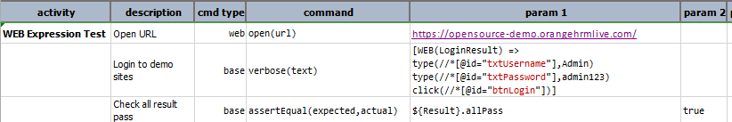

Output:<br/>
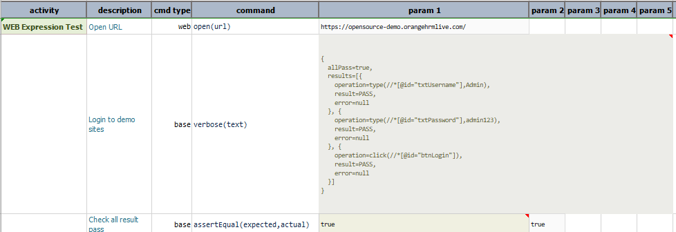

-----

#### `deselect(locator,option1,option2,option3...)`
This automates deselection of one or multiple `OPTION` elements from `select` element identified via locator. If 
multiple `OPTION` elements specified, it deselects multiple options from the list-box (i.e. `<select multiple ...>`).

**Example**<br/>
In this example, selection and deselection of values is done from the `sample.html` page using 
[`select(locator,option1,option2,option3...)`](#selectlocatoroption1option2option3) and then `deselect(locator,option1,option2,option3...)`
operation.

Sample HTML:<br/>
```html
<!DOCTYPE html>
<html>
<body>
<select name="cars" id="car-select" multiple>
  <option value="volvo">Volvo</option>
  <option value="audi">Audi</option>
  <option value="saab">Saab</option>
  <option value="opel">Opel</option>
</select>
</body>
</html>
```

Script:<br/>
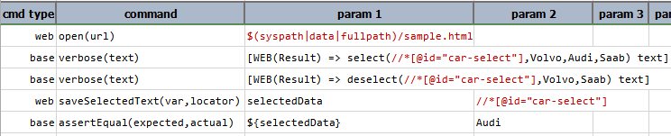

Output:<br/>
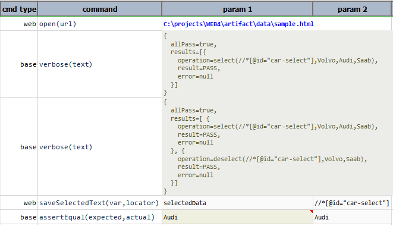

-----

#### `fetchAsCsv(locator1,locator2,locator3...)`
This stores the values of web elements specified via locators to [CSV](CSVexpression) format with the headers `locator` 
and `value`.

**Example**<br/>
In this example, the first step is to open the URL and login the site
[`(https://opensource-demo.orangehrmlive.com/)`](https://opensource-demo.orangehrmlive.com/) using [`type`](#typelocatorvalue)
and [`click`](#clicklocator) operations. If `allPass` is `true` and login is done successfully, then add new user. 
Details of new user is stored in the `user.csv` file by using `fetchAsCsv(locator1,locator2,locator3...)`
operation.

Script:<br/>
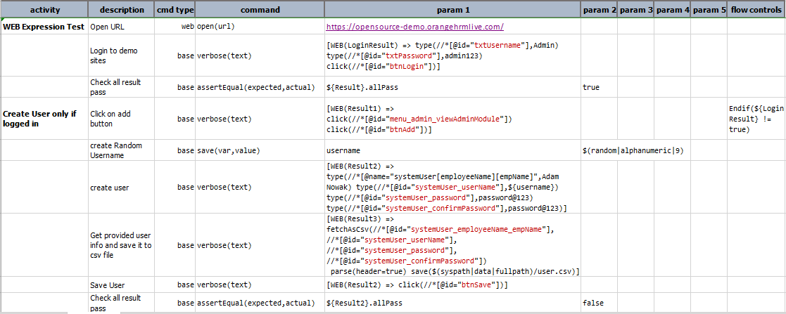

Script in Action:<br/>


Output CSV:<br/>
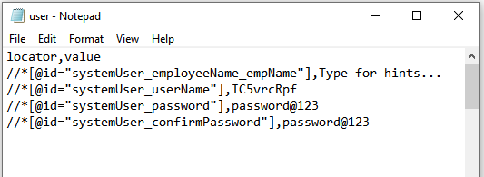

Output Excel:<br/>
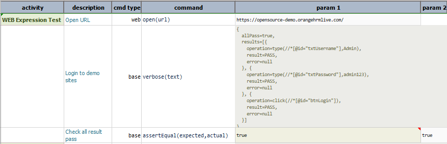
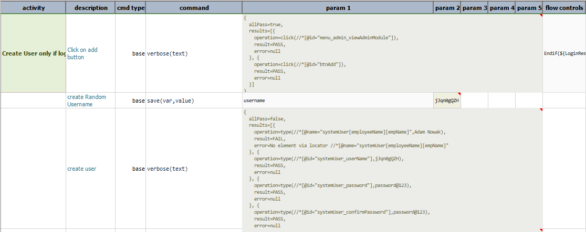
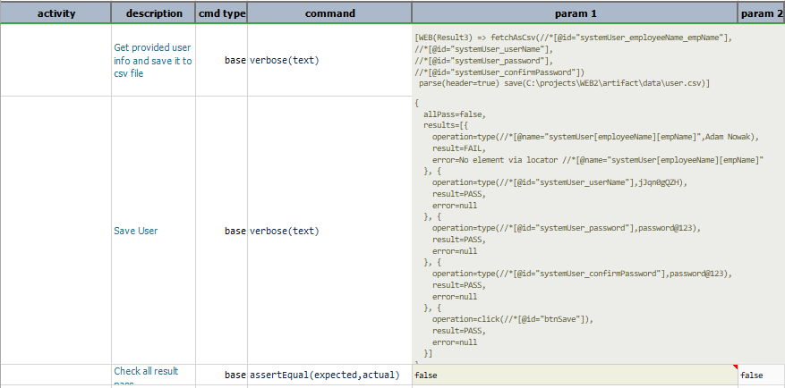

-----

#### `select(locator,option1,option2,option3...)`
This automates selection of one or multiple `OPTION` elements from `select` element identified via locator. If multiple 
`OPTION` elements specified, it selects multiple options from the list-box (i.e. `<select multiple ...>`).

**Example**<br/>
In this example, selection of values is done from the `sample.html` page using 
`select(locator,option1,option2,option3...)` operation.

Sample HTML:<br/>
```html
<!DOCTYPE html>
<html>
<body>
<select name="cars" id="car-select" multiple>
  <option value="volvo">Volvo</option>
  <option value="audi">Audi</option>
  <option value="saab">Saab</option>
  <option value="opel">Opel</option>
</select>
</body>
</html>
```

Script:<br/>
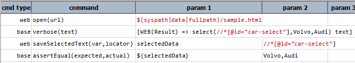

Output:<br/>
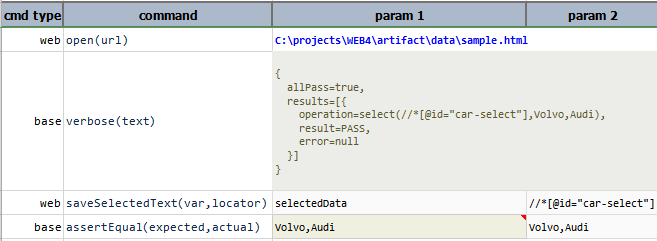

-----

#### `selectWindow(winId)`
This selects the open tab/window as per the `windows id` or by `index` determined by the order when corresponding 
tab/window is opened.

**Example**<br/>
Script:<br/>
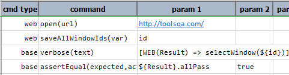

Output:<br/>
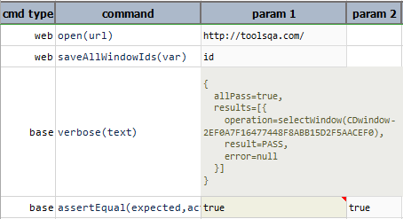

-----

#### `text`
Transforms the associated Web statement(s) result into plain text.

**Example**<br/>
In this example, the web execution result is converted to [`TEXTexpression`](TEXTexpression) to perform 
`TEXTexpression` operations on the result.

Script:<br/>
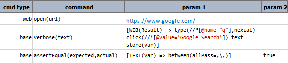

Output:<br/>
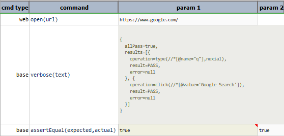

-----

#### `type(locator,value)`
This enters the specified `value` into the first element that matches the specified `locator`.
 
**Example**<br/>
In this example, `nexial` is typed in the google and the `google search` button is clicked by [`clicklocator`](#click)
operation.  

Script:<br/>


Script in Action:<br/>


Output:<br/>
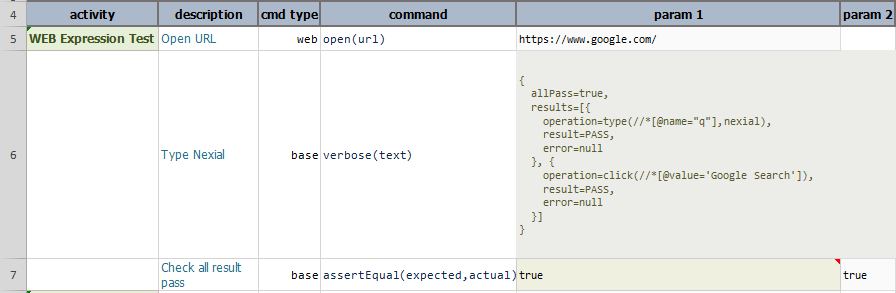

-----

#### `typeKeys(locator,value)`
This issues keystroke on the element specified via `locator`. For more information, go 
through [web &raquo; `typeKeys(locator,value)`](../commands/web/typeKeys(locator,value))
 
**Example**<br/>
In this example, the first step is to open the URL and login the site
[`(https://opensource-demo.orangehrmlive.com/)`](https://opensource-demo.orangehrmlive.com/) using [`type`](#typelocatorvalue)
and [`click`](#clicklocator) operations. By using, `typeKeys(locator,value)` the Username in the Admin Module is copied 
and pasted to the Employee Name.

Script:<br/>
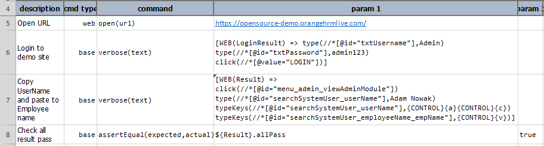

Script in Action:<br/>


Output:<br/>
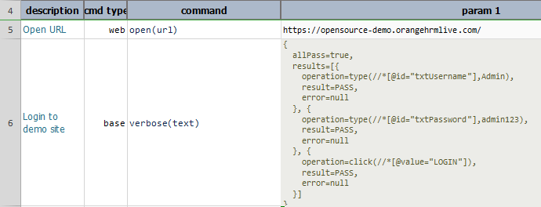
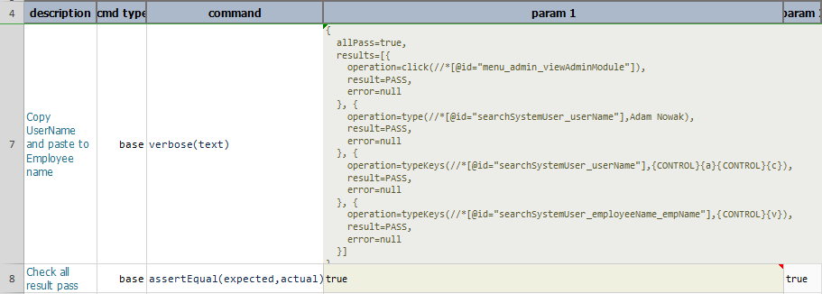

-----

#### `wait(waitMs)`
This waits till the desired time(in milli seconds) passed as input parameter `waitMs`.

**Example**<br/>
In this example, `nexial` is typed in the google. The `wait(waitMs)` force browser to wait for `10000ms` to click 
`google search` button. 

Script:<br/>
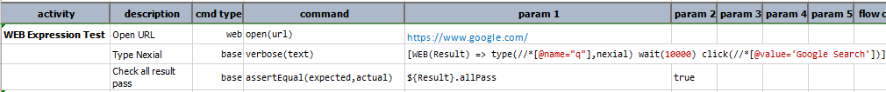

Script in Action:<br/>
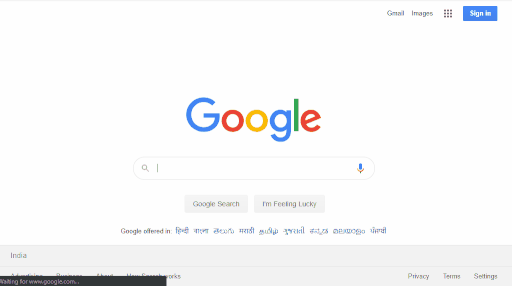

Output:<br/>
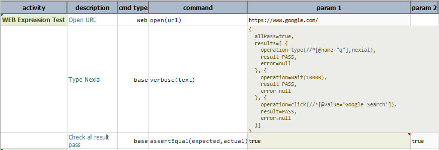

-----

<script>jQuery(document).ready(function () { newOperationSelect(); });</script>
