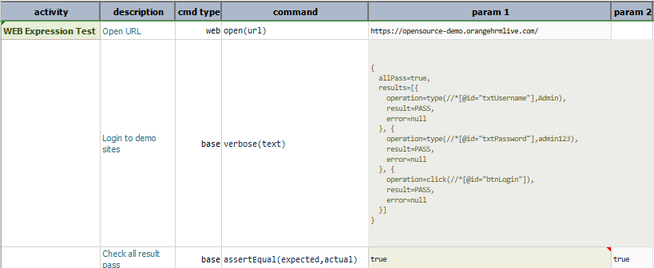
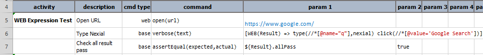

### Description
WEB expression allows one to express the processing of one or more Web automation operations in a pipeline-like format.
A Web expression must be in following format:<br/>
`[WEB(webResult) => type(locator,value) click(locator)]`<br/>

In the above example, `webResult` is the variable to capture the outcome of each web operation.


### Working with Execution Result
Executing series of Web automated operation will result in series of outcomes. So Nexial is designed to capture entire 
result into a "wrapper" or "object". This wrapper consists of following fields, which one can access via the dot (`.`) 
notation:
- **allPass** - `true` means all the executed web operations were successful, or `false` means one or more web 
  operations had failed.
- **results** - a list of web operation results, in the order of the executions:
  - **operation** - the web operation performed.
  - **result** - the result of the web operation performed which is `PASS` or `FAIL`.
  - **error** - the error, if any, occurred to a failed web operation.

Following is the JSON-like sample of the Web Execution result:
```text
{
  allPass=false,
  results=[{
    operation=type(//*[@id="txtUsername"],Admin),
    result=PASS,
    error=null
  }, {
    operation=type(//*[@id="txtPassword"],admin123),
    result=PASS,
    error=null
  }, {
    operation=click(//*[@id="btnLogin"]),
    result=FAIL,
    error=No element via locator '//*[@id="btnLogin"]'
  }]
}
```

To reference the specific execution result, one would use the dot notation (`.`) like this: `${result}.allPass`. 
This would retrieve end execution result for a series of operations. In contrast, the `${result}.results[0].result` will 
return first operation result as `PASS` or `FAIL`. One can use a different variable name other than `result`.


### Operations

#### `allPass`
This returns `true` if all the operations within the same WEB expression executed successful, or `false` is one or more 
operations had failed.

-----

#### `check(locator,waitMs)`
**Only applicable to checkboxes**. This operation ensures that the checkbox represented by the `locator` is checked. 
If the target checkbox is already checked, this operation performs no action upon it.

If the specified `locator` resolves to multiple checkboxes, then the same applies to all of them.

The `waitMs` parameter is optional. It represents the amount of time Nexial would wait for all the matching checkboxes
to be checked. If none is specified, then the value of [`nexial.pollWaitMs`](../systemvars/index.html#nexial.pollWaitMs)
will be used instead. If you are considering only ave a small number of checkboxes, it might be good to set `waitMs` 
to a small number like `1000`.

-----

#### `click(locator)`
This clicks on an element specified via its locator. One may perform the `click-by-label` operation (see 
[web &raquo; `clickByLabel`](../commands/web/clickByLabel(label))) by specifying the `locator` parameter as `text=...`. 
For example, to click on an element with text `LOGIN`, one may specify the locator as `text=LOGIN`.

**Example**<br/>
In this example, the first step is to open the URL and then login the site
[`(https://opensource-demo.orangehrmlive.com/)`](https://opensource-demo.orangehrmlive.com/) 
using [`type(locator,value)`](#typelocatorvalue)
and `click` operations.

Script:<br/>


Output:<br/>


-----

#### `deselect(locator,options)`
This automates the deselection of one or multiple `OPTION` elements from `select` element identified via locator. If 
multiple `OPTION` elements specified, it deselects multiple options from the list-box (i.e. `<select multiple ...>`).
Multiple options specified via `options` must be separated by [`nexial.textDelim`](./../systemvars/index#nexial.textDelim)

**Example**<br/>
In this example, selection and deselection of values is done from the `sample.html` page using 
[`select(locator,options)`](#selectlocatoroptions) and then `deselect(locator,options)` operation.

Sample HTML:<br/>
```html
<!DOCTYPE html>
<html>
<body>
<select name="cars" id="car-select" multiple>
  <option value="volvo">Volvo</option>
  <option value="audi">Audi</option>
  <option value="saab">Saab</option>
  <option value="opel">Opel</option>
</select>
</body>
</html>
```

Script:<br/>


Output:<br/>


-----

#### `fetchAsCsv(locators)`
This operation captures the values of web elements in CSV format. These web elements are expressed as a series of 
locators, separated by [`nexial.textDelim`](../systemvars/index#nexial.textDelim).

**Example**<br/>
In this example, the [`type(locator,value)`](#typelocatorvalue) and [`click(locator)`](#clicklocator) operations are 
used to log in to [OrangeHRM](https://opensource-demo.orangehrmlive.com/). After a new user is added, the 
`fetchAsCsv(locators)` is used to reference a series of web element and save the corresponding `value` attribute as 
[CSV](CSVexpression). Finally, the captured CSV data is parsed and saved to `user.csv`.

Script:<br/>


Script in Action:<br/>


Output CSV:<br/>


Output Excel:<br/>


-----

#### `jsClick(locator)`
Or `js-click(locator)`. This operation performs the similar function as [`click(locator)`](#clicklocator), except the
click operation is performed via JavaScript. Using JavaScript to perform click can be useful at times, especially when
one wishes to "click without wait". The [`click(locator)`](#clicklocator) operation uses WebDriver to perform the click
action, and as such incur some delay between WebDriver and target browser. However, using JavaScript, such delay is
eliminated.

-----

#### `select(locator,options)`
This automates selection of one or multiple `OPTION` elements from `select` element identified via locator. If multiple 
`OPTION` elements specified, it selects multiple options from the list-box (i.e. `<select multiple ...>`).
Multiple options specified via `options` must be separated by [`nexial.textDelim`](./../systemvars/index#nexial.textDelim)

**Example**<br/>
In this example, selection of values is done from the `sample.html` page using 
`select(locator,options)` operation.

Sample HTML:<br/>
```html
<!DOCTYPE html>
<html>
<body>
<select name="cars" id="car-select" multiple>
  <option value="volvo">Volvo</option>
  <option value="audi">Audi</option>
  <option value="saab">Saab</option>
  <option value="opel">Opel</option>
</select>
</body>
</html>
```

Script:<br/>


Output:<br/>


-----

#### `selectWindow(winId)`
This selects the open tab/window as per the `windows id` or by `index` determined by the order when corresponding 
tab/window is opened.

**Example**<br/>
Script:<br/>


Output:<br/>


-----

#### `text`
Transforms the associated Web statement(s) result into plain text.

**Example**<br/>
In this example, the web execution result is converted to [`TEXTexpression`](TEXTexpression) to perform 
`TEXTexpression` operations on the result.

Script:<br/>


Output:<br/>


-----

#### `type(locator,value)`
This enters the specified `value` into the first element that matches the specified `locator`.
 
**Example**<br/>
In this example, `nexial` is typed inti the search box and the `Google Search` button is clicked via the 
[`click(locator)`](#clicklocator) operation.  

Script:<br/>


Script in Action:<br/>


Output:<br/>


-----

#### `typeKeys(locator,value)`
This issues keystroke on the element specified via `locator`. For more information, go 
through [web &raquo; `typeKeys(locator,value)`](../commands/web/typeKeys(locator,value))
 
**Example**<br/>
In this example, the first step is to open the URL and login the site
[`(https://opensource-demo.orangehrmlive.com/)`](https://opensource-demo.orangehrmlive.com/) using 
[`type(locator,value)`](#typelocatorvalue) and [`click(locator)`](#clicklocator) operations. By using, 
`typeKeys(locator,value)` the Username in the Admin Module is copied and pasted to the Employee Name.

Script:<br/>


Script in Action:<br/>


Output:<br/>


-----

#### `uncheck(locator,waitMs)`
**Only applicable to checkboxes**. This operation ensures that the checkbox represented by the `locator` is unchecked.
If the target checkbox is already unchecked, this operation performs no action upon it.

If the specified `locator` resolves to multiple checkboxes, then the same applies to all of them.

The `waitMs` parameter is optional. It represents the amount of time Nexial would wait for all the matching checkboxes
to be unchecked. If none is specified, then the value of [`nexial.pollWaitMs`](../systemvars/index.html#nexial.pollWaitMs)
will be used instead. If you are considering only ave a small number of checkboxes, it might be good to set `waitMs`
to a small number like `1000`.
-----

#### `wait(waitMs)`
This waits until the specified time (`waitMs`, in milliseconds) passed.

**Example**<br/>
In this example, `nexial` is typed in the text box. The `wait(waitMs)` force browser to wait for `10000ms` to click 
`google search` button. 

Script:<br/>


Script in Action:<br/>


Output:<br/>


-----

#### `waitFor(locator)`
This operation waits for the specified locator to be present in the current page (or frame). The maximum wait time is
controlled by [`nexial.pollWaitMs`](../systemvars/index#nexial.pollWaitMs).

-----

<script>jQuery(document).ready(function () { newOperationSelect(); });</script>
