### Description
XML Expression provides transformational operations on a XML document.

### Operations
#### **`append(xpath,content)`**
search against specified `xml` via `xpath`, and append `content` to all matching instances. 

**Example**

**Input XML file**: 
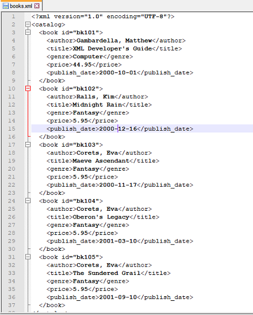

**Script**: Append the string `" US dollars "` to the `price` in each node 
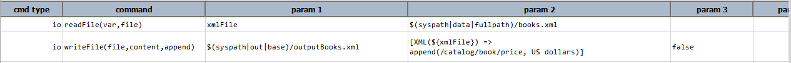

**Output file**: 
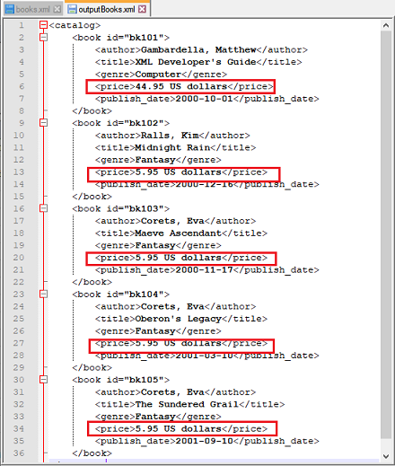

-----

#### **`attribute(xpath,name)`**
Retrieves the value of `name` attribute from the element(s) that matched the specified `xpath`. If exactly one match is 
found, this operation returns a [`TEXT`](TEXTexpression) data type. If more than one matches are found, a 
[`LIST`](LISTexpression) data type is returned instead.

**Example**

**Input XML file**: bookstore.xml 
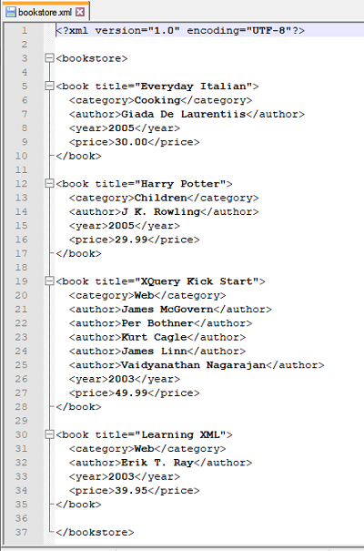

**Script**: List all titles with price > 30.00 
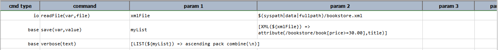

**Output**: 
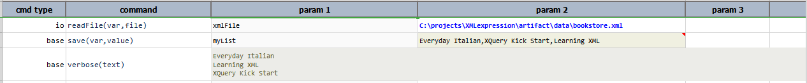

-----

#### **`beautify`**
"Pretty" formatting on current XML document to improve readability.

**Input XML file**: books.xml 
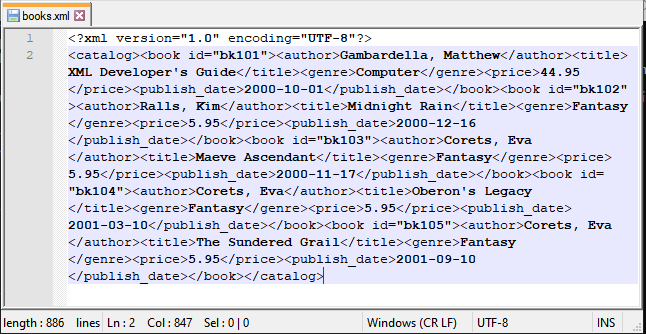

**Script**: Beautify the above xml 
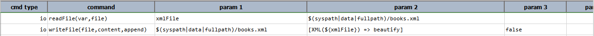

**Output file** 
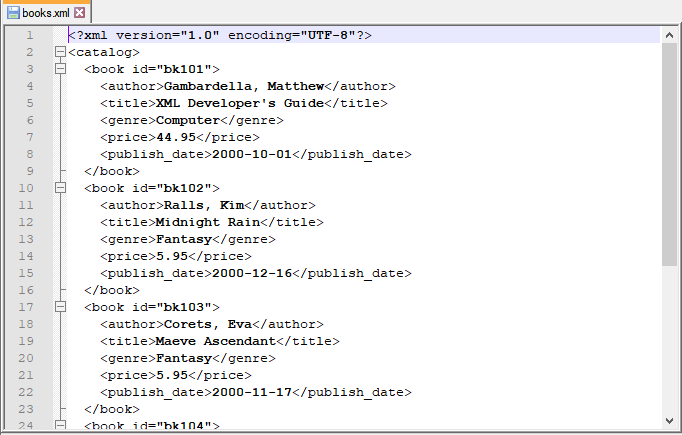

-----

#### **`clear(xpath)`**
Search against specified `xml` via `xpath` and clear content of all matching instances. As seen above, `clear(xpath)` 
clears the element's content. This is different from [`delete(xpath)`](#deletexpath) which removes the matching element 
itself. 

**Example**

**Input XML file**: books.xml 

**Script**: Clear all instances where `genre` is `Fantasy`. 
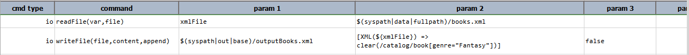

**Output file**:  
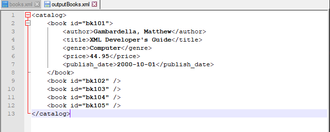

-----

#### **`content(xpath)`**
Retrieves the content of the element(s) that matched the specified `xpath`. If exactly one match is found, this 
operation returns a [`TEXT`](TEXTexpression) data type. If more than one matches are found, a [`LIST`](LISTexpression) 
data type is returned instead.

**Example**

**Input XML file**: books.xml 

**Script**: List all the titles. 
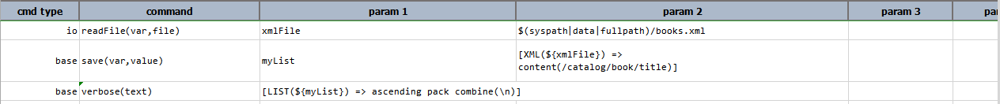

**Output**: 
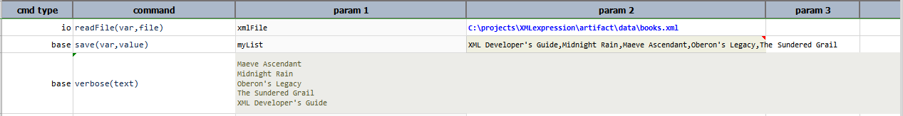

-----

#### **`count(xpath)`**
Counts the number of elements present at the specified `xpath`.

**Example**

**Input XML file**: bookstore.xml 

**Script**: Count all the books from year 2003. 
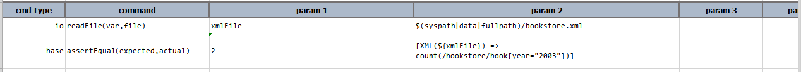

**Output**: 
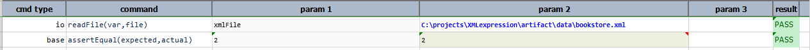

-----

#### **`delete(xpath)`**
Search against specified `xml` via `xpath` and delete xml node of all matching instances.`delete(xpath)` removes the 
matching element(s) itself. This is different from [`clear(xpath)`](#clearxpath) which only clears the content of the 
matching element(s). This operation is the same as [`remove(xpath)`](#removexpath).

**Example**

**Input XML file**: books.xml 

**Script**: Clear the nodes where `genre` is `Fantasy`. 
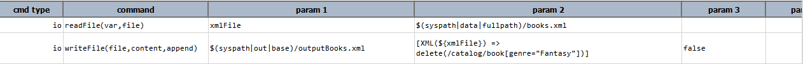

**Output File**:  
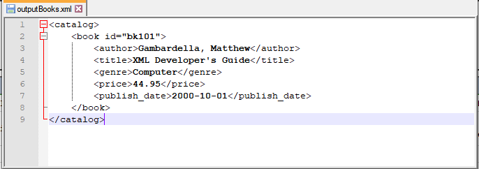

-----

#### **`extract(xpath)`**
Extract a portion of the XML document based on the specified `xpath`. Based on the XML document in question and the `xpath`
specified, the result could either be `null` (none matched), text (matched to a textual value), XML node or an XML array.
`extracted` is added as the root tag if the specified `xpath` matches with multiple nodes in order to make it a valid XML.

**Example**

**1. Extracting XML nodes** 
**Input XML file**: books.xml 

**Script**: Extract all the books published in the year 2000. 

**Output File**: 
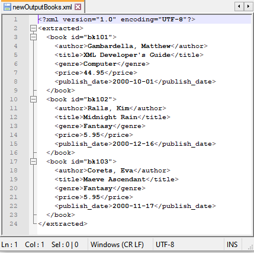

**2. Extracting text and arrays from XML** 
**Input XML file**: desserts.xml 
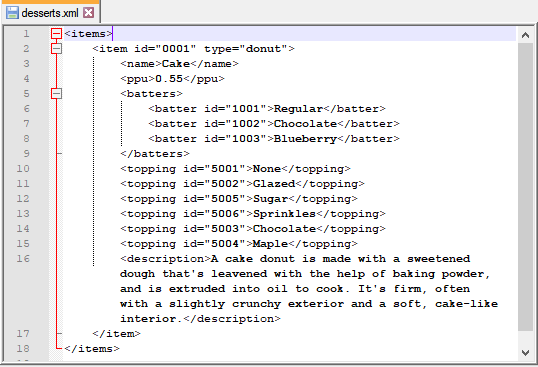

**Script**: 
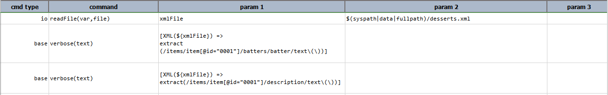

**Output**: 
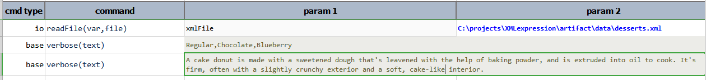

-----

#### **`insertAfter(xpath,content)`**
Search against specified `xml` via `xpath`, and insert `content` after all matching instances. 

**Example**

**Input XML file**: books.xml 

**Script**: Insert new tag `description` after `publish_date`. 
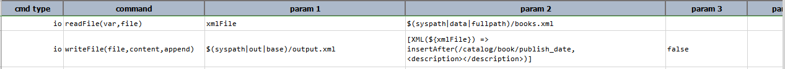

**Output File**: 
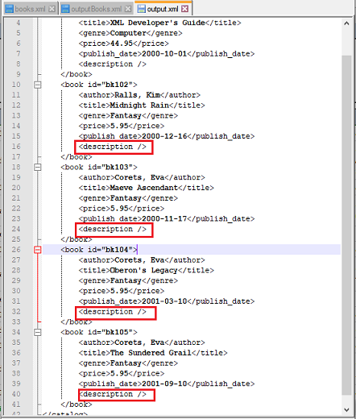

-----

#### **`insertBefore(xpath,content)`**
Search against specified `xml` via `xpath`, and insert `content` before all matching instances. 

**Example**

**Input XML file**: books.xml 

**Script**: Insert new tag `description` before `publish_date`. 
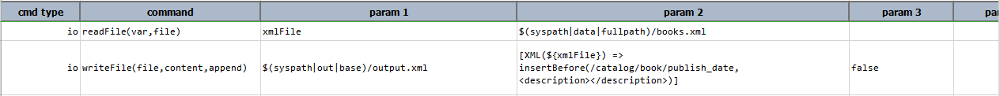

**Output File**: 
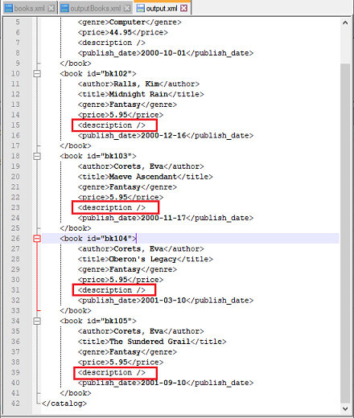

-----

#### **`minify`**
Compressed current XML document which are suitable for effecient data transfer.

**Example**

**Input XML file**: books.xml 

**Script**: Minify the above XML. 
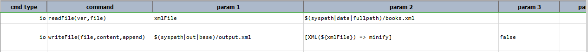

**Output File**: 
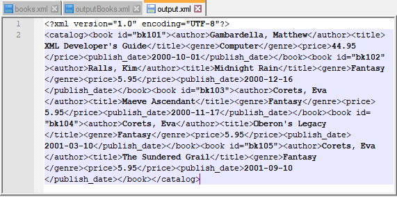

-----

#### **`prepend(xpath,content)`**
Search against specified `xml` via `xpath`, and prepend `content` to all matching instances. 

**Example**

**Input XML file**: bookstore.xml 

**Script**: Prepend the string `"publishing year = "` to each `publish_year`. 
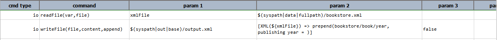

**Output File**: 
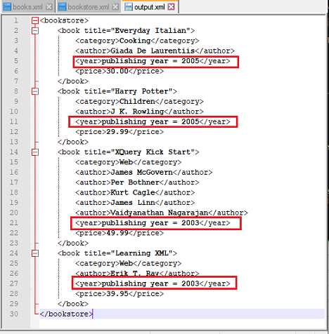

-----

#### **`remove(xpath)`**
Remove from the source XML the element(s) that matches the specified `xpath`. This operation is the same as 
[`delete(xpath)`](#deletexpath).

**Example**

**Input XML file**: bookstore.xml 

**Script**: Remove `author` from each book in `Web` category. 
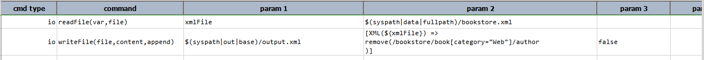

**Output File**: 
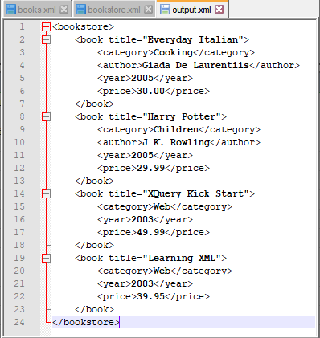

-----

#### **`replace(xpath,content)`**
Search against specified `xml` via `xpath`, and replace `content` against all matching instances. This command 
is different from [`replaceIn(xpath,content)`](#replaceinxpathcontent) in that it replaces the tags as well as the 
content of the matching elements while [`replaceIn(xpath,content)`](#replaceinxpathcontent) only replaces the content 
of the matching elements. 

**Example**

**Input XML file**: books.xml 

**Script**: Replace the `publish_date` in each node with `current_dateTime` containing the current date and time. 
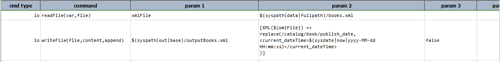

**Output File**: As seen below, the entire line containing the `publish_date` tag along with its content was 
replaced by the `current_dateTime` tag and its content. 
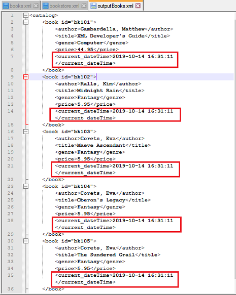

-----

#### **`replaceIn(xpath,content)`**
Search against specified `xml` via `xpath`, and replace inside content of all matching instances. This command 
is different from [`replace(xpath,content)`](#replacexpathcontent) in that it only replaces the content of the 
matching elements while [`replace(xpath,content)`](#replacexpathcontent) replaces the tags as well as the content 
of the matching elements. 

**Example**

**Input XML file**: books.xml 

**Script**: Replace the `price` of each book in the `Fantasy` genre with `35.50 USD`. 
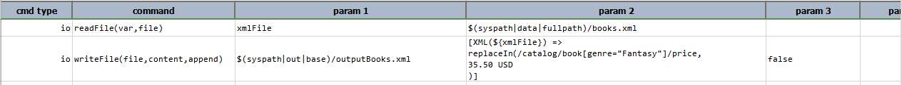

**Output**: As seen below. only the content of the `price` tag was replaced, the tag itself remains unmodified. 
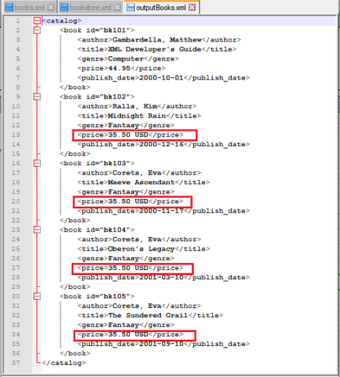

**Note:** `replaceIn(xpath,content)` and [`updateContent(xpath,content)`](#updatecontentxpathcontent) are the same when 
the specified xpath points to an XML node.

-----

#### **`save(path,append)`**
Save current expression content to `path`. If `path` resolves to an existing file, `append` set as `true` will append 
current expression content to the said file. `append` is optional and defaults to `false`.

**Example**

**Input XML file**: books.xml 

**Script**: Save all the books published in the year 2000 to another XML. 
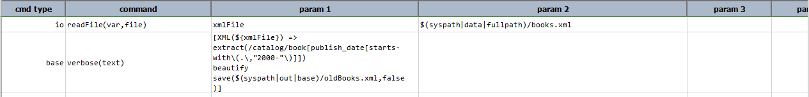

**Output File**: 
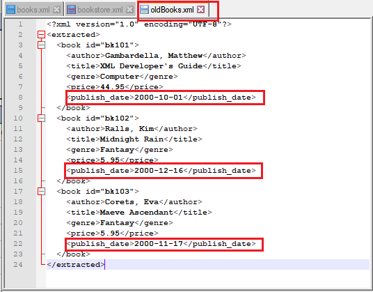

-----

#### **`store(var)`**
Save current XML expression to a data variable.  If the specified `var` exists, its value will be overwritten. Using 
this operation, one can put an expression on pause and resume it at a later time.

**Example**

**Input XML file**: bookstore.xml 

**Script**: `newXml` contains the expression to extract all the books from the year 2005. We then use this variable to
extract the books belonging to the `Cooking` category. 
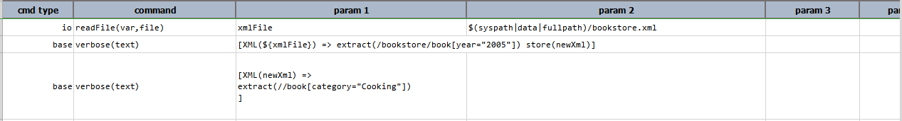

**Output**: 

-----

#### **`text`**
Transform current XML document into its textual representation.

**Example**

**Input XML file**: bookstore.xml 

**Script**: Transform above XML to text. 
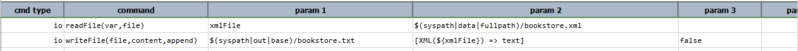

**Output File**: 
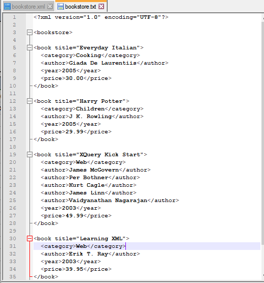

-----

#### **`updateAttribute(xpath,name,value)`**
Also known as **`update-attribute(xpath,name,value)`**. This operation updates the attribute of all matched elements 
based on `name` and `value`. If `value` is empty, then the target attributes are effectively removed. 

**Example**

**Input XML file**: bookstore.xml 

**Script**: Update the title of every book to `new Title`. 
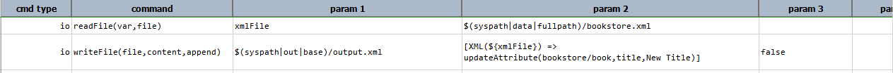

**Output File**: 
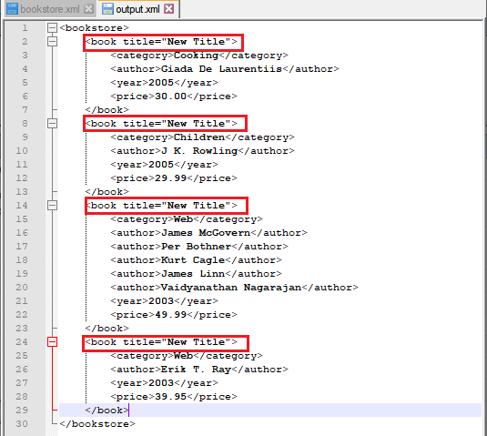

-----

#### **`updateContent(xpath,content)`**
Also known as **`update-content(xpath,content)`**. This operation updates (technically speaking, replace) the content 
of the matched elements with the specified `content`. `content` may be text or XML nodes. If `content` is empty, then 
the content of the target elements are effectively removed. 

**Example**

**Input XML file**: bookstore.xml 

**Script**: Update the price of each book from the year 2005 to `50.00`. 
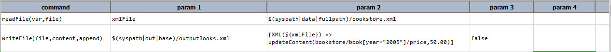

**Output File**: 
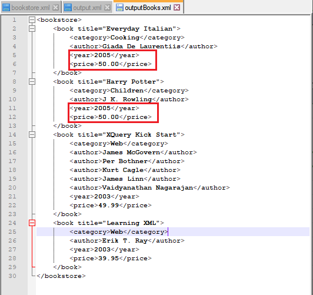

**Note:** `updateContent(xpath,content)` and [`replaceIn(xpath,content)`](#replaceinxpathcontent) are the same when the 
specified xpath points to a XML node.

-----

