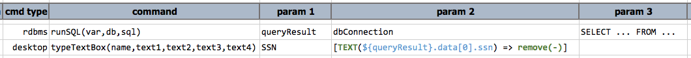
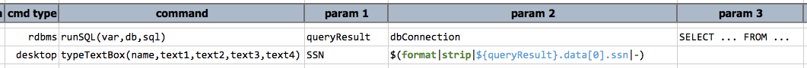
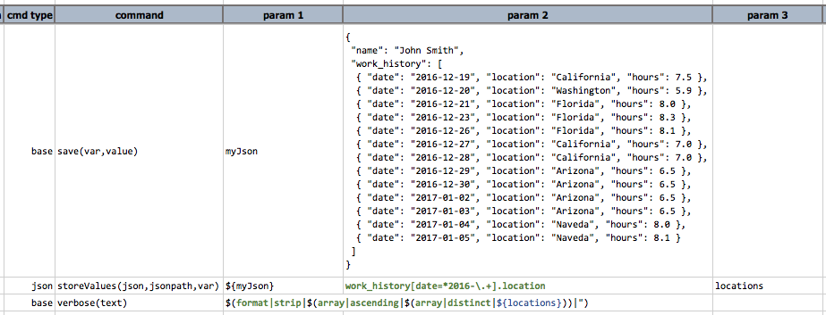
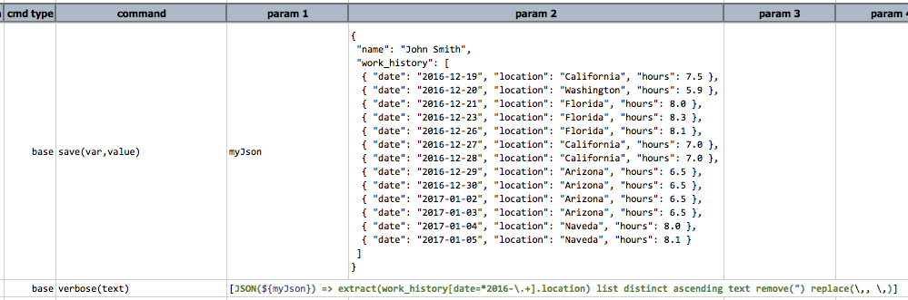
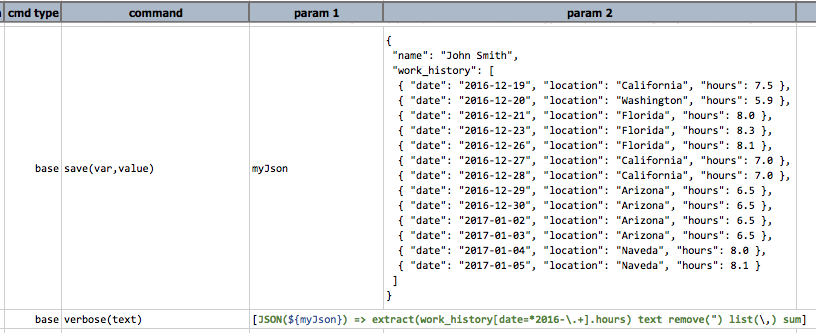
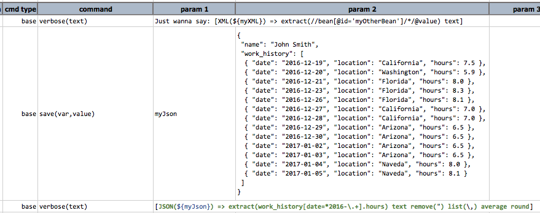

<br/>
Every so often, one would find oneself, as part of automation, the need to take _a thing and turn it into something 
else_.  This is common when dealing with multiple interfaces or dealing with service-oriented testing.  The need to 
transform, or to manipulate, data can be handled in multiple ways:

1. **[`Nexial commands`](../commands/index)** - specific to the intrinsic data type.  As a command, it cannot be
   combined in multiplicity (meaning: do multiple transformation in one command).
2. **[`Nexial built-in functions`](../functions)** - specific to the intrinsic data type, can be nested to perform 
   multiple transformations within one command.  But the nesting can make your script less readable and more difficult 
   to maintain (see below).
3. **Nexial expression** - ability to _morph_ to/fro data types, can be nested to perform multiple transformations 
  within one command (one test step).  Much more readable than built-in functions - READ ON!


### What is Nexial Expression?
The design intent of Nexial expression is to create a fluent approach towards transforming information, be it a form 
of input or output, that provide a consistent user experience and a rich, expressive platform to manipulate information 
on-the-fly.  Simply put, it's a way (and hopefully a simpler way) to express the transformation of information 
embedded within a single command execution. Nexial Expression is "type-aware", "nestable" and "data-transformational".


### Formal Notation
For you geeks out there, here's Nexial expression in pseudo-notation form:<br/>
> `{text}* [{DATA TYPE}(DATA VALUE) => operation(parameters?)...]{text}*`

- **`DATA TYPE`** is an all-caps reserved word to express the intended data type for a given set of information.  
  For example, `TEXT(Hello World)` means `Hello World` treated as `TEXT`. `JSON({...})` means the specified content 
  is treated as a JSON document. 
- **`DATA VALUE`** would be the value about which the transformation would be carried out.  This can be
  expressed either as literal or data variable (in `${..}` syntax).
- **`operation`** is one or more transformation "instructions" to be carried out on the given data.  Note that the 
  reference data might be _morphed_ into a different type (e.g. `TEXT` becomes `NUMBER`, or `JSON`becomes `LIST`) as 
  the specified transform-operations are carried out.


### Nexial in Action
Let's take an example to see how Nexial expression works.

Suppose we have a SQL query that will return the SSN of a user in the form of `xxx-xx-xxxx`, but for UI automation we 
need the same SSN in the form of `xxxxxxxxx`(without dashes).  Using Nexial expression, one could approach it this way:



`Param 2`of the second command shows Nexial expression in action.  It reads "Take the data from the `ssn` column of 
the first row, remove all `-`characters from it and use it as input to the `SSN` field.

Of course, those already familiar with Nexial might rightly protest "_how is this different than Nexial built-in 
function?!_", like:



True, in this specific and simple example, the net effort and effect would be roughly the same using either Nexial 
built-in function or Nexial expression.  Hopefully you would agree that at the very least Nexial expression is a bit 
more readable than Nexial built-in function.

Now let's try our hand at a more complex example:

Suppose we have to retrieve a unique and sorted list of US states where John Smith had worked in 2016.  The API, 
however, would only return such information unfiltered, unsorted and may contain multiple years:

```json
{
   "name": "John Smith",
   "work_history": [
      { "date": "2016-12-19", "location": "California", "hours": 7.5 },
      { "date": "2016-12-20", "location": "Washington", "hours": 5.9 },
      { "date": "2016-12-21", "location": "Florida", "hours": 8.0 },
      { "date": "2016-12-23", "location": "Florida", "hours": 8.3 },
      { "date": "2016-12-26", "location": "Florida", "hours": 8.1 },
      { "date": "2016-12-27", "location": "California", "hours": 7.0 },
      { "date": "2016-12-28", "location": "California", "hours": 7.0 },
      { "date": "2016-12-29", "location": "Arizona", "hours": 6.5 },
      { "date": "2016-12-30", "location": "Arizona", "hours": 6.5 },
      { "date": "2017-01-02", "location": "Arizona", "hours": 6.5 },
      { "date": "2017-01-03", "location": "Arizona", "hours": 6.5 },
      { "date": "2017-01-04", "location": "Naveda", "hours": 8.0 },
      { "date": "2017-01-05", "location": "Naveda", "hours": 8.1 }
   ]
}
```

So ideally what we want to do is:
- filter out all entries under `work_history`that do not fall within year 2016
- filter out all duplicate `location`
- sort the remaining states

With the combination of [json &raquo; `storeValues()`](../commands/json/storeValues(json,jsonpath,var)) and a bunch of 
Nexial built-in functions, we can achieve this:



The second command stores the matching JSON fragments into a variable named `locations`, and the third command 
utilizes a series of Nexial functions to manipulate that variable.  To aid in deciphering the intent, here's the 
breakdown:

```
                                       $(array|distinct|${locations})
                                       |
                                      \|/
                    $(array|ascending|...)
                    |
                   \|/
    $(format|strip|...|")
```

One would read: "make _locations_ distinct, then sort it in ascending order, then remove all its double-quotes".
The tricky bit is to decipher its intent.  The way Nexial functions are designed, one would have to read it in a 
**inside-out** fashion.  Meaning, one would read to know the innermost function first, and move outward.  Yes, this 
can get clumsy and definitely not business-friendly!

In contrast, Nexial expression offers a more natural, **left-to-right** readability design that would hopefully make 
it easier for its reader to derive the intent more effectively.  Here's the same script using Nexial expression 
(last line):



With Nexial expression, one would decipher its intent as one scans the expression in the **left-to-right** fashion: 
"**extract** via `work_history` array, convert to a **list**, make the list **distinct**, sort it in **ascending** 
order, **remove** double-quotes, **replace** comma with _comma-plus-space_".  Notice also that there are a few niceties 
added:

- The previous 2 commands are merged into 1, with Nexial expression
- One less intermediary variable to create and keep track
- Nexial expression keep tracks of the change in intrinsic data type as each specified operation is being processed.

Suppose now we want to sum up all the hours worked in 2016.  With Nexial expression one would express this intent 
like this (last line):<br/>



How about finding the average hours worked in 2016, round to the closest hour?<br/>




### When to use which, and why?
All three: Nexial commands, Nexial built-in function and Nexial expression, each has its place and purpose.  In some 
ways they are interchangeable. But for the most part, here are the guiding factors to decide which approach should be 
applied.

1. When in doubt, always consider Nexial expression first.  The main driver behind this is readability.  Having a 
   test automation suite is certainly an accomplishment.  But having the test script understood by everyone in the 
   team is even more important.  Readability hence is a key factor towards collaboration.  If the team can understand 
   the test script, the team can help expanding test coverage.
2. One may consider using Nexial built-in function when only simple, straightforward transformation is needed.
3. One can consider using Nexial command if the outcome of the transformation should register a PASS or FAIL to a test.
4. Nexial built-in function can be used in combination with Nexial expression.  However, Nexial built-in functions are 
   evaluated first.


### Available Expressions
- [`BAI2 expression`](BAI2expression)
- [`CONFIG expression`](CONFIGexpression)
- [`CSV expression`](CSVexpression)
- [`DATE expression`](DATEexpression)
- [`EXCEL expression`](EXCELexpression)
- [`INI expression`](INIexpression)
- [`JSON expression`](JSONexpression)
- [`LIST expression`](LISTexpression)
- [`NUMBER expression`](NUMBERexpression)
- [`SQL expression`](SQLexpression)
- [`TEXT expression`](TEXTexpression)
- [`WEB expression`](WEBexpression)
- [`XML expression`](XMLexpression)
