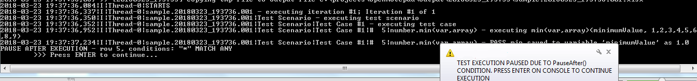
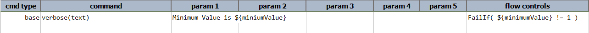
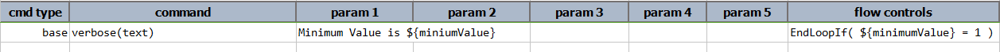
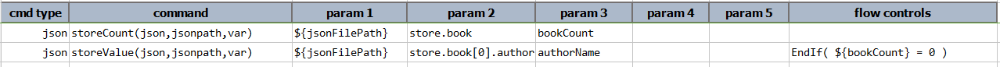
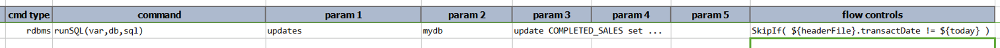

The concept of flow controls is to provide a variable flow of a test script so as to possibly modify the test 
execution, and possibly the expected outcome.  While this might sound contradictory to the "norm" of test automation, 
where the execution paths are predictable and consistent, there are some meaningful use cases to applying flow 
controls to a test execution.  For example,

1. In the execution of "_search for all defective products_", there might not be any "_defective"_ product since due 
   a preceding or upstream process.  In such case, failing the execution might seems inappropriate since the 
   application under test is not at fault when all "_defective_" products are fixed.  It might be more appropriate to 
   skip over the test steps that validate _"defective_" products.  See **`SkipIf()`** and **`ProceedIf()`** below.
2. On the condition of certain application state, it might be deem appropriate to end a test execution prematurely.  
   On good example would be load testing where test execution should end at the passing of certain time value (e.g. 
   100 minutes, 1 hour and 30 minutes, etc.).  See **`EndIf()`** below.
3. In some situation where a fatal error has occurred, it might not be meaningful to continue the test execution at 
   hand since such execution would likely generate more false-positive errors.  For example, database server became 
   unavailable.  In such case, it might be prudent to just end the test execution has a "FAILED" test.  See 
   **`FailIf()`** below.
4. For troubleshooting purpose, it can be useful to pause the test execution before or after a specific step.  See 
   **`PauseBefore()`** and **`PauseAfter()`** below.

Each flow control directives can be activated or suppressed via one or more conditions.  The general syntax of a 
flow control looks like this:

**`[SkipIf|ProceedIf|EndIf|EndLoopIf|FailIf|PauseBefore|PauseAfter]([nexial filter conditions])`**

For further details and examples of `[nexial filter conditions]`, click [Nexial Filter](../flowcontrols/filter).
- Use **`&`** to create a multi-condition flow control.

More than one flow controls may be specified for a given test step.  During execution, Nexial evaluates the flow controls
with the following order of significance:
1. `PauseBefore()`
2. `FailIf()`
3. `EndLoopIf()`
4. `EndIf()`
5. `SkipIf()`
6. `ProceedIf()`
7. *`... execution of the test steps...`*
8. `PauseAfter()`

### PauseBefore() / PauseAfter()
While being fairly obvious what these would do, it is good to note that these flow controls DO NOT require any 
conditions.  In other words, it is possible to pause a test step before or after its execution regardless of any 
known condition at the time of execution.  The only caveat to that is that neither of these flow controls will be 
activated during remote execution via Jenkins. Here's an example of how one can add a _pause_ in the execution:

When the _pause_ in effect, you should see a prompt on the console, `>>> Press Enter to continue...`  like this:

To continue, simply press Enter on the console.

**Note:** The desktop feedback on the taskbar (`nexial notifier`)  is controlled via `nexial.verbose`.

### FailIf(condition)
This flow control is used to fail a single test step if the specified condition is true.  For example,

The above step will be considered as a FAIL if `${minimumValue}` does not have the value `1`.

### EndLoopIf(condition)
This flow control will end the current iteration if the specific condition is true.  However, it will register the 
current step as a `SKIPPED`, not `FAIL`.  As such the activation of this flow control will not increment the failure 
count of the corresponding test scenario.

Example: 

There is a variation to this. If `EndLoopIf()` flow control is used within a 
[base &raquo; `repeatUntil(steps,maxWaitMs)`](../commands/base/repeatUntil(steps,maxWaitMs)) section, then only the 
enclosing repeat-until loop will terminate. Nexial will proceed to the next step after the affected repeat-until loop
is terminated. Similar to the impact on iteration, the use of `EndLoopIf()` within a repeat-until loop will not 
increment failture count for the corresponding test scenario.

### EndIf(condition)
This flow control is different from `EndLoopIf()` in that the activation of this will end the entire test execution.  
All remaining test steps, test cases and test scenarios will not be executed.

Example: 

### SkipIf(condition)
This flow control is used to skip certain test step when the specified condition is true.  This can be helpful to 
maintain the flow of the test execution, but Nexial user should be cautioned not to abuse it.  Skipping steps 
generally means deviation from the intent of the test case.  But for conditions or scenarios that are either 
externally controlled (such as external client) or unpredictable (such as temperature or air pressure), then this 
flow control may be of some use.

Example: 
 

The above example would read:
> if the "transaction date" on the "header file" is not today, then don't update the "COMPLETED_SALES" table. 
> 
> otherwise, run the update SQL on "COMPLETED_SALES" table.

#### On-the-spot Step Skipping
_Another way (easier way?) to skip steps?_

`SkipIf()` provides a powerful way to skip over certain steps based on execution-time condition. However at times, one
finds the need to skip a series of steps without any condition. For example, one might want to temporarily "disable"
one or more steps in order to observe change in behavior in the target application (AUT). 

Nexial supports such step disabling via the use of "strikethrough", like this:
1. Move cursor to the "command" column of the desire step to skip.
2. Apply "strikethrough" formatting over the command of the said step. Use `Ctrl-5` to apply the strikethrough 
   formatting.
3. Alternatively, highlight a contiguous set of commands of the steps to skip and use `Ctrl-5` to skip over them.
4. During execution, Nexial will automatically place a `SkipIf(true)` flow control to the corresponding 
   "flow controls" column, thus effectively skip over such steps.
5. Use `Ctrl-5` again to re-enable the previous "disabled steps.

This technique can be applied to test steps, to macro steps and to test plan (apply "strikethrough" over the "script" 
column).

### ProceedIf(condition)
This flow control is essentially the same as **`SkipIf(condition)`** (above), albeit the logical inverse of it.  
Basically it would read: "`If `**`condition`**` is true, then proceed if the current test step`" .  Depending on 
the flow of the test steps in reference, some times it might _read_ better to use `ProceedIf` rather than `SkipIf`.  
Hence this flow condition is added to enhance readability (and possibly readability).

### See Also
- [`Time Tracking`](timeTracking)